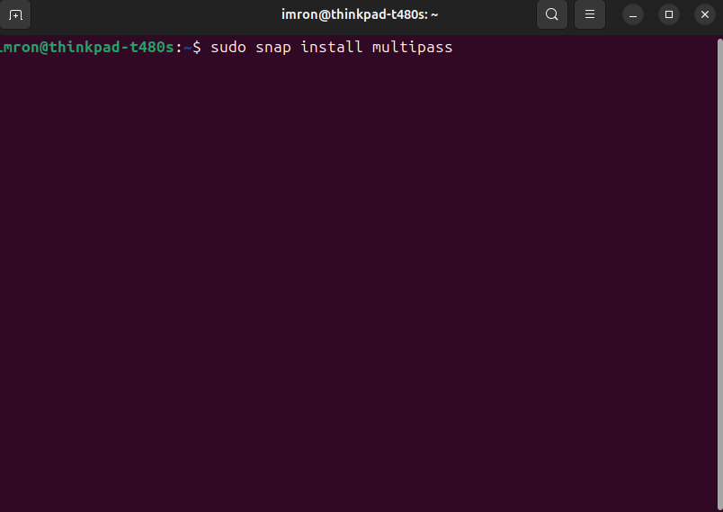
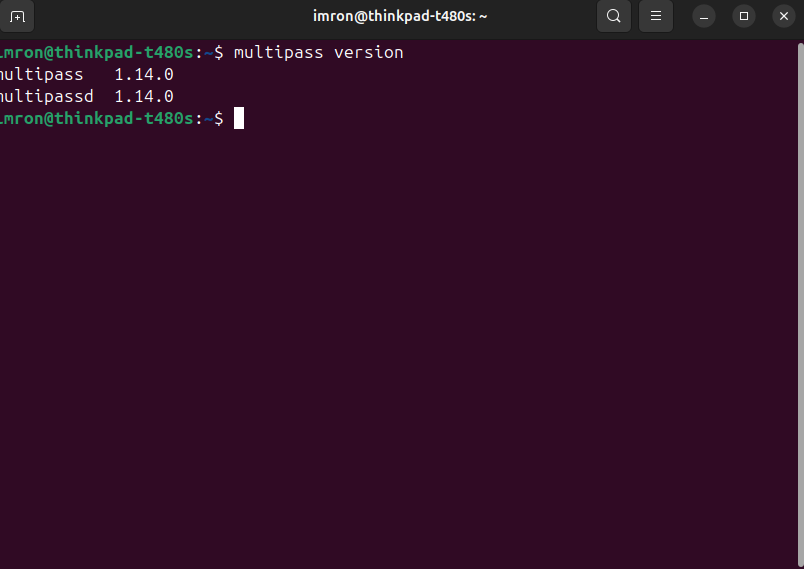
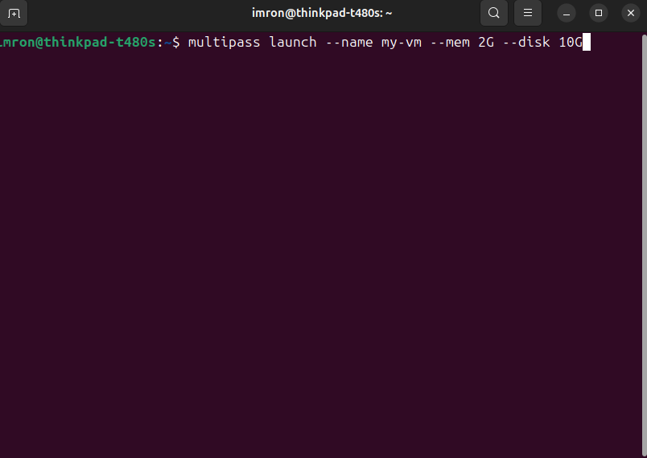
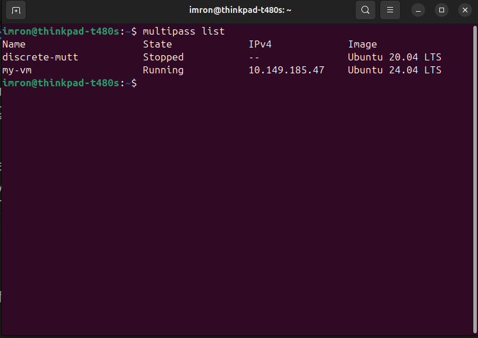
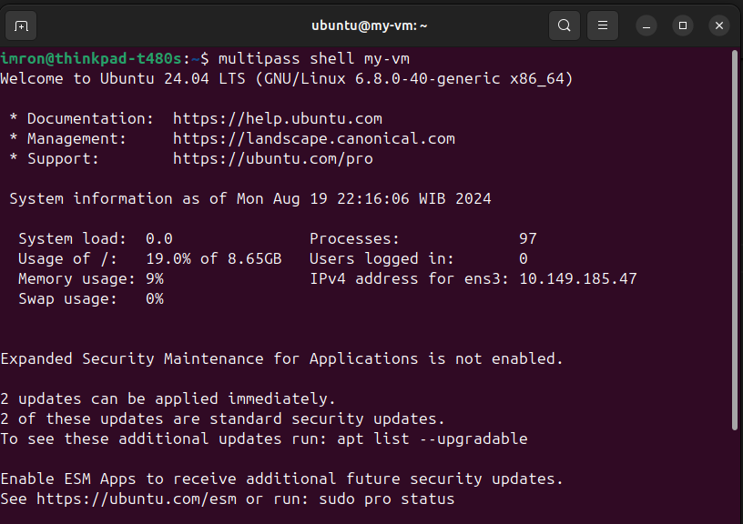
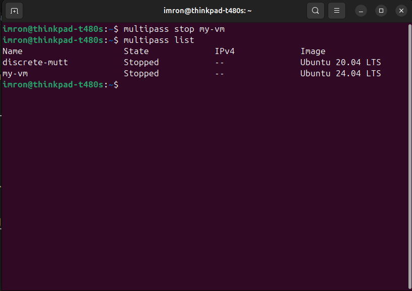
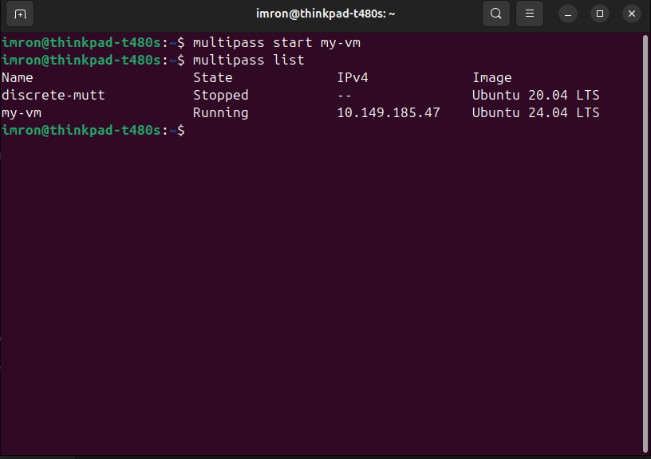
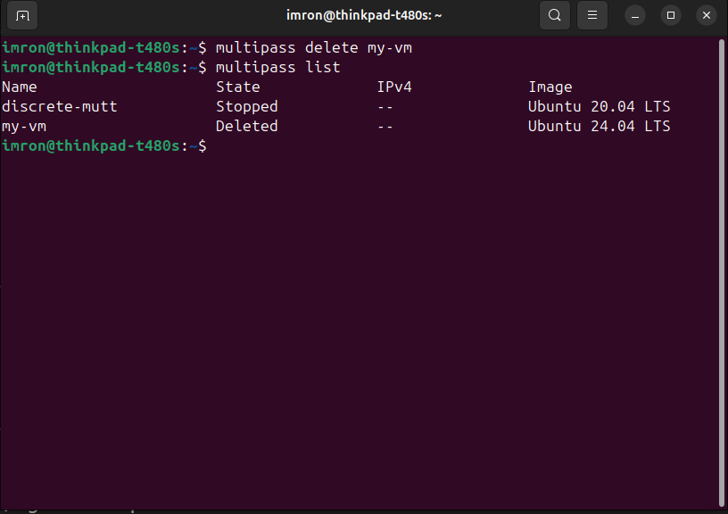

# Membuat Virtual Machine dengan Multipass di Linux

Panduan ini akan membantu kamu untuk membuat dan menginstall virtual machine menggunakan Multipass di Linux. Ikuti langkah-langkah berikut:

## Persyaratan

Sebelum memulai, pastikan kamu sudah memenuhi persyaratan berikut:
- Sistem operasi Linux (Ubuntu, Debian, atau distribusi lainnya)
- Akses internet
- Terminal (Command Line Interface)

## Langkah-langkah Instalasi

### 1. Instalasi Multipass

1. **Buka Terminal**
   Tekan `Ctrl + Alt + T` untuk membuka terminal di Linux.

2. **Perbarui Paket dan Repositori**
   Jalankan perintah berikut untuk memperbarui daftar paket:
       sudo apt update
         

3. **Instalasi Multipass**
   Gunakan perintah berikut untuk menginstall `Multipass`:
       sudo snap install multipass
         

4. **Verifikasi Instalasi**
   Pastikan Multipass terinstall dengan benar dengan menjalankan perintah:
       multipass version
         

### 2. Membuat Virtual Machine

1. **Membuat Virtual Machine Baru dengan Spesifikasi Tertentu**
   Jalankan perintah berikut untuk membuat virtual machine baru dengan spesifikasi memori dan hardisk yang diinginkan:
          multipass launch --name my-vm --mem 2G --disk 10G
         

   Penjelasan:
   - `my-vm` adalah nama virtual machine kamu. Kamu bisa menggantinya dengan nama lain.
   - `--mem 2G` menetapkan memori yang digunakan sebesar 2GB.
   - `--disk 10G` menetapkan ukuran hardisk sebesar 10GB.

2. **Verifikasi Virtual Machine**
   Cek daftar virtual machine yang aktif dengan perintah:
             multipass list
         

### 3. Mengakses Virtual Machine

1. **Masuk ke Virtual Machine**
   Gunakan perintah berikut untuk masuk ke virtual machine:
         multipass shell my-vm
         

### 4. Mengelola Virtual Machine

1. **Menghentikan Virtual Machine**
   Untuk menghentikan virtual machine, gunakan perintah:
      multipass stop my-vm
         

2. **Menghidupkan Kembali Virtual Machine**
   Untuk menghidupkan kembali virtual machine, gunakan perintah:
   multipass start my-vm
         

3. **Menghapus Virtual Machine**
   Jika kamu ingin menghapus virtual machine, gunakan perintah:
    multipass delete my-vm
         

Dengan mengikuti langkah-langkah di atas, kamu telah berhasil membuat dan mengelola virtual machine menggunakan Multipass di Linux. Semoga panduan ini membantu!
