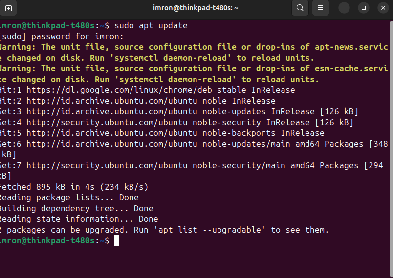
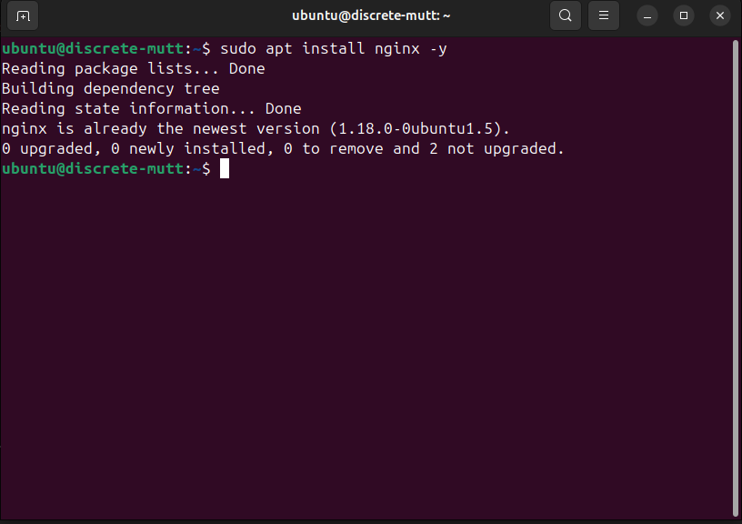
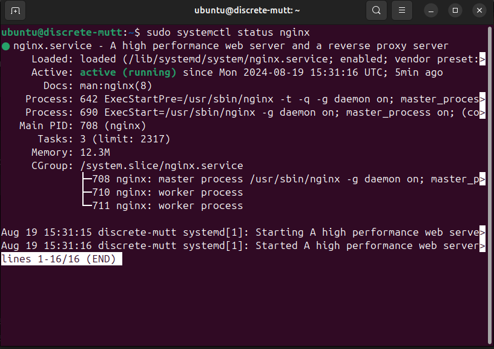
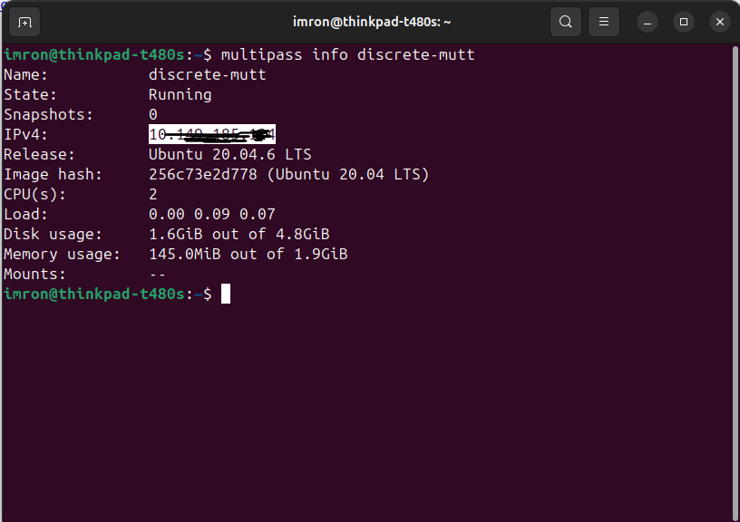
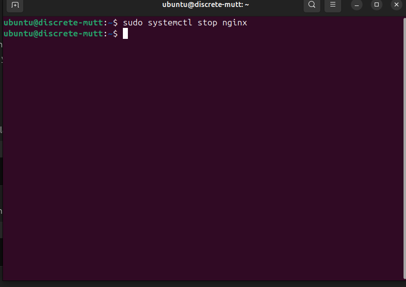
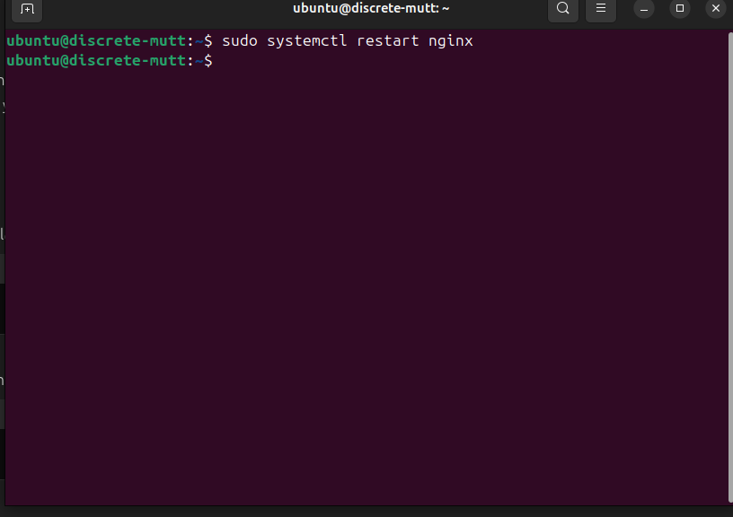
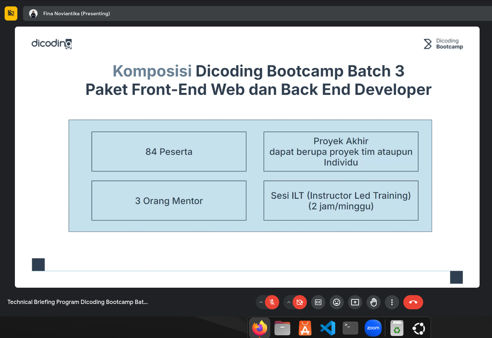

# Instalasi Nginx Web Server di Virtual Machine Menggunakan Multipass

Panduan ini akan memandu kamu untuk menginstal Nginx web server di dalam virtual machine yang dibuat menggunakan Multipass. Ikuti langkah-langkah berikut:

## Persyaratan

Sebelum memulai, pastikan kamu telah:
- Menginstall Multipass (lihat [panduan instalasi Multipass](#persyaratan)).
- Membuat virtual machine menggunakan Multipass (lihat [panduan membuat virtual machine](#membuat-virtual-machine)).

## Langkah-langkah Instalasi

### 1. Akses Virtual Machine

1. **Masuk ke Virtual Machine**
   Gunakan perintah berikut untuk masuk ke virtual machine yang telah dibuat:
   multipass shell <nama virtual machine yang sudah dibuat>

2. **Update Sistem**
    Perbarui Daftar Paket
Sebelum menginstal Nginx, perbarui daftar paket dengan menjalankan:
        sudo apt update
         

### 3. **Instalasi Nginx**

1. **Install Nginx**
    Jalankan perintah berikut untuk menginstal Nginx:
        sudo apt install nginx -y
         

2. **Verifikasi Instalasi**
    Cek apakah Nginx sudah terinstall dan berjalan dengan perintah:
        sudo systemctl status nginx
         
        
## 4. **Konfigurasi Nginx**

1. **Buka Browser**
Buka browser dan ketikkan alamat IP dari virtual machine kamu untuk memastikan Nginx berjalan dengan baik. Kamu bisa mendapatkan alamat IP dengan perintah:
        multipass info <nama virtual machine yang sudah dibuat>
          

2. **Cek Halaman Default Nginx**
Di browser, ketikkan alamat IP virtual machine kamu. Jika semuanya berjalan dengan baik, kamu akan melihat halaman default Nginx yang menunjukkan bahwa server web Nginx berhasil diinstal.
!       [bukabrowsernginx](assets/images/cek-browser-ip-nginx.png)   

## 5. **Mengelola Nginx**

1. **Menjalankan Nginx**
Jika Nginx tidak berjalan, kamu bisa menjalankannya dengan perintah:
        sudo systemctl start nginx
           

2. **Menghentikan Nginx**
Untuk menghentikan Nginx, gunakan perintah:
        sudo systemctl stop nginx
           

3. **Merestart Nginx**
Untuk merestart Nginx setelah perubahan konfigurasi, gunakan perintah:
        sudo systemctl restart nginx
           

## 6. Mengakses dan Mengelola Virtual Machine
    Keluar dari Virtual Machine
Untuk keluar dari virtual machine, ketikkan:
        exit
           

Dengan mengikuti langkah-langkah di atas, kamu telah berhasil menginstal dan mengelola Nginx web server di dalam virtual machine menggunakan Multipass. Semoga panduan ini membantu!

