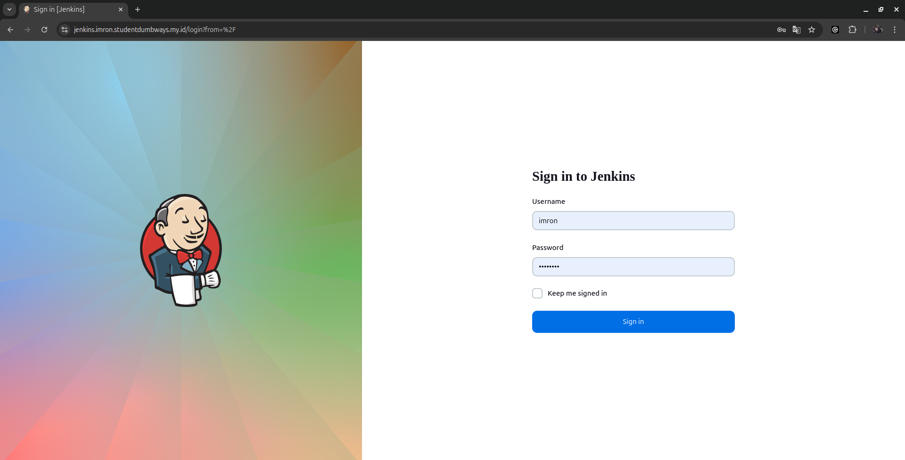
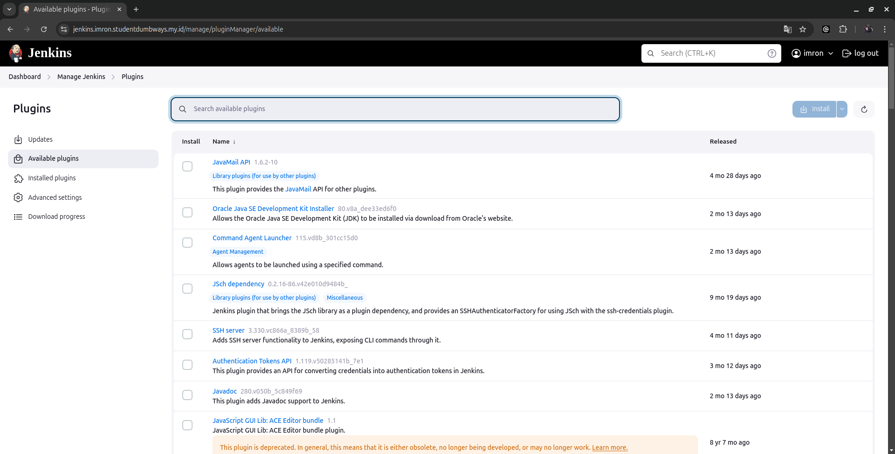
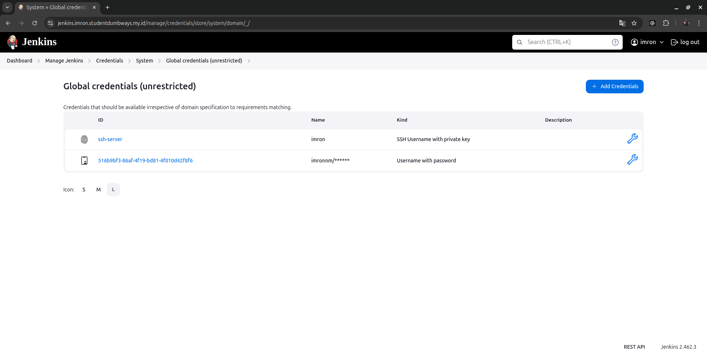
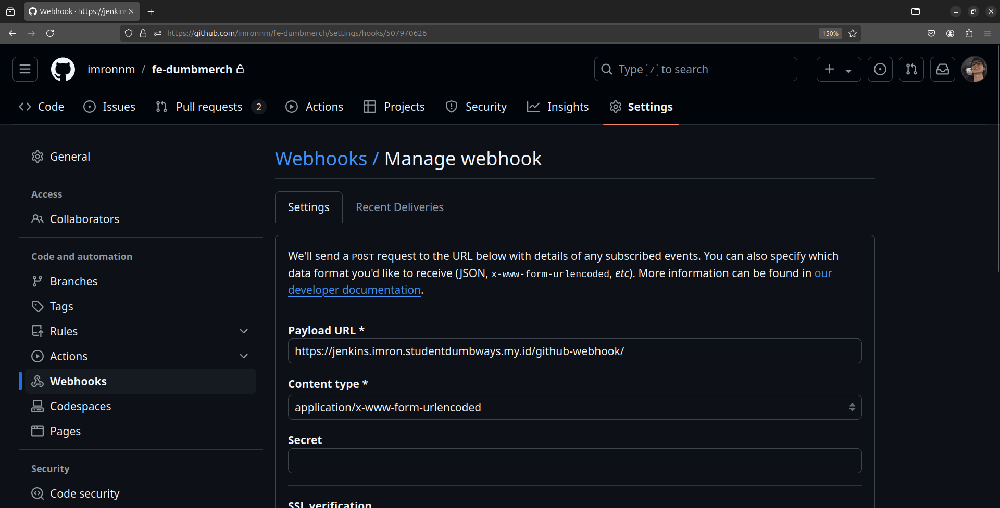
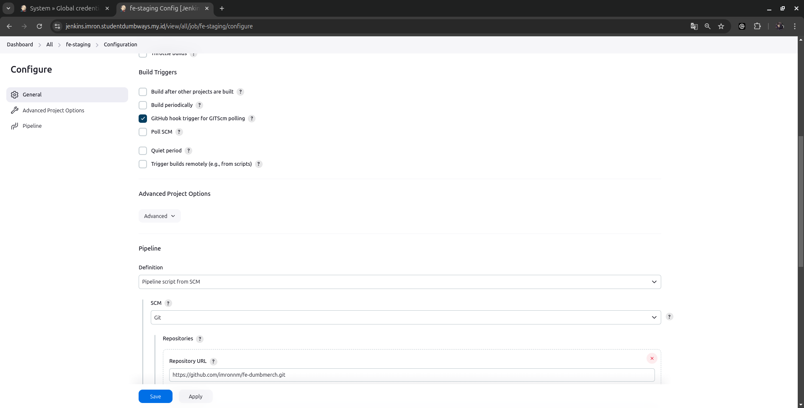

# Panduan Konfigurasi Jenkins CI/CD Pipeline

Panduan ini menjelaskan cara mengatur pipeline CI/CD Jenkins untuk deployment otomatis aplikasi frontend menggunakan Docker.

## Prasyarat
- Akses server Jenkins (https://jenkins.imron.studentdumbways.my.id/)
- Akses repository GitHub
- Docker dan Docker Compose terinstall di server
- Akses SSH ke server deployment

## Daftar Isi
1. [Login Jenkins](#1-login-jenkins)
2. [Instalasi Plugin](#2-instalasi-plugin)
3. [Konfigurasi Credential SSH](#3-konfigurasi-credential-ssh)
4. [Membuat Job Pipeline](#4-membuat-job-pipeline)
5. [Pengaturan Webhook GitHub](#5-pengaturan-webhook-github)
6. [Menjalankan Pipeline](#6-menjalankan-pipeline)
7. [Troubleshooting](#7-troubleshooting)
8. [Uji Coba dan Validasi](#8-uji-coba-dan-validasi)

## 1. Login Jenkins
1. Akses Jenkins melalui browser: `https://jenkins.imron.studentdumbways.my.id/`
2. Masukkan kredensial:
   - Username: (username Anda)
   - Password: (password Anda)
3. Klik "Sign in"

 *  <br>

## 2. Instalasi Plugin
1. Buka `Manage Jenkins` → `Plugins`
2. Pilih tab "Available Plugins"
3. Install plugin berikut:
   - Pipeline (untuk membuat pipeline script)
   - SSH Agent Plugin (untuk koneksi SSH)
4. Klik "Install without restart" dan tunggu hingga selesai

 *  <br>

## 3. Konfigurasi Credential SSH
1. Buka `Manage Jenkins` → `Credentials`
2. Pilih `(global)` → `Add Credentials`
3. Konfigurasi:
   - Kind: SSH Username with private key
   - Username: imron
   - Private Key: Masukkan private key yang ada di dalam server jenkins
   - ID: ssh-server
4. Klik "Save"

 *  <br>

## 4. Membuat Job Pipeline
1. Klik "New Item" dari Dashboard Jenkins
2. Masukkan nama job (contoh: "CI-CD-Frontend")
3. Pilih "Pipeline" dan klik "OK"
4. Pada konfigurasi Pipeline, gunakan script berikut:

```groovy

pipeline {
    agent any

    environment {
        DOCKER_REGISTRY_SERVER  = credentials('docker-registry-server')
        DOCKER_IMAGE            = credentials('docker-image')
        DOCKER_TAG              = credentials('docker-tag')
        REPO_URL                = credentials('repo-url')
    }

    stages {
        stage('Pull Repository') {
            steps {
                script {
                    echo "Menarik kode dari repository branch staging..."
                    git branch: "staging", 
                        url: "${REPO_URL}", 
                        credentialsId: 'ssh-credentials-id'
                }
            }
        }

        stage('Build Application') {
            steps {
                script {
                    echo "Membangun Docker image di Jenkins..."
                    sh """
                    docker build -t ${DOCKER_REGISTRY_SERVER}/${DOCKER_IMAGE}:${DOCKER_TAG} .
                    """
                }
            }
        }


        stage('Push to Docker Registry') {
            steps {
                script {
                    echo "Push Docker image ke registry private..."
                    sh """
                    docker push ${DOCKER_REGISTRY_SERVER}/${DOCKER_IMAGE}:${DOCKER_TAG}
                    docker image prune -f
                    """
                }
            }
        }

        stage('Redeploy App Server') {
            steps {
                script {
                    sshagent(credentials: ['ssh-credentials-id']) {
                        withCredentials([string(credentialsId: 'ssh-user', variable: 'SSH_USER'), 
                                         string(credentialsId: 'remote-server', variable: 'REMOTE_SERVER')]) {
                            sh """
                            ssh -o StrictHostKeyChecking=no ${SSH_USER}@${REMOTE_SERVER} << EOF
                            docker compose stop frontend
                            docker compose pull frontend
                            docker compose up -d --build frontend
                            docker image prune -f
                            echo "Redeploy Berhasil"
                            exit
                            EOF
                            """
                        }
                    }
                }
            }
        }
    }

    post {
        success {
            echo 'Pipeline berhasil dijalankan untuk frontend staging.'
        }
        failure {
            echo 'Pipeline gagal dijalankan untuk frontend staging.'
        }
    }
}


```

## 5. Pengaturan Webhook GitHub
1. Buka repository GitHub Anda
2. Pilih Settings → Webhooks → Add webhook
3. Konfigurasi webhook:
   - Payload URL: `https://jenkins.imron.studentdumbways.my.id/github-webhook/`
   - Content Type: `application/json`
   - Trigger: Pilih "Just the push event"
4. Klik "Add webhook"

 *  <br>

## 6. Menjalankan Pipeline
1. Buka job pipeline Jenkins
2. Dashboard create new item
3. beri nama folder lalu pilih pipeline
4. ceklis bagian GitHub hook trigger for GITScm polling
5. pipeline script from scm pilih git
6. masukkan repository url
7. pada bagian branch ganti branch master menjadi staging
7. test commit kemudian push repo ke origin staging
8. jenkins otomatis ke triggering karena ada perubahan repository
9. Pantau setiap tahap:
   - Pull Repository: Update dari Git
   - Build Docker Image: Membuat image baru
   - Push to Registry: Upload ke registry private
   - Redeploy: Update aplikasi menggunakan Docker Compose

 *  <br>

## 7. Troubleshooting
Jika pipeline gagal, periksa:
- Kredensial SSH dan konektivitas
- Log tahapan pipeline untuk error spesifik
- Sumber daya server dan hak akses

## 8. Uji Coba dan Validasi
Setelah pipeline selesai:

1. **Cek Status Build di Jenkins**
   - Verifikasi keberhasilan build
   - Review log jika terjadi error

2. **Verifikasi di Server**
   ```bash
   ssh imron@34.101.35.102
   docker ps  # Cek container yang berjalan
   ```

3. **Testing Aplikasi**
   - Akses URL aplikasi frontend
   - Verifikasi fungsi setelah deployment
   - Cek Docker registry untuk image baru

## Ringkasan Pipeline
Pipeline CI/CD ini mengotomatisasi:
- Update kode dari repository Git
- Pembuatan dan upload Docker image
- Redeploy aplikasi
- Penanganan error dan notifikasi

### Manfaat
- **Otomatisasi**: Menghilangkan langkah deployment manual
- **Efisiensi**: Mempercepat proses deployment
- **Konsistensi**: Memastikan sinkronisasi kode dan deployment
- **Keandalan**: Termasuk penanganan error dan validasi

## Catatan
- Pastikan semua kredensial dan izin terkonfigurasi dengan benar
- Monitoring log pipeline secara rutin direkomendasikan
- Jaga kerapihan dan kebersihan Docker registry
- Terapkan praktik version control yang baik