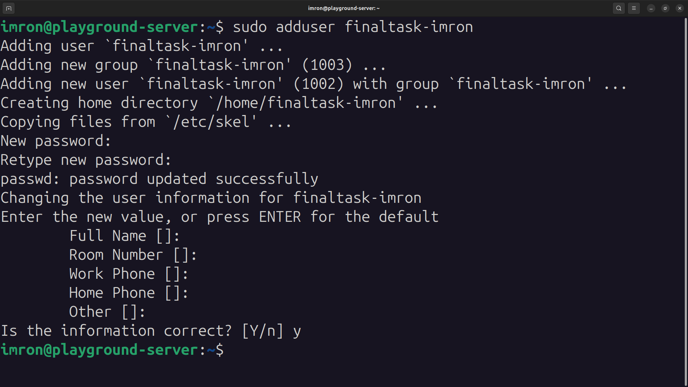
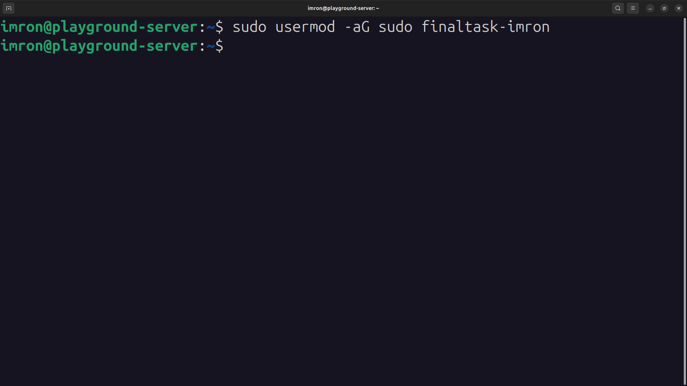
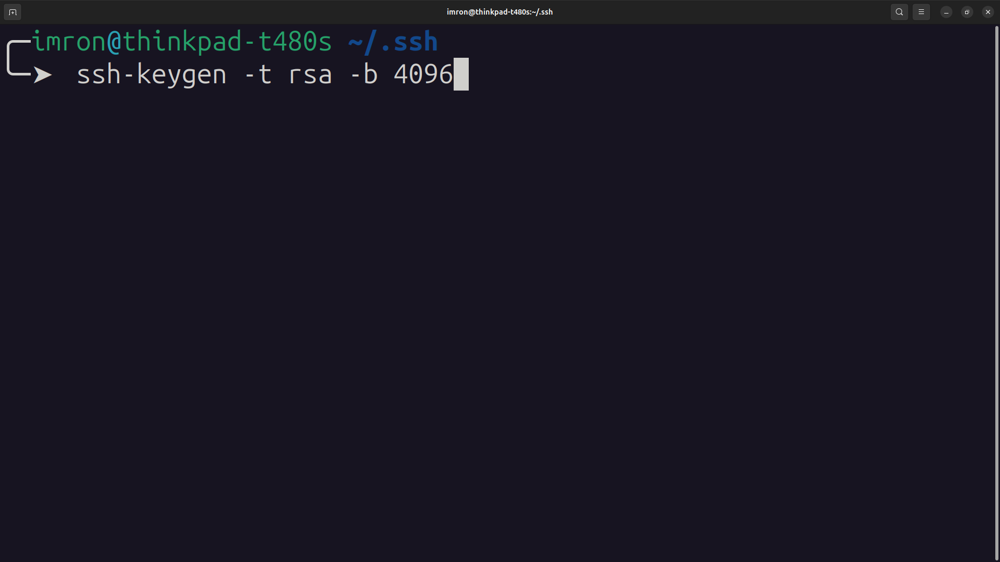
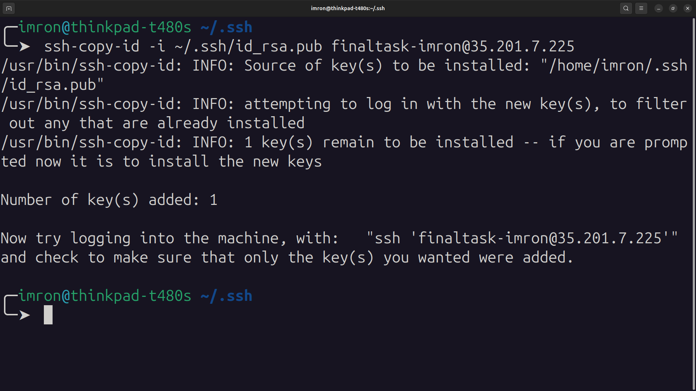
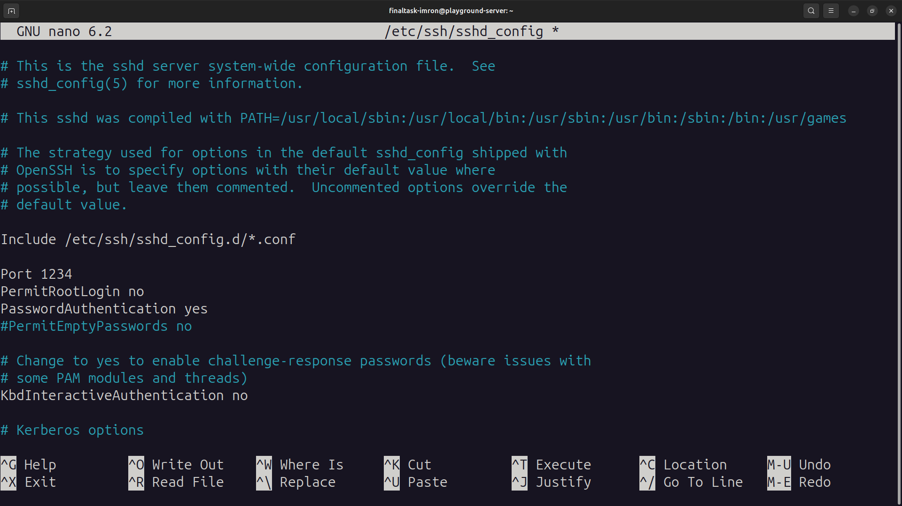
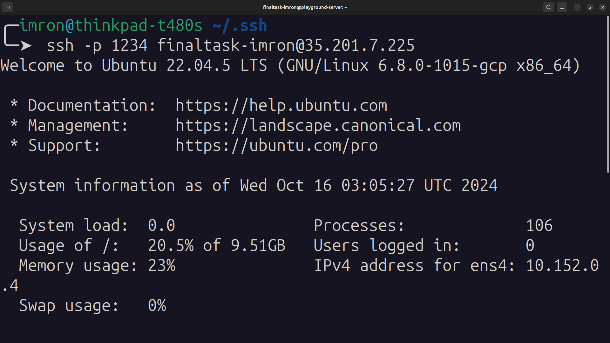
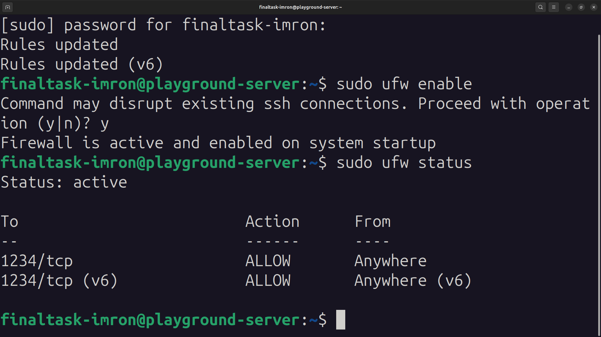

# Konfigurasi SSH dan Firewall

## Step 1: Membuat User Baru

1. **Login ke Server** sebagai user dengan akses root atau sudo.
2. **Buat User Baru** dengan nama `finaltask-imron`:

```bash
   sudo adduser finaltask-imron
```
   * Ikuti petunjuk untuk memasukkan password dan informasi lain (bisa dilewati dengan menekan enter).
   *  <br>.

3. **Tambahkan User ke Grup Sudo** (jika diperlukan):

```bash
   sudo usermod -aG sudo finaltask-imron
```
   *  <br>.

## Step 2: Konfigurasi SSH dengan Satu SSH Key

1. **Buat SSH Key** di mesin lokal Anda (jika belum punya) atau gunakan yang sudah ada:

```bash
   ssh-keygen -t rsa -b 4096
```
   *  <br>.

2. **Salin SSH Key ke Server** untuk user `finaltask-$USER`:

```bash
   ssh-copy-id -i ~/.ssh/id_rsa.pub finaltask-imron@35.201.7.225
```

   *  <br>.

3. **Verifikasi SSH Key** pada server dengan login menggunakan user baru:

```bash
   ssh -p 22 finaltask-imron@35.201.7.225
```
   * Pastikan Anda bisa login tanpa memasukkan password (jika SSH key berhasil diatur).
   *  <br>.

## Step 3: Konfigurasi SSH Server

1. **Edit File Konfigurasi SSH** pada server:

```bash
   sudo nano /etc/ssh/sshd_config
```
   * Ubah port default dari `22` ke `1234`:
```yaml
     Port 1234
```
   * Nonaktifkan login sebagai root:
```bash
     PermitRootLogin no
```
   * Pastikan password authentication tetap diaktifkan:
```bash
     PasswordAuthentication yes
```

2. **Restart SSH Service**:

```bash
   sudo systemctl restart ssh
```
   *  <br>.

3. **Cek Apakah Port Baru Berfungsi**:
   * Login menggunakan port baru untuk memastikan konfigurasi berhasil:
 ```bash
     ssh -p 1234 finaltask-imron@35.201.7.225
```
   *  <br>.

## Step 4: Mengaktifkan dan Mengonfigurasi Firewall (UFW)

1. **Izinkan Port SSH Baru**:

```bash
   sudo ufw allow 1234/tcp
```

2. **Aktifkan UFW**:

```bash
   sudo ufw enable
```

3. **Cek Status UFW** untuk memastikan hanya port yang diizinkan saja yang terbuka:

```bash
   sudo ufw status
```
   *  <br>.