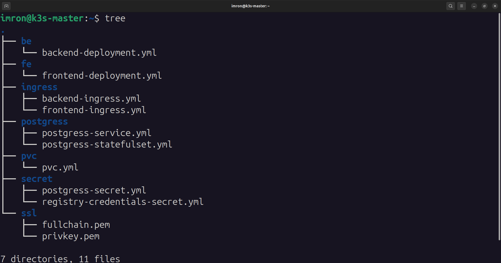
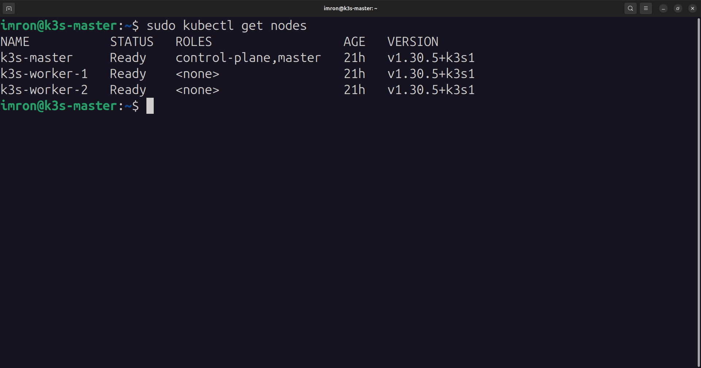
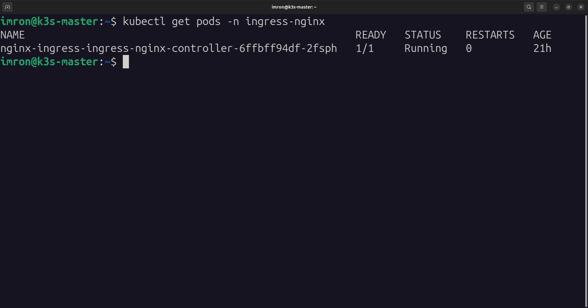
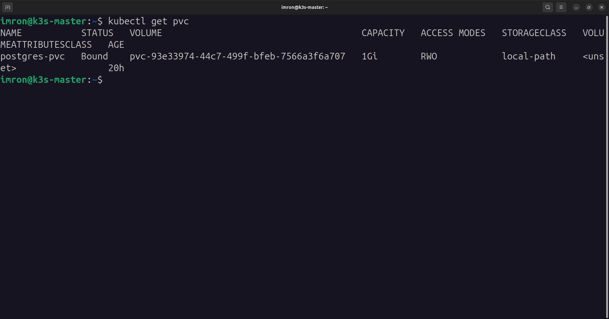
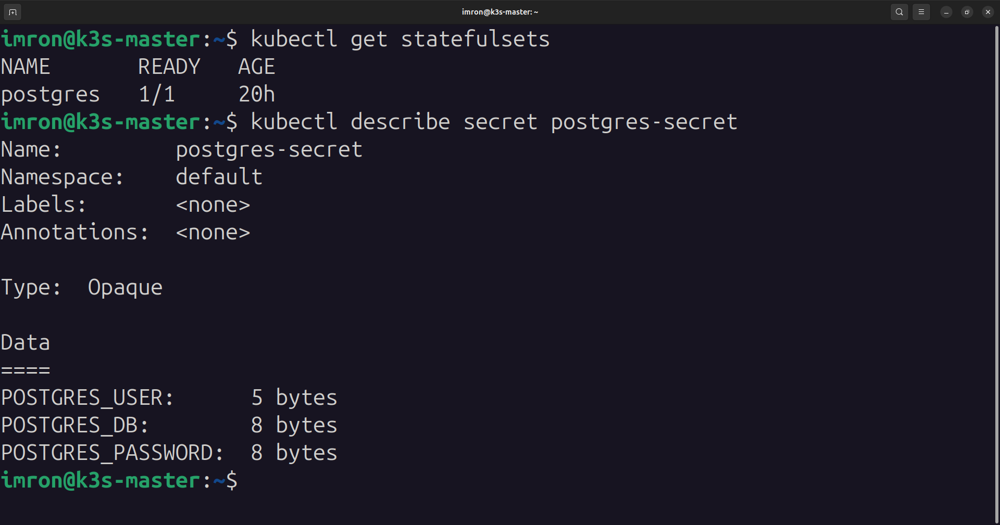
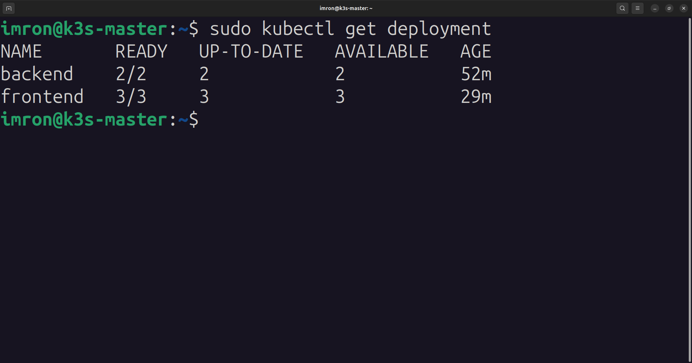
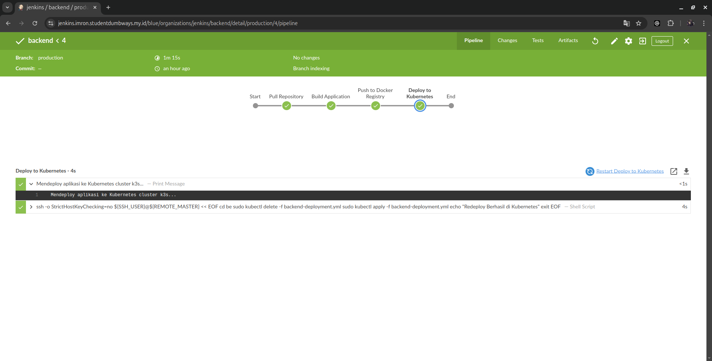
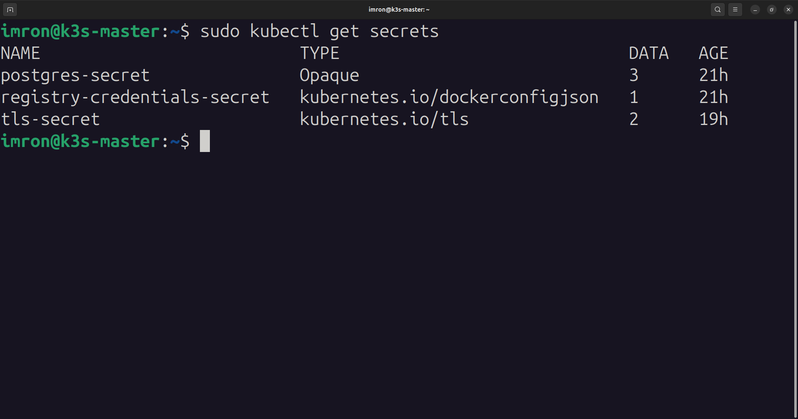
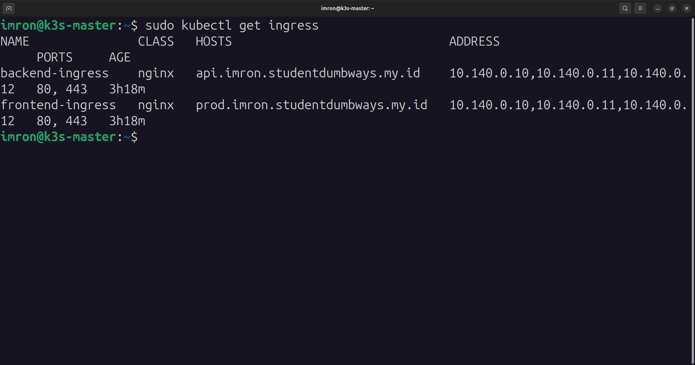

# Deployment Aplikasi dengan Kubernetes

## Daftar Isi
- [Prasyarat](#prasyarat)
- [1. Instalasi K3s](#1-instalasi-k3s)
- [2. Setup Ingress Nginx](#2-setup-ingress-nginx)
- [3. Konfigurasi Storage](#3-konfigurasi-storage)
- [4. Deployment Database](#4-deployment-database)
- [5. Konfigurasi Secret](#5-konfigurasi-secret)
- [6. Deployment Aplikasi](#6-deployment-aplikasi)
- [7. CICD Integration](#7-cicd-integration)
- [8. Konfigurasi Domain](#8-konfigurasi-domain)
- [Troubleshooting](#troubleshooting)

## Prasyarat
- Server dengan OS Linux
- Minimal RAM 2GB
- CPU 2 Core
- Storage 20GB
- Domain yang sudah dikonfigurasi

## Struktur Folder
*  <br>

## 1. Instalasi K3s
1. K3s merupakan distribusi Kubernetes yang ringan. Berikut langkah instalasinya:

```bash
# Install K3s
curl -sfL https://get.k3s.io | sh -

# Verifikasi instalasi
kubectl get nodes
```
2. Tambahkan node agar masuk ke cluster

```bash
# lihat token
sudo cat /var/lib/rancher/k3s/server/node-token

# jalankan perintah ini ke server node
curl -sfL https://get.k3s.io | K3S_URL=https://<ip-master>:6443 K3S_TOKEN=<your-token> sh -

# cek status node
kubectl get nodes
```
*  <br>

## 2. Setup Ingress Nginx
1. Ingress diperlukan untuk mengatur akses eksternal:

```bash
# Install Helm terlebih dahulu
curl https://raw.githubusercontent.com/helm/helm/master/scripts/get-helm-3 | bash

# Add NGINX Ingress Helm Repository
helm repo add ingress-nginx https://kubernetes.github.io/ingress-nginx
helm repo update

# Install NGINX Ingress Controller
helm install ingress-nginx ingress-nginx/ingress-nginx

# Verifikasi instalasi
kubectl get pods -n ingress-nginx
```
*  <br>

## 3. Konfigurasi Storage
### Persistent Volume dan PVC untuk PostgreSQL

1. Create Persistent Volume and Persistent Volume Claim for PostgreSQL
```yaml
# pv-postgres.yaml
apiVersion: v1
kind: PersistentVolume
metadata:
  name: postgres-pv
spec:
  capacity:
    storage: 1Gi
  accessModes:
    - ReadWriteOnce
  hostPath:  
    path: /var/lib/postgresql/data

---
apiVersion: v1
kind: PersistentVolumeClaim
metadata:
  name: postgres-pvc
spec:
  accessModes:
    - ReadWriteOnce
  resources:
    requests:
      storage: 1Gi
```
2. Deploy Persistent Volume dan Persistent Volume Claim
```bash
kubectl apply -f pv-postgres.yaml
```
*  <br>

## 4. Deployment Database
### StatefulSet untuk PostgreSQL

1. Generate Secret
```bash
# Generate base64 untuk credentials
echo -n 'imron' | base64
echo -n 'imron123' | base64
echo -n 'dumbmerch' | base64
```

2. Konfigurasi Secret
```yaml
# secret-postgres.yaml
apiVersion: v1
kind: Secret
metadata:
  name: postgres-secret
type: Opaque
data:
  POSTGRES_DB: ZHVtbWVyY2g=  # Base64 encoding for "dumbmerch"
  POSTGRES_USER: aW1yb24=     # Base64 encoding for "imron"
  POSTGRES_PASSWORD: aW1yb24xMjM=  # Base64 encoding for "imron123"
```

3. Create statefulset postgres
```yaml
# statefulset-postgres.yaml
apiVersion: apps/v1
kind: StatefulSet
metadata:
  name: postgres
spec:
  serviceName: db 
  replicas: 1
  selector:
    matchLabels:
      app: postgres
  template:
    metadata:
      labels:
        app: postgres
    spec:
      containers:
        - name: postgres
          image: postgres:latest
          ports:
            - containerPort: 5432
          envFrom:
            - secretRef:
                name: postgres-secret  # Menggunakan secret yang berisi environment variables
          volumeMounts:
            - name: postgres-storage
              mountPath: /var/lib/postgresql/data
      volumes:
        - name: postgres-storage
          persistentVolumeClaim:
            claimName: postgres-pvc 
```
*  <br>

4. deploy konfigurasi file yaml
```bash
kubectl apply -f statefulset-postgres.yaml
kubectl apply -f secret-postgres.yaml
```

## 5. Deployment Aplikasi
### Backend Deployment

1. Konfigurasi password docker login, karena nantinya kita akan pakai docker registry private
```yaml
# registry-credentials-secret.yaml
apiVersion: v1
kind: Secret
metadata:
  name: registry-credentials-secret
type: Opaque
data:
  username: aW1yb24=          # Base64 encoding for "imron"
  password: aW1yb24xMjM=      # Base64 encoding for "imron123"
```

2. Deploy backend
```yaml
# backend.yaml
apiVersion: apps/v1
kind: Deployment
metadata:
  name: backend
  namespace: default  # Pastikan namespace sesuai
spec:
  replicas: 2
  selector:
    matchLabels:
      app: backend
  template:
    metadata:
      labels:
        app: backend
    spec:
      imagePullSecrets:
        - name: registry-credentials-secret  # Nama secret yang digunakan
      containers:
      - name: backend
        image: registry.imron.studentdumbways.my.id/backend-prod:production
        imagePullPolicy: Always  # Memastikan image terbaru selalu di-pull
        ports:
        - containerPort: 5000
---
apiVersion: v1
kind: Service
metadata:
  name: backend-service
  namespace: default
spec:
  selector:
    app: backend
  ports:
    - protocol: TCP
      port: 80
      targetPort: 5000
      nodePort: 30081  # Port NodePort yang digunakan untuk backend
  type: NodePort
```
3. Deploy backend dengan kubernetes
```bash
kubectl apply -f backend.yaml
```


## 6. Deployment Aplikasi
### Frontend Deployment

1. Create frontend.yaml
```yaml
# frontend.yaml
apiVersion: apps/v1
kind: Deployment
metadata:
  name: frontend
  namespace: default  
spec:
  replicas: 3
  selector:
    matchLabels:
      app: frontend
  template:
    metadata:
      labels:
        app: frontend
    spec:  
      imagePullSecrets:
        - name: registry-credentials-secret  
      containers:
      - name: frontend
        image: registry.imron.studentdumbways.my.id/frontend-prod:production
        imagePullPolicy: Always   # Menambahkan imagePullPolicy untuk memastikan penarikan image terbaru
        ports:
        - containerPort: 3000
---
apiVersion: v1
kind: Service
metadata:
  name: frontend-service
  namespace: default
spec:
  selector:
    app: frontend
  ports:
    - protocol: TCP
      port: 80
      targetPort: 3000
      nodePort: 30080  # Port NodePort yang akan digunakan
  type: NodePort
```

2. Deploy frontend
```bash
kubectl apply -f frontend.yaml
```

3. Cek status deployment backend dan frontend
```bash
kubectl get deployment
```
*  <br>

## 7. CICD Integration
1. Create file Jenkinsfile to repository be-dumbmerch branch production

```groovy
pipeline {
    agent any

    environment {
        DOCKER_REGISTRY_SERVER  = credentials('docker-registry-server')
        DOCKER_IMAGE_PROD       = credentials('docker-image-be-prod')
        DOCKER_TAG_PROD         = credentials('docker-tag-prod')
        REPO_URL                = credentials('repo-url-be')
    }

    stages {
        stage('Pull Repository') {
            steps {
                script {
                    echo "Menarik kode dari repository branch production..."
                    git branch: 'production', 
                        url: "${REPO_URL}", 
                        credentialsId: 'ssh-credentials-id'
                }
            }
        }

        stage('Build Application') {
            steps {
                script {
                    echo "Membangun Docker image di Jenkins..."
                    sh """
                        docker build -t ${DOCKER_REGISTRY_SERVER}/${DOCKER_IMAGE_PROD}:${DOCKER_TAG_PROD} .
                    """
                }
            }
        }

        stage('Push to Docker Registry') {
            steps {
                script {
                    echo "Push Docker image ke registry private..."
                    sh """
                        docker push ${DOCKER_REGISTRY_SERVER}/${DOCKER_IMAGE_PROD}:${DOCKER_TAG_PROD}
                        docker image prune -f
                    """
                }
            }
        }

        stage('Deploy to Kubernetes') {
            steps {
                script {
                    echo "Mendeploy aplikasi ke Kubernetes cluster k3s..."
                    sshagent(credentials: ['ssh-credentials-id']) {
                        withCredentials([
                            string(credentialsId: 'ssh-user', variable: 'SSH_USER'), 
                            string(credentialsId: 'remote-master', variable: 'REMOTE_MASTER')
                        ]) {
                            sh """
                                ssh -o StrictHostKeyChecking=no ${SSH_USER}@${REMOTE_MASTER} << EOF
                                cd be
                                sudo kubectl delete -f backend-deployment.yml
                                sudo kubectl apply -f backend-deployment.yml
                                echo "Redeploy Berhasil di Kubernetes"
                                exit
                                EOF
                            """
                        }
                    }
                }
            }
        }
    }
}
```
*  <br>

## 7. Set up ssl domain
1. Pergi ke server nginx
2. lalu copy file sertifikat ssl
3. lalu paste ke dalam ssl yang akan kita buat
4. buat folder mkdir ssl
5. copy file fullchain.pem dan privkey.pem ke dalam folder ssl
6. deploy tls-secret
```bash
kubectl create secret tls tls-secret --cert=/home/imron/ssl/fullchain.pem --key=/home/imron/ssl/privkey.pem
```
7. cek apakah tls-secret berhasil di deploy
```bash
kubectl get secrets
```
*  <br>

## 8. Konfigurasi Domain
### Setup Ingress

1. Create file be-ingress.yaml
```yaml
# be-ingress.yaml
apiVersion: networking.k8s.io/v1
kind: Ingress
metadata:
  name: backend-ingress
  namespace: default  
spec:
  ingressClassName: nginx  
  tls:
  - hosts:
    - api.imron.studentdumbways.my.id
    secretName: tls-secret  # Secret untuk TLS
  rules:
  - host: api.imron.studentdumbways.my.id
    http:
      paths:
      - path: /
        pathType: Prefix
        backend:
          service:
            name: backend-service
            port:
              number: 80
```

2. Deploy Ingress
```bash
kubectl apply -f be-ingress.yaml
```

3. Create file fe-ingress-nginx.yaml

```yaml
apiVersion: networking.k8s.io/v1
kind: Ingress
metadata:
  name: frontend-ingress
  namespace: default  
spec:
  ingressClassName: nginx 
  tls:
  - hosts:
    - prod.imron.studentdumbways.my.id
    secretName: tls-secret  # Secret untuk TLS
  rules:
  - host: prod.imron.studentdumbways.my.id
    http:
      paths:
      - path: /
        pathType: Prefix
        backend:
          service:
            name: frontend-service
            port:
              number: 80
```

4. Deploy Ingress
```bash
kubectl apply -f fe-ingress-nginx.yaml
```

5. Cek status ingress
```bash
kubectl get ingress
```
*  <br>

## Troubleshooting
### Common Issues dan Solusi

1. **Issue**: Pod dalam status `Pending`
   **Solusi**: Cek resource dengan `kubectl describe pod [nama-pod]`

2. **Issue**: Database tidak dapat diakses
   **Solusi**: 
   - Verifikasi secret: `kubectl get secrets`
   - Cek logs: `kubectl logs [nama-pod]`

3. **Issue**: Ingress tidak berfungsi
   **Solusi**:
   - Cek status nginx: `kubectl get pods -n ingress-nginx`
   - Verifikasi konfigurasi: `kubectl describe ingress`

### Perintah Berguna

```bash
# Lihat logs
kubectl logs -f [nama-pod]

# Masuk ke dalam pod
kubectl exec -it [nama-pod] -- /bin/bash

# Cek status resources
kubectl get all -A

# Hapus resource
kubectl delete -f [nama-file.yaml]
```