# Step-by-Step: Setup Frontend dan Backend + CI/CD

## 1. Membuat Repositori Private

1. **Login ke GitHub/GitLab**.
2. Klik tombol **New Repository**.
3. Beri nama repositori sesuai kebutuhan, misalnya `fe-dumbmerch` dan `be-dumbmerch`.
4. **Set repositori ke Private**.
5. Tambahkan user `rizqyalvindra@gmail.com` sebagai **collaborator**.

**Screenshot:**
* 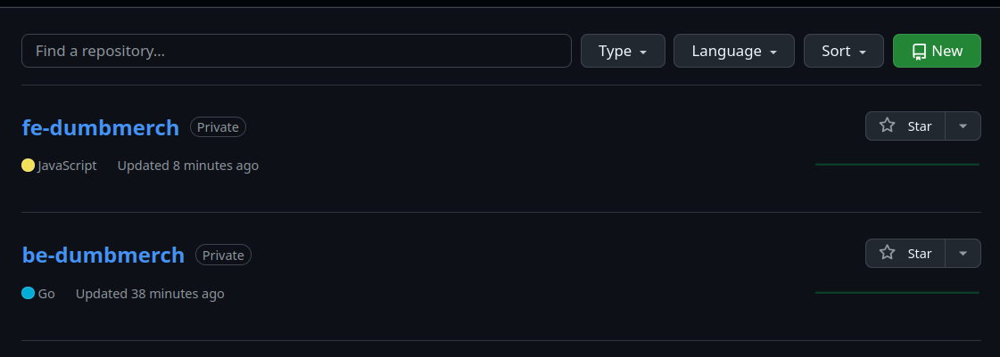 <br>
*  <br>

## 2. Clone dan Setup Frontend

1. Buka terminal dan clone repository frontend:

```bash
git clone https://github.com/demo-dumbways/fe-dumbmerch.git fe-dumbmerch
cd fe-dumbmerch
```

2. Install **NodeJS v16.x atau lebih**:
   * Install NodeJS
```bash
curl -o- https://raw.githubusercontent.com/nvm-sh/nvm/v0.39.5/install.sh | bash
source ~/.bashrc
nvm install 16
```

3. Install dependencies untuk project frontend:

```bash
npm install
```

4. Buat file `.env` untuk integrasi frontend-backend:

```
REACT_APP_BASEURL=https://api.imron.studentdumbways.my.id/api/v1
```

5. Test apakah frontend bisa berjalan:

```bash
npm start
```

**Screenshot:**
* 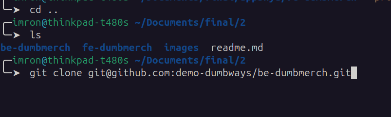 <br>
* 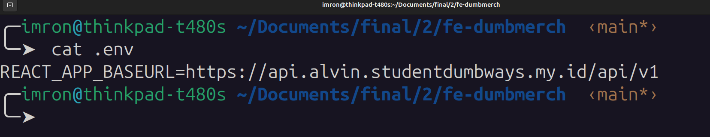 <br>
* 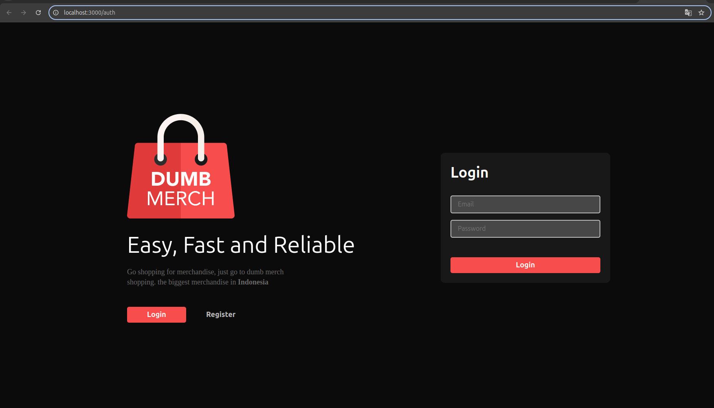 <br>

## 3. Clone dan Setup Backend

1. Clone repository backend:

```bash
git clone https://github.com/demo-dumbways/be-dumbmerch.git 
```

2. Install **Golang v1.16.x atau lebih**:
   * Install Golang

3. Buat file `.env` untuk integrasi database:

```
DB_HOST=localhost
DB_PORT=5432
DB_USER=your-db-user
DB_PASSWORD=your-db-password
DB_NAME=dumbmerch_db
```

4. Jalankan backend:

```bash
go run main.go
```

**Screenshot:**
* 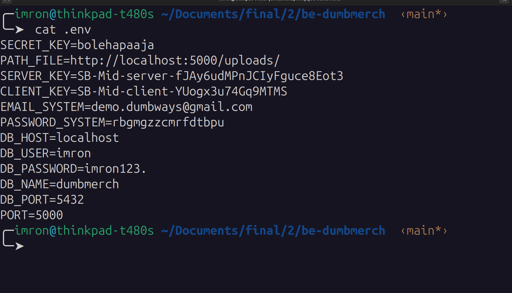 <br>
* 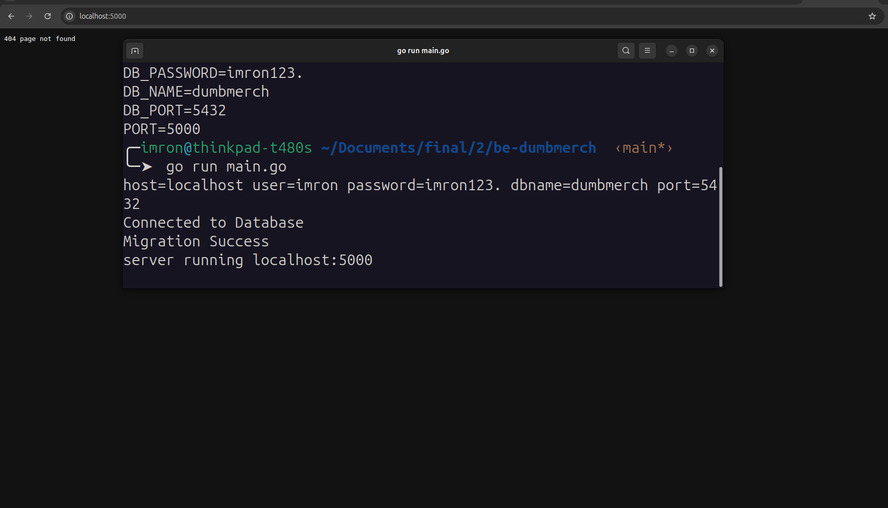 <br>

## 4. Buat Branch: Staging dan Production

1. Buka terminal di folder project frontend/backend.
2. Buat dan pindah ke branch **staging**:

```bash
git checkout -b staging
```

3. Push branch ke GitHub:

```bash
git push origin staging
```

4. Ulangi langkah di atas untuk membuat branch **production**:

```bash
git checkout -b production
git push origin production
```

**Screenshot:**
* 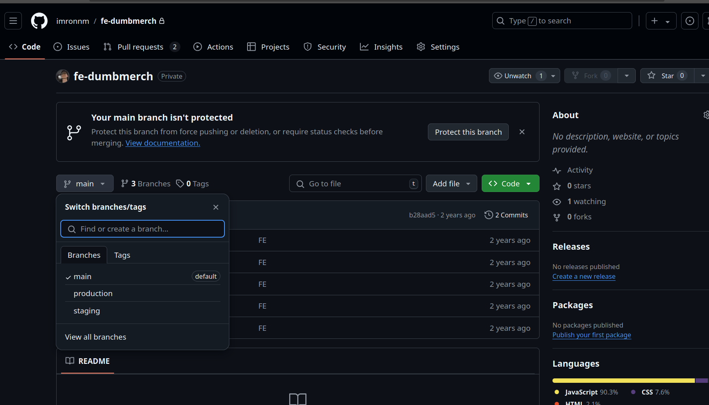 <br>
* 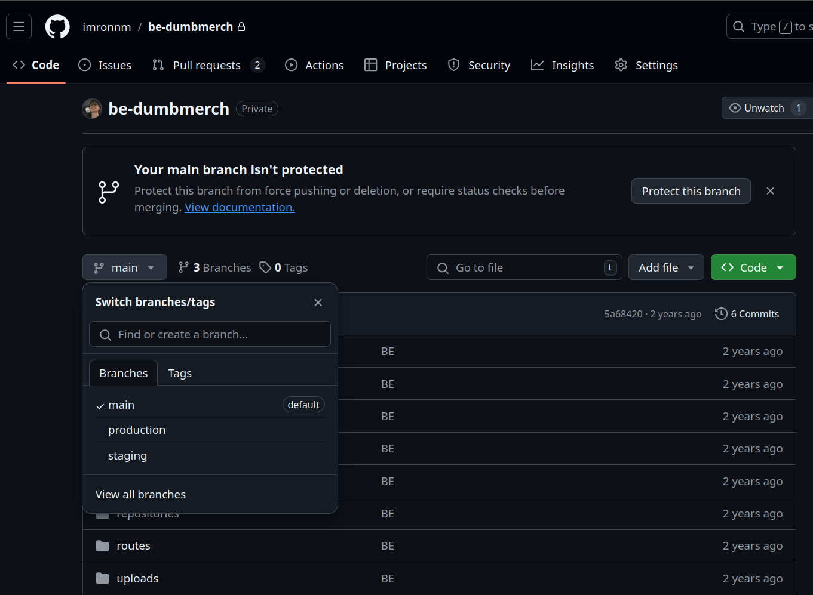 <br>

## 5. Konfigurasi CI/CD untuk Branch Staging dan Production

### Frontend CI/CD (Menggunakan GitHub Actions)

1. Buat file baru `.github/workflows/deploy.yml` di repositori frontend.
2. Isi dengan konfigurasi berikut:

```yaml
name: Frontend Deployment

on:
  push:
    branches:
      - staging
      - production

jobs:
  build:
    runs-on: ubuntu-latest
    steps:
      - uses: actions/checkout@v2
      - name: Setup Node.js
        uses: actions/setup-node@v2
        with:
          node-version: 16

      - name: Install Dependencies
        run: npm install

      # Setting CI=false to bypass warnings as errors
      - name: Build Application
        run: |
          export CI=false
          npm run build

      - name: Notify Success
        run: echo "Build and deployment successful!"

```

3. Commit dan push ke **staging** dan **production** branch.

**Screenshot:**
* 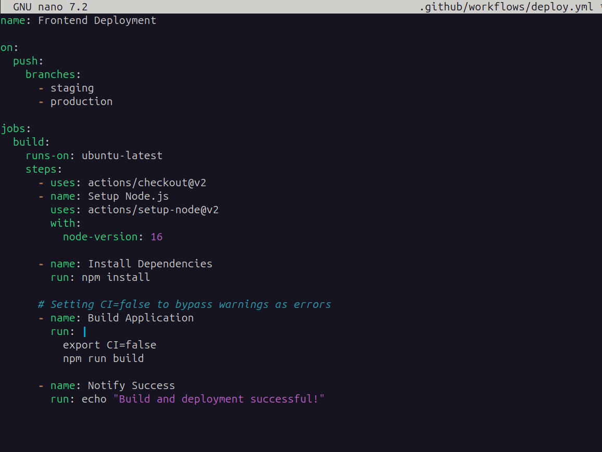 <br>

### Backend CI/CD (Menggunakan GitHub Actions)

1. Buat file baru `.github/workflows/deploy.yml` di repositori backend.
2. Isi dengan konfigurasi berikut:

```yaml
name: Backend Deployment

on:
  push:
    branches:
      - staging
      - production

jobs:
  build:
    runs-on: ubuntu-latest
    steps:
      - uses: actions/checkout@v2
      - name: Setup Go
        uses: actions/setup-go@v2
        with:
          go-version: 1.16
      - run: go build -o main .
      - run: echo "Backend Deployment Complete!"
```

3. Commit dan push ke **staging** dan **production** branch.

**Screenshot:**
* 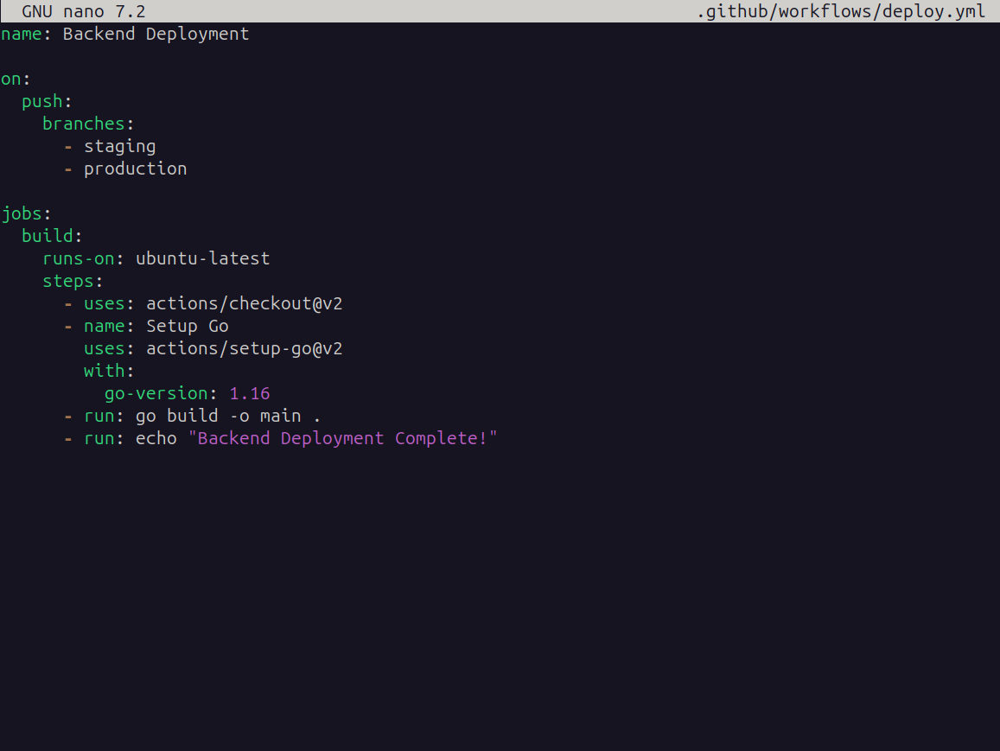 <br>

## 6. Test dan Verifikasi Deployment

1. Pastikan setiap kali melakukan push ke branch **staging** atau **production**, workflow CI/CD otomatis berjalan di GitHub Actions.
2. Cek status di tab **Actions** pada masing-masing repositori.

**Screenshot:**
* 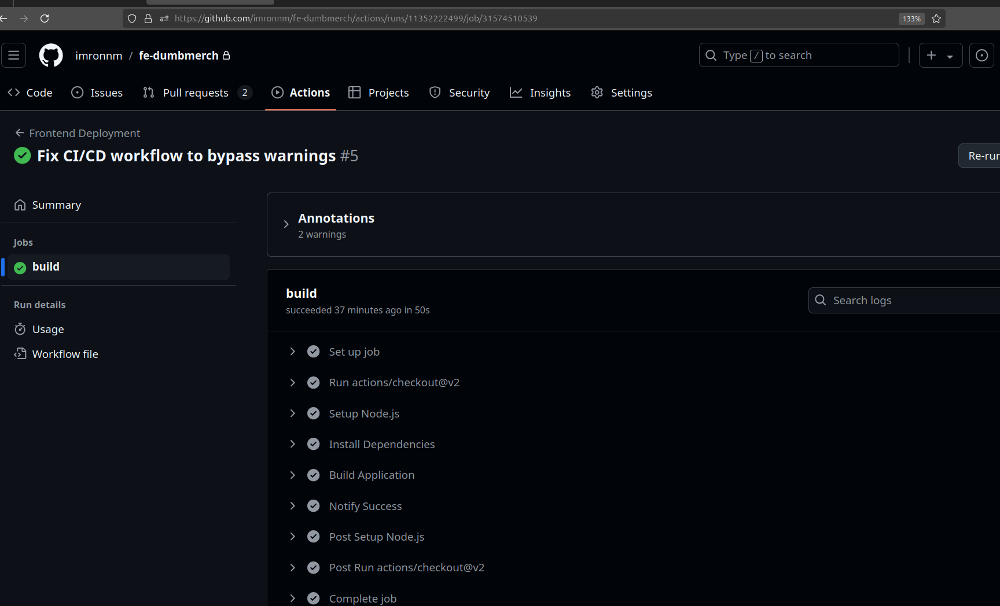 <br>
* 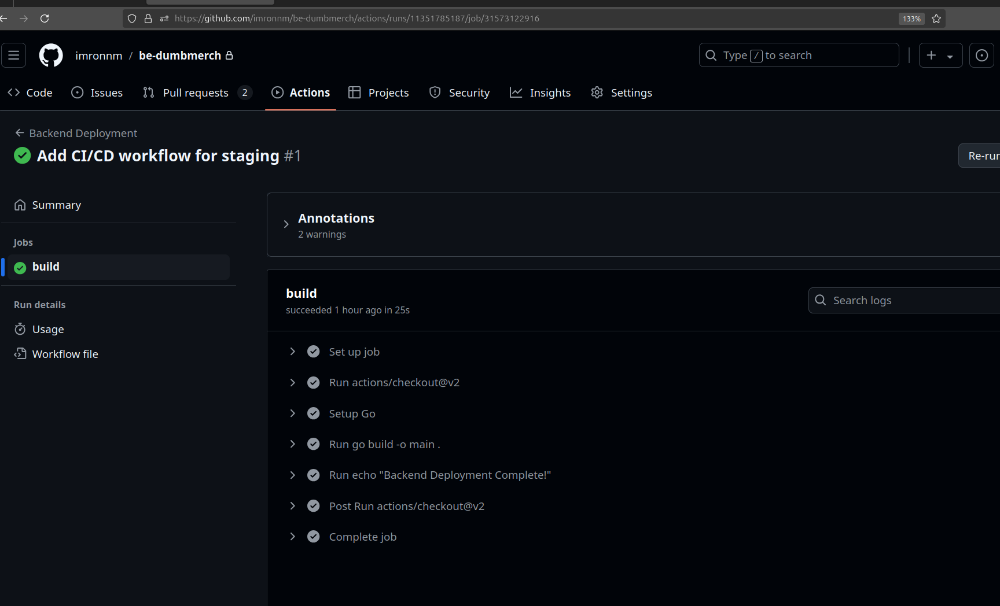 <br>