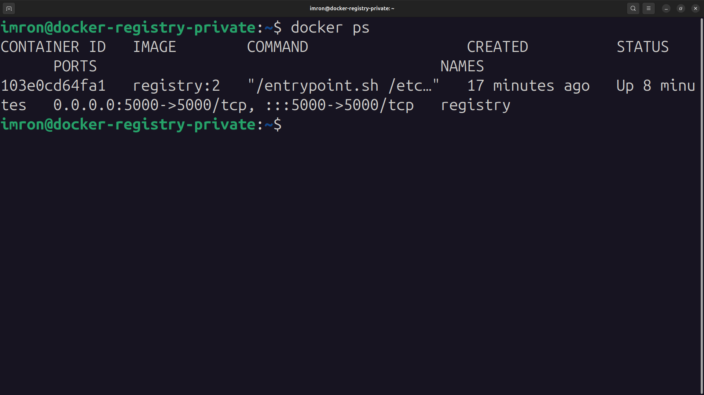
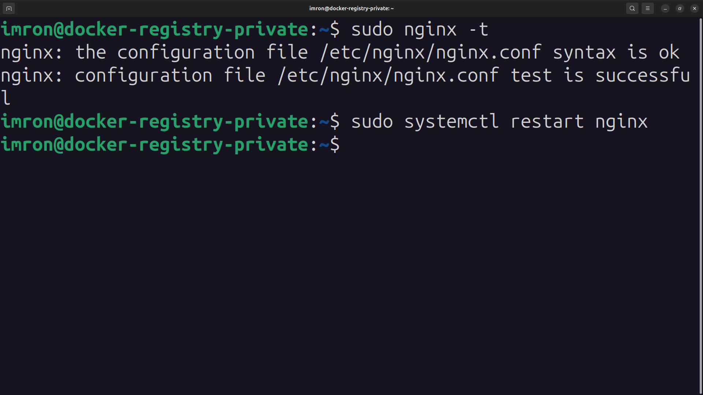
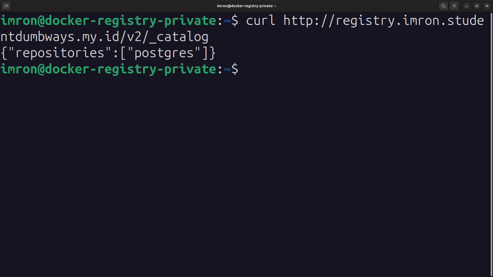

# Docker Registry Setup Guide

## Step 1: Instalasi Docker di Server

1. **Login ke Server** dengan user `imron`:
```bash
ssh imron@34.101.163.41
```

2. **Update dan Install Dependensi Awal**:
```bash
sudo apt-get update
sudo apt-get install ca-certificates curl
sudo install -m 0755 -d /etc/apt/keyrings
sudo curl -fsSL https://download.docker.com/linux/ubuntu/gpg -o /etc/apt/keyrings/docker.asc
sudo chmod a+r /etc/apt/keyrings/docker.asc
```

3. **Tambahkan Repository Docker ke Apt Sources**:
```bash
echo \
"deb [arch=$(dpkg --print-architecture) signed-by=/etc/apt/keyrings/docker.asc] https://download.docker.com/linux/ubuntu \
$(. /etc/os-release && echo "$VERSION_CODENAME") stable" | \
sudo tee /etc/apt/sources.list.d/docker.list > /dev/null
sudo apt-get update
```

4. **Install Docker**:
```bash
sudo apt-get install docker-ce docker-ce-cli containerd.io docker-buildx-plugin docker-compose-plugin
```
* Tambahkan group docker ke user imron
```bash
sudo usermod -aG docker imron
```

## Step 2: Deploy Docker Registry Private

1. **Menjalankan Docker Registry Private**:
```bash
docker run -d -p 5000:5000 --restart=always --name registry \
-v /path/ke/registry:/var/lib/registry \
-v /path/ke/auth:/auth \
-e "REGISTRY_AUTH=htpasswd" \
-e "REGISTRY_AUTH_HTPASSWD_REALM=Registry Realm" \
-e REGISTRY_AUTH_HTPASSWD_PATH=/auth/htpasswd \
registry:2

```
* Port default untuk Docker Registry adalah `5000`.

3. **masuk ke server nginx **
- buat htpasswd untuk username dan password login docker
- install terlebih dahulu
```bash
sudo apt-get install apache2-utils

mkdir -p /auth
sudo htpasswd -Bc /auth/htpasswd imron
```
- jika diminta password, masukkan password untuk nanti login

- tambahkan file ini ke dalam reverse proxy
```bash
        # Basic Authentication (via htpasswd)
        auth_basic "Private Docker Registry";
        auth_basic_user_file /auth/htpasswd;
```

- cek ke server yang lain coba untuk login
```bash
docker login registry.imron.studentdumbways.my.id
```
- masukkan password dan username yang sudah dibuat

2. **Cek Apakah Docker Registry Berjalan**:
```bash
docker ps
```
*  <br>.

## Step 3: Konfigurasi Reverse Proxy untuk Docker Registry

1. **Install NGINX**:
```bash
sudo apt-get install nginx
```

2. **Konfigurasi NGINX sebagai Reverse Proxy**:
* Buka file konfigurasi NGINX:
```bash
sudo nano /etc/nginx/sites-available/registry.conf
```

* Tambahkan konfigurasi berikut:
```bash
server {
    listen 80;
    server_name registry.imron.studentdumbways.my.id;

    ssl_certificate /etc/letsencrypt/live/imron.studentdumbways.my.id/fullchain.pem;
    ssl_certificate_key /etc/letsencrypt/live/imron.studentdumbways.my.id/privkey.pem;

    location / {
        proxy_pass http://localhost:5000;
        proxy_set_header Host $host;
        proxy_set_header X-Real-IP $remote_addr;
        proxy_set_header X-Forwarded-For $proxy_add_x_forwarded_for;
        proxy_set_header X-Forwarded-Proto $scheme;
    }
}
```

3. **Aktifkan Konfigurasi NGINX**:
```bash
sudo ln -s /etc/nginx/sites-available/registry.conf /etc/nginx/sites-enabled/
sudo nginx -t
sudo systemctl restart nginx
```
*  <br>.

## Step 4: Push Docker Image ke Registry

1. **Build image be dan fe**:
- Lakukan git clone pada repo fe dan be

```bash
git clone https://github.com/demo-dumbways/fe-dumbmerch.git
git clone https://github.com/demo-dumbways/be-dumbmerch.git
```

- Set up Dockerfile BE
```bash
```dockerfile
# Stage 1: Build aplikasi
FROM golang:1.18-alpine AS builder  
WORKDIR /app
COPY . .
RUN go mod tidy
RUN go build -o main

# Stage 2: Menjalankan aplikasi
FROM alpine:latest
WORKDIR /root/
COPY --from=builder /app/main .
COPY .env .  
EXPOSE 5000
CMD ["./main"]
```
- Dockerfile FE
```bash
# Stage 1: Tahap Build
FROM node:16-alpine AS build

# Tentukan working directory di dalam container
WORKDIR /app

# Salin package.json dan package-lock.json untuk install dependencies
COPY package*.json ./

# Install dependencies
RUN npm install

# Salin semua file aplikasi ke dalam container
COPY . .

# Build aplikasi
RUN npm run build

# Stage 2: Tahap Production
FROM node:16-alpine

# Tentukan working directory di dalam container
WORKDIR /app

# Salin hasil build dari Stage 1 ke Stage 2
COPY --from=build /app /app

# Expose port 3000
EXPOSE 3000

# Jalankan aplikasi React
CMD ["npm", "start"]
```

- Masuk ke direktori folder FE
- lakukan build image fe

```bash
docker build -t imron-frontend .
```

- Masuk ke direktori folder BE
```bash
docker build -t imron-backend .
```

2. **Tag Image yang Ingin Dikirim ke Registry**:
```bash
docker tag imron-frontend:latest registry.imron.studentdumbways.my.id/imron-frontend:latest
```

```bash
docker tag imron-backend:latest registry.imron.studentdumbways.my.id/imron-backend:latest

```

3. **Push Image ke Docker Registry**:
```bash
docker push registry.imron.studentdumbways.my.id/postgres
```

## Step 5: Verifikasi Image di Registry

1. **Cek Image yang Tersedia di Registry**:
```bash
curl https://registry.imron.studentdumbways.my.id/v2/_catalog
```
*  <br>.