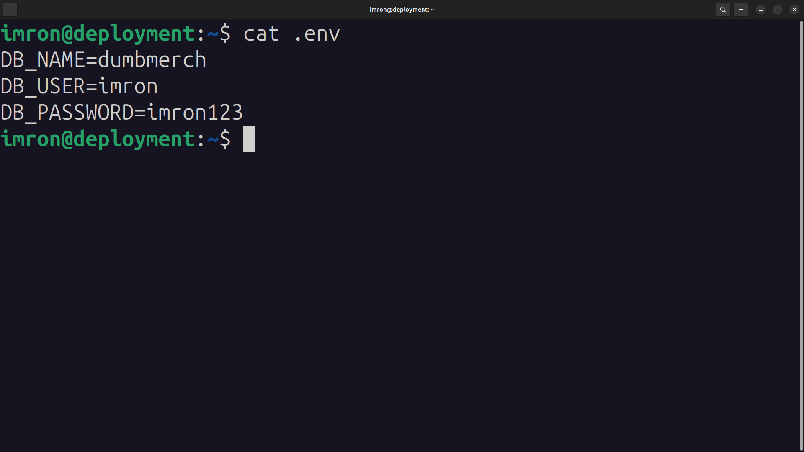
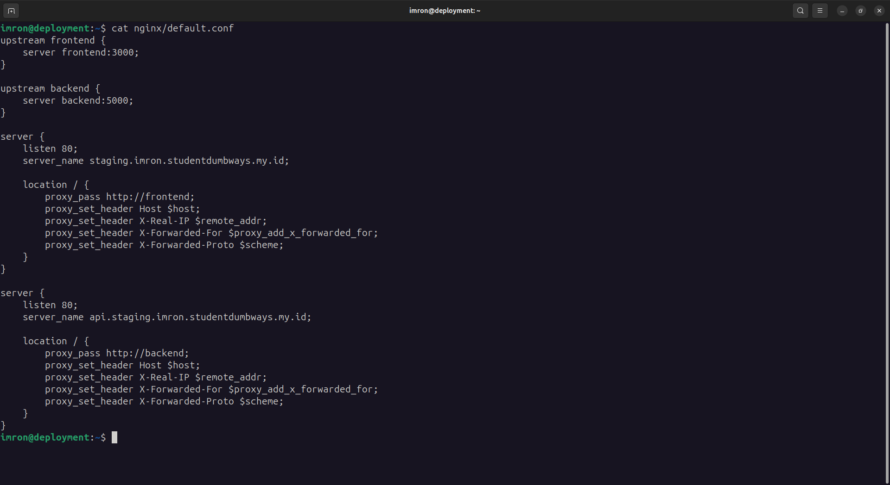
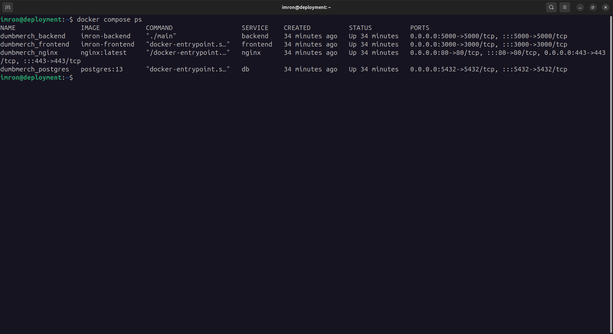
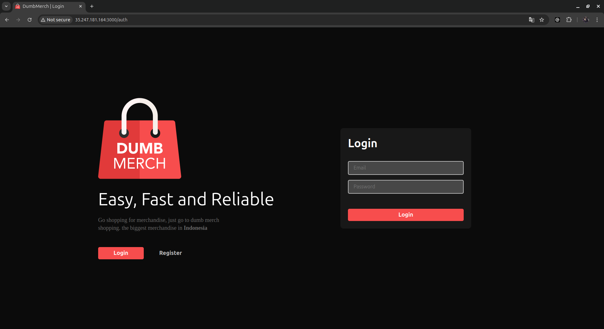
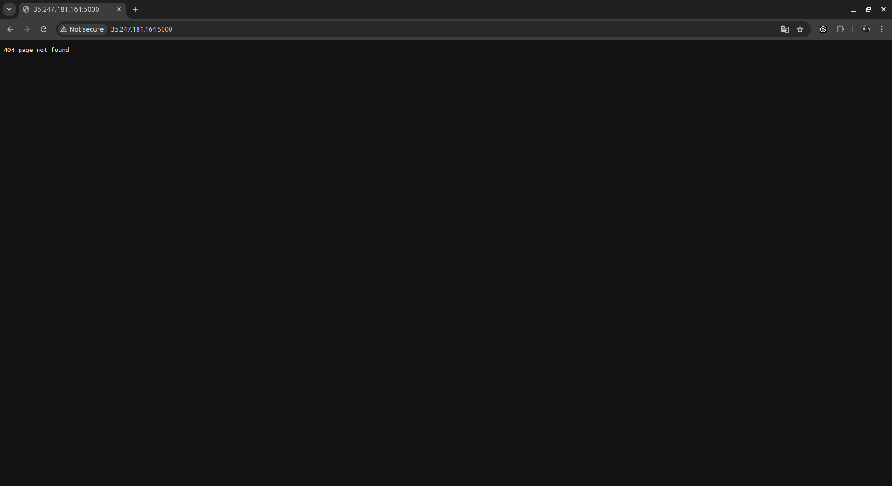
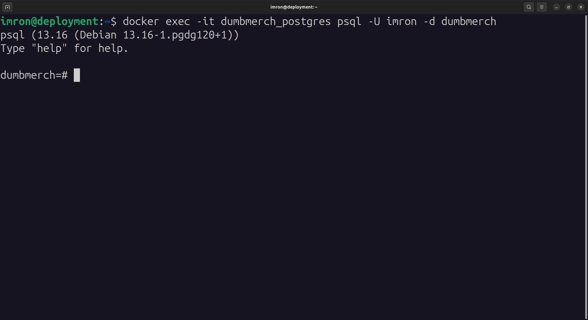

# Panduan Deployment Docker - Dumbmerch 🐳

Panduan ini akan membantu Anda dalam melakukan deployment Dumbmerch menggunakan Docker dengan konfigurasi yang telah dioptimalkan, termasuk multi-stage builds dan load balancing.

## Prasyarat

- Docker dan Docker Compose sudah terinstal
- Project Node.js (Frontend dan Backend)
- Pemahaman dasar tentang Docker dan PostgreSQL

## Struktur Project

```
.
├── docker-compose.yml
├── .env
├── fe-dumbmerch/
├── be-dumbmerch/
└── dbdata/
```

## 1. Pengaturan Environment

Buat file `.env` di direktori utama dengan konfigurasi berikut:

```bash
DB_NAME=dumbmerch
DB_USER=imron
DB_PASSWORD=imron123
```

* .env untuk fe
```bash
REACT_APP_BASEURL=https://api.staging.imron.studentdumbways.my.id/api/v1
``

* .env untuk be
```bash
DB_HOST=db
DB_NAME=dumbmerch
DB_USER=imron
DB_PASSWORD=imron123
DB_PORT=5432
PORT=5000
`

 *  <br>


## 2. Konfigurasi Docker

### Backend Dockerfile (Multi-stage Build)

Buat Dockerfile ini di direktori backend:

```dockerfile
# Stage 1: Build aplikasi
FROM golang:1.18-alpine AS builder  
WORKDIR /app
COPY . .
RUN go mod tidy
RUN go build -o main

# Stage 2: Menjalankan aplikasi
FROM alpine:latest
WORKDIR /root/
COPY --from=builder /app/main .
COPY .env .  
EXPOSE 5000
CMD ["./main"]
```

### Frontend Dockerfile (Multi-stage Build)

Buat Dockerfile ini di direktori frontend:

```dockerfile
# Stage 1: Tahap Build
FROM node:16-alpine AS build

# Tentukan working directory di dalam container
WORKDIR /app

# Salin package.json dan package-lock.json untuk install dependencies
COPY package*.json ./

# Install dependencies
RUN npm install

# Salin semua file aplikasi ke dalam container
COPY . .

# Build aplikasi
RUN npm run build

# Stage 2: Tahap Production
FROM node:16-alpine

# Tentukan working directory di dalam container
WORKDIR /app

# Salin hasil build dari Stage 1 ke Stage 2
COPY --from=build /app /app

# Expose port 3000
EXPOSE 3000

# Jalankan aplikasi React
CMD ["npm", "start"]
```

### Konfigurasi NGINX Load Balancer

Buat file `nginx.conf` di direktori utama:

```bash
upstream frontend {
    server frontend:3000;
}

upstream backend {
    server backend:5000;
}

server {
    listen 80;
    server_name staging.imron.studentdumbways.my.id;

    location / {
        proxy_pass http://frontend;
        proxy_set_header Host $host;
        proxy_set_header X-Real-IP $remote_addr;
        proxy_set_header X-Forwarded-For $proxy_add_x_forwarded_for;
        proxy_set_header X-Forwarded-Proto $scheme;
    }
}

server {
    listen 80;
    server_name api.staging.imron.studentdumbways.my.id;

    location / {
        proxy_pass http://backend;
        proxy_set_header Host $host;
        proxy_set_header X-Real-IP $remote_addr;
        proxy_set_header X-Forwarded-For $proxy_add_x_forwarded_for;
        proxy_set_header X-Forwarded-Proto $scheme;
    }
}
```

 *  <br>

## 3. Langkah-langkah Deployment

### 1. Memulai Aplikasi

* Buat file compose

```yaml
services:
  db:
    image: postgres:13
    container_name: dumbmerch_postgres
    restart: always
    environment:
      POSTGRES_DB: ${DB_NAME}
      POSTGRES_USER: ${DB_USER}
      POSTGRES_PASSWORD: ${DB_PASSWORD}
    volumes:
      - ./dbdata:/var/lib/postgresql/data
    ports:
      - "5432:5432"
    networks:
      - dumbmerch_network

  backend:
    build: ./be-dumbmerch
    container_name: dumbmerch_backend
    ports:
      - "5000:5000"
    depends_on:
      - db
    networks:
      - dumbmerch_network

  frontend:
    build: ./fe-dumbmerch
    container_name: dumbmerch_frontend
    ports:
      - "3000:3000"
    depends_on:
      - backend
    networks:
      - dumbmerch_network
  nginx:
    image: nginx:latest
    container_name: dumbmerch_nginx
    volumes:
      - ./nginx/default.conf:/etc/nginx/conf.d/default.conf
    ports:
      - "80:80"
      - "443:443"
    depends_on:
      - frontend
      - backend
    networks:
      - dumbmerch_network

networks:
  dumbmerch_network:
    driver: bridge
```

Jalankan dengan perintah:
```bash
docker-compose up -d --build
```

Cek apakah semua container sudah berjalan
```bash
docker compose ps
```
 *  <br>

### 2. Konfigurasi Akses Remote PostgreSQL

1. Akses container PostgreSQL:
```bash
docker exec -it dumbmerch_postgres bash
```

2. Update konfigurasi PostgreSQL:
   - Atur `listen_addresses = '*'` di `postgresql.conf`
   - Tambahkan di `pg_hba.conf`:
   - kita tidak perlu melakukan ini, karena secara default sudah konfigurasinya sudah bisa diakses public

```bash
# TYPE  DATABASE        USER            ADDRESS                 METHOD
host    all            all             0.0.0.0/0               md5
```

## 4. Verifikasi Deployment

1. Akses frontend: `http://35.247.181.164:3000` 

 *  <br>

2. Tes endpoint API: `http://35.247.181.164:5000`

 *  <br>

3. Verifikasi koneksi database: 

```bash
docker exec -it dumbmerch_postgres psql -U imron -d dumbmerch
```

 *  <br>
