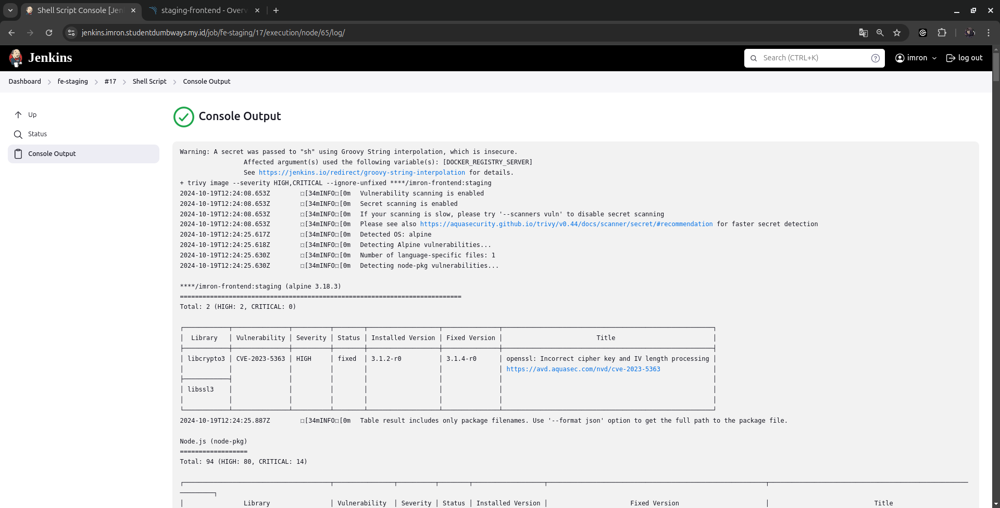
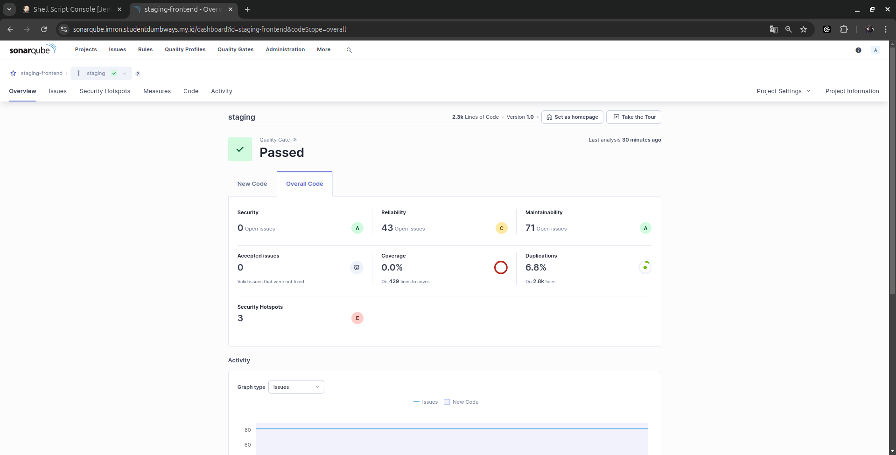
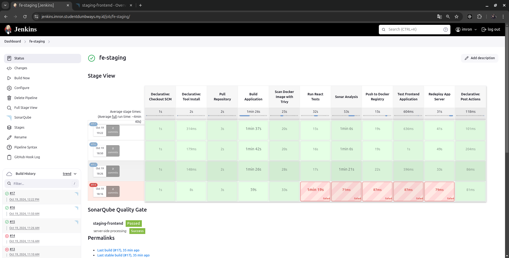

# Dokumentasi Pipeline CI/CD testing untuk Frontend Staging

Dokumentasi ini menjelaskan pipeline Jenkins yang digunakan untuk mengotomatisasi proses pengujian, pembangunan, dan deployment aplikasi frontend staging. Setiap pekerjaan dijelaskan secara detail, dengan fokus pada pengujian menggunakan SonarQube, wget spider, dan Trivy.

## Gambaran Umum Pipeline

Pipeline terdiri dari beberapa tahap:
- Mengambil repositori dari GitHub
- Membangun image Docker aplikasi
- Memindai kerentanan image Docker menggunakan Trivy
- Menjalankan unit test untuk aplikasi React
- Menganalisis kualitas kode menggunakan SonarQube
- Mengunggah image Docker ke registry privat
- Menguji aplikasi yang berjalan menggunakan wget spider
- Mendeploy ulang aplikasi di server remote

## Rincian Tahapan

### Rincian CI CD
```groovy
pipeline {
    agent any

    environment {
        DOCKER_REGISTRY_SERVER  = credentials('docker-registry-server')
        DOCKER_IMAGE            = credentials('docker-image')
        DOCKER_TAG              = credentials('docker-tag')
        REPO_URL                = credentials('repo-url')
    }

    tools {
        nodejs 'nodejs-16'
    }

    stages {
        stage('Pull Repository') {
            steps {
                script {
                    echo "Menarik kode dari repository branch staging..."
                    git branch: "staging", 
                        url: "${REPO_URL}", 
                        credentialsId: 'ssh-credentials-id'
                }
            }
        }

        stage('Build Application') {
            steps {
                script {
                    echo "Membangun Docker image di Jenkins..."
                    sh """
                    docker build -t ${DOCKER_REGISTRY_SERVER}/${DOCKER_IMAGE}:${DOCKER_TAG} .
                    """
                }
            }
        }

        stage('Scan Docker Image with Trivy') {
            steps {
                script {
                    echo "Memindai Docker image dengan Trivy untuk kerentanan keamanan..."
                    sh """
                    trivy image --severity HIGH,CRITICAL --ignore-unfixed ${DOCKER_REGISTRY_SERVER}/${DOCKER_IMAGE}:${DOCKER_TAG}
                    """
                }
            }
        }

        stage('Run React Tests') {
            steps {
                script {
                    echo "Menjalankan unit tests dan menghasilkan laporan coverage untuk aplikasi React..."
                    sh """
                    npm install
                    npm run test -- --coverage --passWithNoTests
                    """
                }
            }
        }

        stage('Sonar Analysis') {
            environment {
                scannerHome = tool 'sonar-4.7'
            }
            steps {
                withCredentials([string(credentialsId: 'sonar-login-token', variable: 'SONARQUBE_TOKEN'),
                                 string(credentialsId: 'sonarqube-url', variable: 'SONARQUBE_URL'),
                                 string(credentialsId: 'sonarqube-project-key', variable: 'SONARQUBE_PROJECT_KEY')]) {
                    withSonarQubeEnv('SonarQube') {
                        sh """
                        ${scannerHome}/bin/sonar-scanner \
                        -Dsonar.projectKey=${SONARQUBE_PROJECT_KEY} \
                        -Dsonar.projectName=staging-frontend \
                        -Dsonar.projectVersion=1.0 \
                        -Dsonar.sources=. \
                        -Dsonar.host.url=${SONARQUBE_URL} \
                        -Dsonar.token=$SONARQUBE_TOKEN
                        """
                    }
                }
            }
        }

        stage('Push to Docker Registry') {
            steps {
                script {
                    echo "Push Docker image ke registry private..."
                    sh """
                    docker push ${DOCKER_REGISTRY_SERVER}/${DOCKER_IMAGE}:${DOCKER_TAG}
                    docker image prune -f
                    """
                }
            }
        }

        stage('Test Frontend Application') {
            steps {
                script {
                    withCredentials([string(credentialsId: 'app-url', variable: 'APP_URL')]) {
                        echo "Testing halaman-halaman penting dari aplikasi frontend..."
                        sh """
                        wget --spider --method=GET --timeout=10 --tries=3 ${APP_URL}
                        """
                    }
                }
            }
        }

        stage('Redeploy App Server') {
            steps {
                script {
                    sshagent(credentials: ['ssh-credentials-id']) {
                        withCredentials([string(credentialsId: 'ssh-user', variable: 'SSH_USER'), 
                                         string(credentialsId: 'remote-server', variable: 'REMOTE_SERVER')]) {
                            sh """
                            ssh -o StrictHostKeyChecking=no ${SSH_USER}@${REMOTE_SERVER} << EOF
                            docker compose stop frontend
                            docker compose pull frontend
                            docker compose up -d --build frontend
                            docker image prune -f
                            echo "Redeploy Berhasil"
                            exit
                            EOF
                            """
                        }
                    }
                }
            }
        }
    }

    post {
        success {
            echo 'Pipeline berhasil dijalankan untuk frontend staging.'
        }
        failure {
            echo 'Pipeline gagal dijalankan untuk frontend staging.'
        }
    }
}


```

### sebelum melakukan setup tambahkan credentials ke dalam jenkins dashboard

 *  <br>

### 1. Mengambil Repositori
**Deskripsi**: Tahap ini mengambil kode terbaru dari branch staging repositori untuk memastikan Jenkins memiliki versi kode terbaru sebelum memulai proses build dan pengujian.

**Perintah**: Menggunakan perintah git.

```bash
git branch: "staging", url: "${REPO_URL}", credentialsId: 'github-ssh-key'
```

**Mengapa penting**: Memastikan bahwa Anda bekerja dengan kode terbaru dari repositori.

### 2. Membangun Aplikasi (Image Docker)
**Deskripsi**: Jenkins membangun image Docker untuk aplikasi frontend menggunakan Dockerfile yang ada di repositori.

**Perintah**: docker build

```bash
docker build -t ${DOCKER_REGISTRY_SERVER}/${DOCKER_IMAGE}:${DOCKER_TAG} .
```

**Mengapa penting**: Image Docker membuat aplikasi mudah dipindahkan dan dideploy di server manapun.

### 3. Memindai Image Docker dengan Trivy
**Deskripsi**: Pada tahap ini, image Docker dipindai untuk kerentanan keamanan menggunakan Trivy. Pemindaian fokus pada identifikasi masalah keamanan tingkat HIGH atau CRITICAL.

**Perintah**: trivy image

```bash
trivy image --severity HIGH,CRITICAL --ignore-unfixed ${DOCKER_REGISTRY_SERVER}/${DOCKER_IMAGE}:${DOCKER_TAG}
```

**Mengapa penting**: Memastikan image Docker tidak memiliki kerentanan kritis yang dapat dieksploitasi.
 *  <br>

### 4. Menjalankan Unit Test untuk Aplikasi React
**Deskripsi**: Unit test dijalankan untuk memastikan semua komponen aplikasi frontend React berfungsi sesuai harapan.

**Perintah**: npm run test

```bash
npm install
npm run test -- --coverage --passWithNoTests
```

**Mengapa penting**: Unit test membantu memverifikasi bahwa perubahan kode tidak menimbulkan bug atau masalah baru.

### 5. Menganalisis Kualitas Kode dengan SonarQube
**Deskripsi**: SonarQube digunakan untuk menganalisis kualitas kode, memeriksa potensi bug, duplikasi kode, dan kerentanan keamanan.

**Perintah**: sonar-scanner

```bash
${scannerHome}/bin/sonar-scanner \
-Dsonar.projectKey=${SONARQUBE_PROJECT_KEY} \
-Dsonar.projectName=staging-frontend \
-Dsonar.projectVersion=1.0 \
-Dsonar.sources=. \
-Dsonar.host.url=${SONARQUBE_URL} \
-Dsonar.token=$SONARQUBE_TOKEN
```

**Mengapa penting**: Pemeriksaan kualitas kode membantu menangkap masalah seperti code smells, kerentanan, atau duplikasi di awal siklus pengembangan.

 *  <br>

### 6. Mengunggah Image Docker ke Registry Privat
**Deskripsi**: Setelah image terverifikasi aman dan fungsional, image diunggah ke registry Docker.

**Perintah**: docker push

```bash
docker push ${DOCKER_REGISTRY_SERVER}/${DOCKER_IMAGE}:${DOCKER_TAG}
docker image prune -f
```

**Mengapa penting**: Mengunggah image ke registry memastikan image dapat diakses dan dideploy dengan mudah di server manapun.

### 7. Menguji Aplikasi Frontend menggunakan wget spider
**Deskripsi**: Tahap ini memeriksa apakah halaman-halaman penting dari aplikasi frontend yang berjalan dapat diakses.

**Perintah**: wget --spider

```bash
wget --spider --method=GET --timeout=10 --tries=3 ${APP_URL}
```

**Mengapa penting**: Memastikan aplikasi berjalan dengan baik dan halaman-halaman penting dapat diakses oleh pengguna.

### 8. Mendeploy Ulang Aplikasi di Server Remote
**Deskripsi**: Jika semua langkah sebelumnya berhasil, versi baru aplikasi dideploy di server remote.

**Perintah**: ssh dan docker-compose

```bash
ssh -o StrictHostKeyChecking=no ${SSH_USER}@${REMOTE_SERVER} << EOF
docker compose stop frontend
docker compose pull frontend
docker compose up -d --build frontend
docker image prune -f
echo "Redeploy Berhasil"
exit
EOF
```

**Mengapa penting**: Langkah ini memastikan versi terbaru aplikasi berjalan di server tanpa intervensi manual.
 *  <br>

## Kesimpulan

Pipeline Jenkins ini mengotomatisasi proses pengujian, pembangunan, dan deployment aplikasi frontend untuk staging. Dengan mengintegrasikan tools seperti Trivy, SonarQube, dan wget spider, kita memastikan bahwa aplikasi:

- Aman (pemindaian Trivy)
- Berkualitas tinggi dan bebas dari masalah kode (analisis SonarQube)
- Dapat diakses dan berfungsi (pengujian dengan wget spider)
