# Dokumentasi Monitoring System 📊

## 📌 Daftar Isi
- [Pengenalan](#pengenalan)
- [Persiapan Awal](#persiapan-awal)
- [Instalasi & Konfigurasi](#instalasi--konfigurasi)
- [Penggunaan Dasar](#penggunaan-dasar)
- [Konfigurasi Lanjutan](#konfigurasi-lanjutan)
- [Notifikasi](#notifikasi)

## 🎯 Pengenalan

Dokumen ini akan membantu Anda memasang sistem monitoring menggunakan Prometheus dan Grafana. Sistem ini akan membantu Anda memantau:
- Penggunaan CPU
- Penggunaan RAM
- Penggunaan Disk
- Lalu Lintas Jaringan
- Kondisi Server

## 🚀 Persiapan Awal

### Kebutuhan Sistem
- Sistem Operasi: Linux (Ubuntu/Debian direkomendasikan)
- RAM minimal: 2GB
- Disk Space: 10GB
- Koneksi Internet yang stabil

### Software yang Dibutuhkan
- Docker
- Docker Compose
- NGINX (untuk keamanan tambahan)

## 💻 Instalasi & Konfigurasi
* Noted: karena saya sudah menggunakan ansible, jadi sudah saya siapkan instalisasi docker untuk ke server monitoring saya
- jika belum punya docker, silahkan install terlebih dahulu dengan script dibawah ini

### 1. Instalasi Docker

```bash
# Install Docker
# Add Docker's official GPG key:
sudo apt-get update
sudo apt-get install ca-certificates curl
sudo install -m 0755 -d /etc/apt/keyrings
sudo curl -fsSL https://download.docker.com/linux/ubuntu/gpg -o /etc/apt/keyrings/docker.asc
sudo chmod a+r /etc/apt/keyrings/docker.asc

# Add the repository to Apt sources:
echo \
  "deb [arch=$(dpkg --print-architecture) signed-by=/etc/apt/keyrings/docker.asc] https://download.docker.com/linux/ubuntu \
  $(. /etc/os-release && echo "$VERSION_CODENAME") stable" | \
  sudo tee /etc/apt/sources.list.d/docker.list > /dev/null
sudo apt-get update
```

### 2. Instalasi Docker Package latest version

```bash
# Download Docker package
sudo apt-get install docker-ce docker-ce-cli containerd.io docker-buildx-plugin docker-compose-plugin

# Tambahkan group docker ke user
sudo usermod -aG docker $user

# Cek versi
docker --version
```

### 3. Setup Prometheus dan Grafana

Buat folder untuk project:
```bash
mkdir monitoring-system
cd monitoring-system
```

Buat file `docker-compose.yml`:
```yaml

services:
  prometheus:
    image: prom/prometheus:latest
    container_name: prometheus
    ports:
      - "9090:9090"
    volumes:
      - ./prometheus.yml:/etc/prometheus/prometheus.yml
    restart: unless-stopped
    networks:
      - monitoring_network

  grafana:
    image: grafana/grafana:latest
    container_name: grafana
    ports:
      - "3000:3000"
    volumes:
      - grafana_data:/var/lib/grafana
    environment:
      - GF_SECURITY_ADMIN_USER=admin
      - GF_SECURITY_ADMIN_PASSWORD=admin
      - GF_SERVER_DOMAIN=monitoring.imron.studentdumbways.my.id
      - GF_SERVER_ROOT_URL=https://monitoring.imron.studentdumbways.my.id
    restart: unless-stopped
    networks:
      - monitoring_network

networks:
  monitoring_network:
    driver: bridge 
```

Buat file `prometheus.yml`:
```yaml
global:
  scrape_interval: 15s  

scrape_configs:
  - job_name: 'prometheus'
    static_configs:
      - targets: ['localhost:9090']

  - job_name: 'appserver'
    static_configs:
      - targets: ['34.101.35.102:9100']

  - job_name: 'jenkins'
    static_configs:
      - targets: ['34.101.90.66:9100']

  - job_name: 'nginx_webserver'
    static_configs:
      - targets: ['34.101.194.195:9100']

  - job_name: 'docker_registry'
    static_configs:
      - targets: ['35.198.218.131:9100']

  - job_name: 'k3s_master'
    static_configs:
      - targets: ['34.80.96.149:9100']

  - job_name: 'k3s_worker1'
    static_configs:
      - targets: ['35.221.133.32:9100']

  - job_name: 'k3s_worker2'
    static_configs:
      - targets: ['104.199.233.130:9100']

  - job_name: 'sonarqube'
    static_configs:
      - targets: ['34.151.109.254:9100']
  
```

## 🔧 Penggunaan Dasar

### 1. Menjalankan Sistem

```bash
# Jalankan container
docker compose up -d

# Cek status
docker compose ps
```

### 2. Mengakses Dashboard

- Prometheus: http://localhost:9090
- Grafana: http://localhost:3000
  - Username: admin
  - Password: admin


## 🔒 Konfigurasi Lanjutan

### Menambahkan Basic Auth
* - karena nginx di server terpisah kita masuk dlu ke server tersebut

1. Install NGINX dan Apache utilities:
```bash
sudo apt-get install nginx apache2-utils
```

2. Buat user:
```bash
sudo htpasswd -c /etc/nginx/.htpasswd imron
```
 * 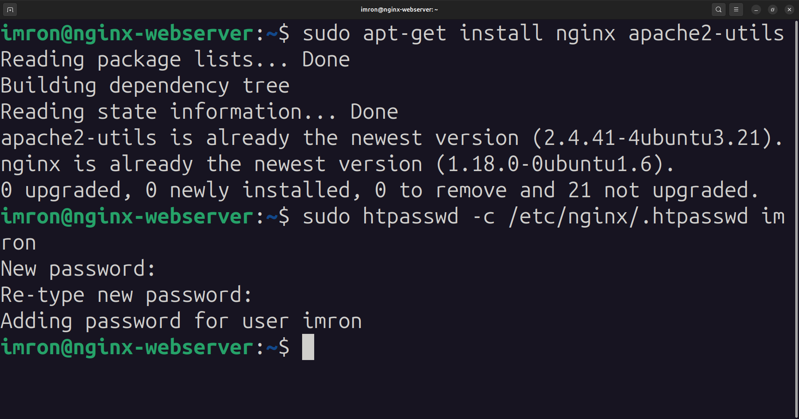 <br>

3. Konfigurasi NGINX:
```nginx
server {
    listen 443 ssl;
    server_name prom.imron.studentdumbways.my.id;

    # Sertifikat SSL
    ssl_certificate /etc/letsencrypt/live/imron.studentdumbways.my.id/fullchain.pem;
    ssl_certificate_key /etc/letsencrypt/live/imron.studentdumbways.my.id/privkey.pem;

    location / {
        #tambahkan ini agar prometheus ketika di akses harus login dari user yang sudah dibuat
	      auth_basic "Prometheus Authentication";
        auth_basic_user_file /etc/nginx/.htpasswd;

        proxy_pass http://34.101.163.41:9090;  # Port default Prometheus
        proxy_set_header Host $host;
        proxy_set_header X-Real-IP $remote_addr;
        proxy_set_header X-Forwarded-For $proxy_add_x_forwarded_for;
        proxy_set_header X-Forwarded-Proto $scheme;
    }
}
```
4. lakukan reload nginx
```bash
sudo systemctl reload nginx
```

5. akses web prometheus

- https://prom.imron.studentdumbways.my.id

- Masukkan username dan password yang sudah dibuat

 * 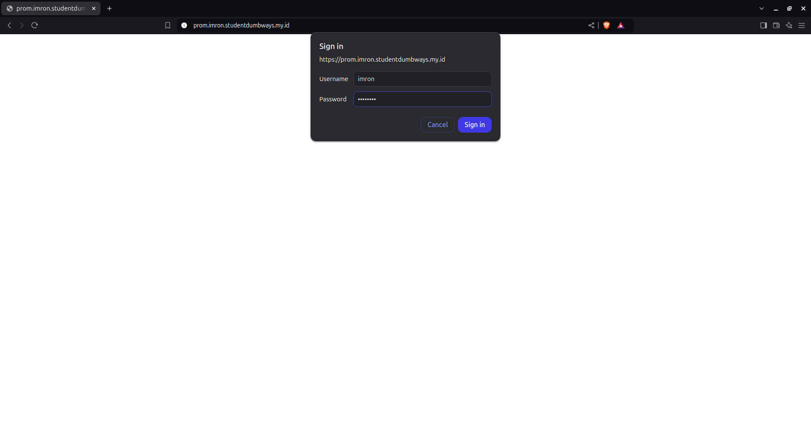 <br>


###  Konfigurasi Dashboard Grafana

1. Buka Grafana di browser
2. Login dengan kredensial di atas > masukkan user admin dan password admin123
3. Tambah Data Source:
   - Klik: Configuration > Data Sources > Add data source
   - Pilih Prometheus
   - URL: https://prom.imron.studentdumbways.my.id
   - Klik "Save & Test"

    * 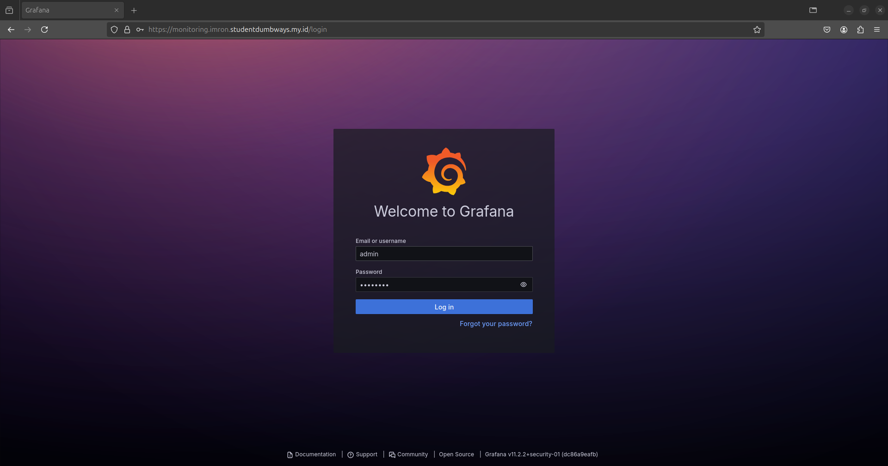 <br>

    * 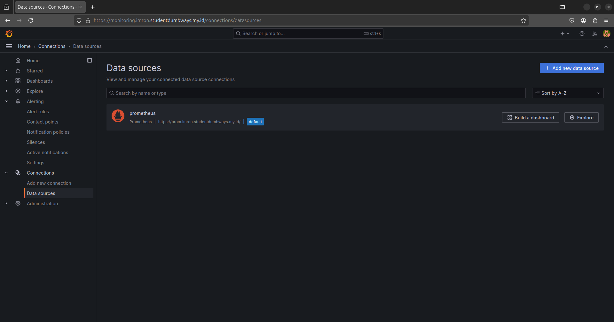 <br>

## 🔔 Notifikasi

### Setup Notifikasi Telegram

1. Buka aplikasi telegram > cari botFather > buat bot
2. Simpan token bot nanti akan digunakan untuk notifikasi
3. Generate chat id > buka browser https://api.telegram.org/bot<TOKEN>/getUpdates
4. simpan chat id nanti akan digunakan untuk notifikasi
5. Di Grafana, buka:
   - Alerting > Contact points > Add contact point
6. Pilih Telegram
7. Masukkan:
   - Bot Token (dari BotFather)
   - Chat ID
8. Klik "Test" untuk memastikan berfungsi
9. Save

    * 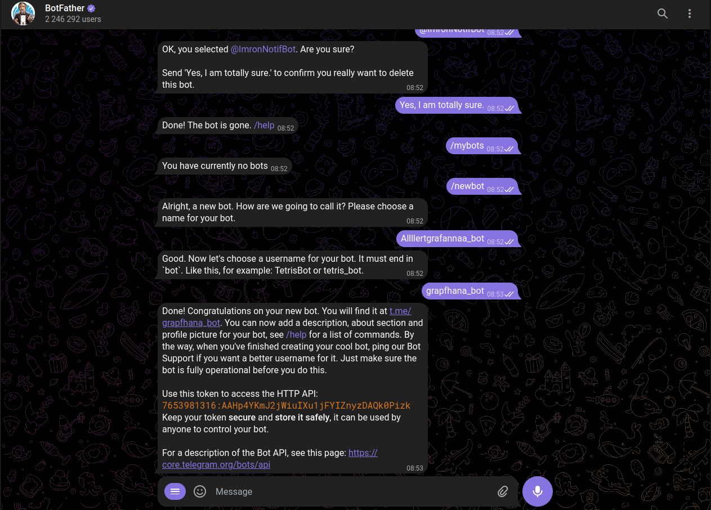 <br>

    * 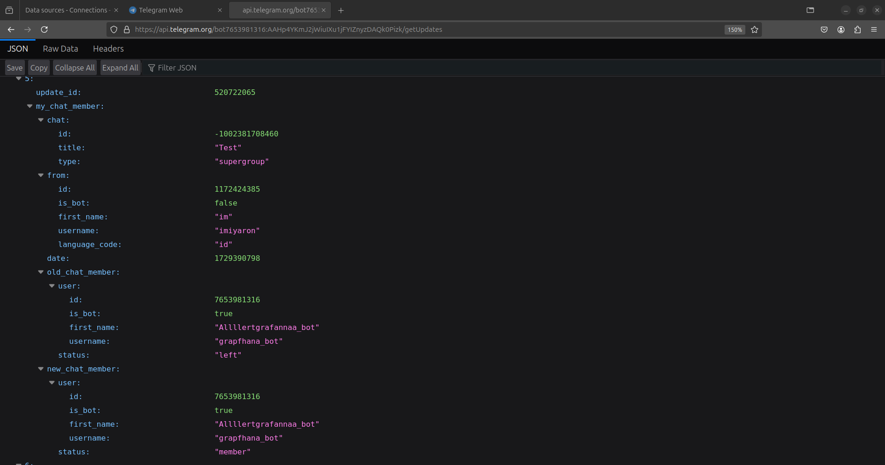 <br>

    * 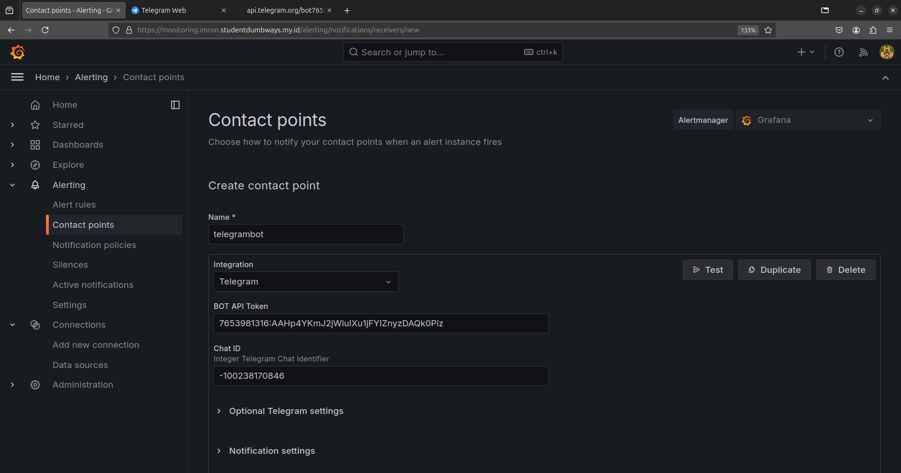 <br>

### Setup Notifikasi Menggunakan Bot Telegram yang sudah dibuat

## CPU USAGE ALLERT

1. buka web monitoring grafana https://monitoring.imron.studentdumbways.my.id/
2. Klik alert rules > new alert rule
3. Buat Query untuk mengambil data cpu usage
```bash
100 - (avg by (job) (rate(node_cpu_seconds_total{mode="idle"}[5m])) * 100)
```
4. Setting Threshold is above 80 > ketika cpu diatas 80%, notifikasi akan muncul
5. set evaluation interval to 1m > buat folder baru
6. set evaluation group and interval to 1m > buat folder baru
7. concatct point pilih telegram
8. custom annotation summary
```bash
"CPU usage for {{ $labels.job }} has exceeded 80%. Current value: {{ $values.A }}%"
``` 
9. custom annotation description
```bash
"The CPU usage for job {{ $labels.job }} has crossed the threshold of 80%. Please investigate the issue as this could affect performance. The threshold was exceeded with a value of {{ $values.A }}%."
```
10. select dashboard and panel > cari prometheus dashboard
11. Save

    * 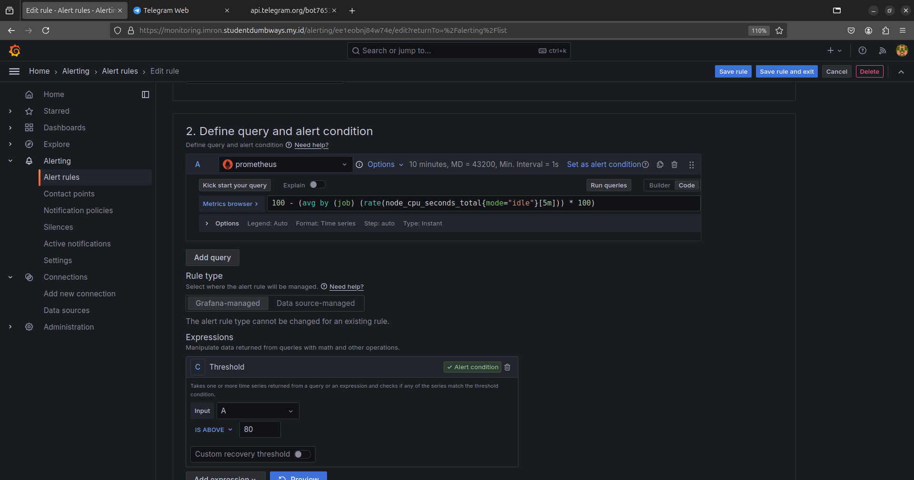 <br>

## RAM USAGE ALLERT

1. Lakukan cara yang sama seperti diatas
2. ubah query
```bash
100 * (1 - (node_memory_MemAvailable_bytes / node_memory_MemTotal_bytes))
``` 
3. setting threeshold is above 80 > ketika ram diatas 80%, notifikasi akan muncul
4. custom annotation summary
```bash
"Memory usage for {{ $labels.job }} has surpassed 80%. Current usage: {{ $values.A }}%"
```
5. custom annotation description
```bash
"The memory utilization for job {{ $labels.job }} has gone above the 80% threshold. Action is required to prevent potential performance degradation. The current usage stands at {{ $values.A }}%."
```
6. Save

* 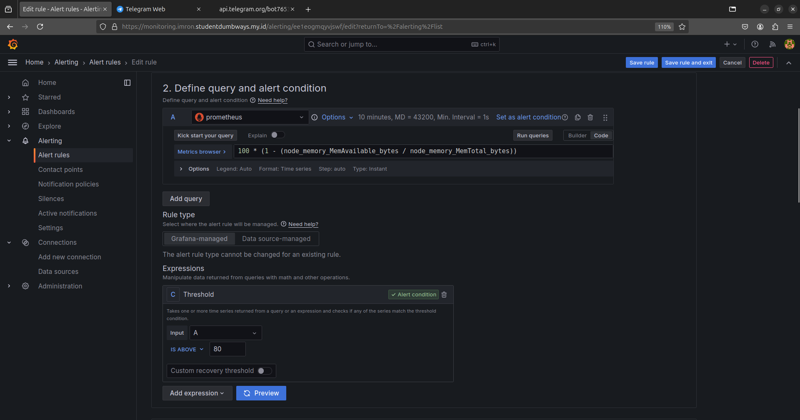 <br>

## DISK USAGE ALLERT

1. Lakukan cara yang sama seperti diatas
2. ubah query
```bash
(node_filesystem_free_bytes{fstype!~"tmpfs|overlay"})
``` 
3. setting threeshold is above 80 > ketika disk diatas 80%, notifikasi akan muncul
4. custom annotation summary
```bash
"Disk space usage for {{ $labels.job }} has exceeded 80%. Current usage: {{ $values.A }}%"
```
5. custom annotation description
```bash
description: "The disk usage for job {{ $labels.job }} has reached critical levels, exceeding 80%. Immediate attention is required to avoid running out of disk space. Current usage is at {{ $values.A }}%."
```
6. Save

* 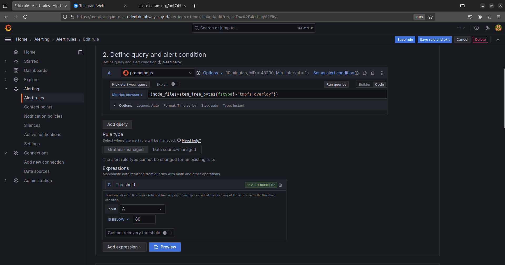 <br>

## Network I/O (NGINX Monitoring)

1. Lakukan cara yang sama seperti diatas
2. ubah query
```bash
rate(node_network_receive_bytes_total{device!="lo", job="nginx_webserver"}[5m])
``` 
3. setting threeshold is above 10485760 > ketika pemakaian network diatas 10mbps, notifikasi akan muncul
4. custom annotation summary
```bash
"Data received by {{ $labels.job }} has exceeded 10 Mbps. Current rate: {{ $values.A }} Mbps."
```
5. custom annotation description
```bash
"The data received on the NGINX job {{ $labels.job }} has crossed the threshold of 10 Mbps. This might indicate heavy traffic or potential issues. Current rate is {{ $values.A }} Mbps."
```
6. Save

* 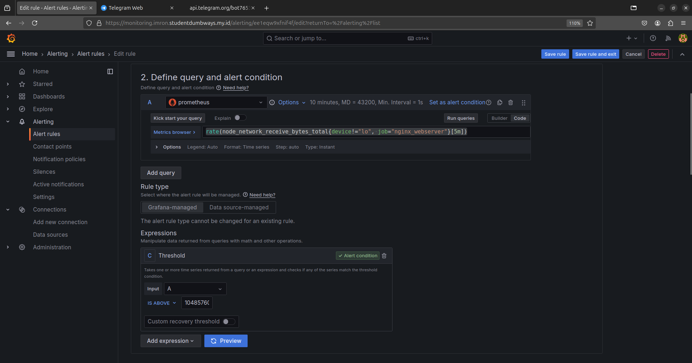 <br>


## 📝 Tips Penggunaan

- Selalu backup data Prometheus dan Grafana secara berkala
- Monitor penggunaan disk pada container
- Update password default setelah instalasi
- Gunakan HTTPS untuk akses publik
- Buat alert untuk metrics penting

## 🆘 Troubleshooting

### Masalah Umum dan Solusi

1. Container tidak mau start:
```bash
# Cek logs
docker compose logs

# Restart services
docker compose restart
```

2. Grafana tidak bisa akses Prometheus:
- Pastikan URL Prometheus benar
- Cek network di docker-compose
- Cek firewall settings

3. Memory tinggi:
- Sesuaikan retention time Prometheus
- Kurangi scrape interval
- Monitor resource usage

## 🔍 Monitoring Tips

- Setup dashboard untuk:
  - System metrics (CPU, RAM, Disk)
  - Application metrics
  - Network metrics
  - Custom metrics

## 📚 Referensi

- [Dokumentasi Prometheus](https://prometheus.io/docs/)
- [Dokumentasi Grafana](https://grafana.com/docs/)
- [Docker Documentation](https://docs.docker.com/)