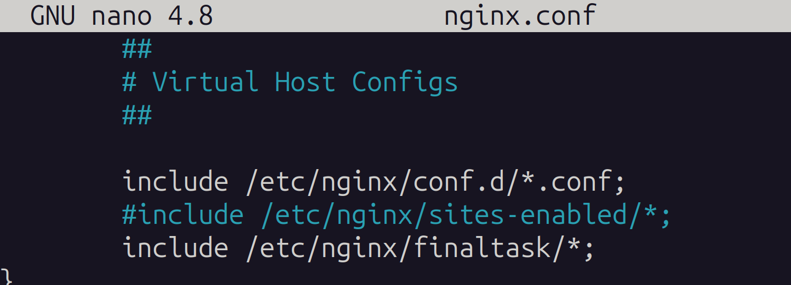
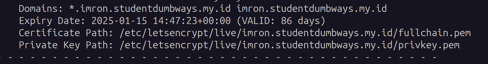
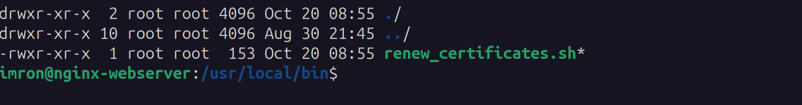
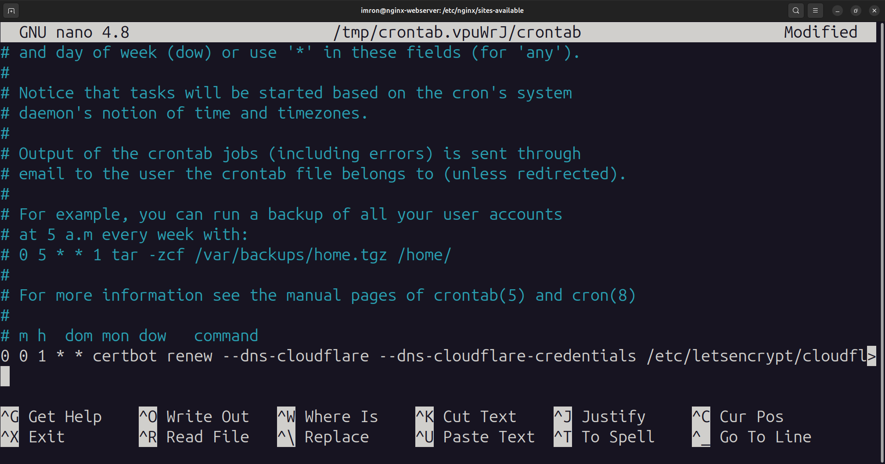
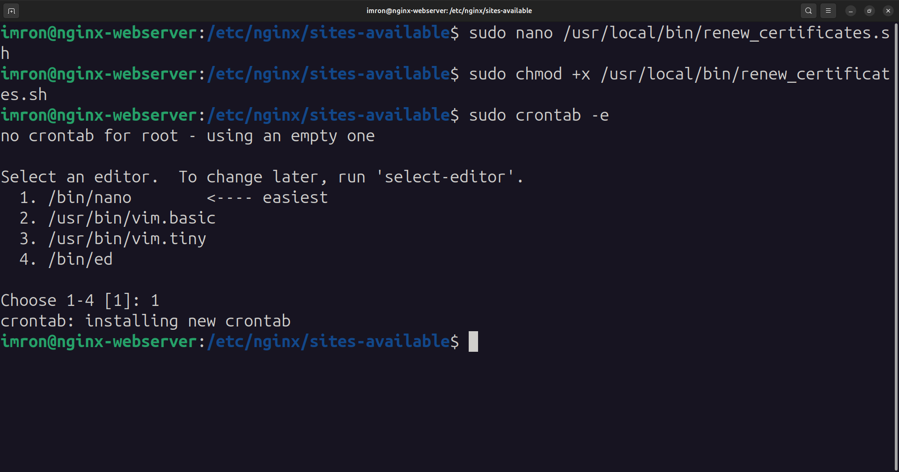

# Panduan Konfigurasi NGINX dan SSL
Panduan yang mudah dipahami untuk mengatur NGINX dengan sertifikat SSL otomatis menggunakan Cloudflare DNS.

## 📋 Ringkasan
Panduan ini akan membantu  untuk:
- Mengatur server web NGINX
- Mengkonfigurasi sertifikat SSL untuk domain 
- Memperbarui sertifikat SSL secara otomatis
- Mengamankan website  dengan HTTPS

## 🔧 Persiapan
Sebelum memulai, pastikan  memiliki:
1. Server dengan sistem operasi Ubuntu/Debian
2. Akun Cloudflare dengan:
   - Email: `youremail@gmail.com`
   - API Key: `your-api-key`
3. Pengetahuan dasar penggunaan terminal

## 📦 Langkah-Langkah Instalasi

### 1. Instalasi Software yang Dibutuhkan
Pertama, kita perlu menginstal software yang diperlukan. Buka terminal dan jalankan:
```bash
sudo apt update
sudo apt install nginx python3-certbot-nginx python3-certbot-dns-cloudflare
```

### 2. Konfigurasi NGINX untuk Domain 
Kita akan mengatur NGINX untuk menangani lalu lintas web untuk domain .

1. Setelah nginx terinstall > edit nginx.conf untuk configurasi
```bash
sudo nano /etc/nginx/nginx.conf
```

*  <br>

2. Buat file konfigurasi baru:
```bash
sudo nano /etc/nginx/finaltask/nama-domain
```

3. Tambahkan konfigurasi dasar ini (contoh untuk aplikasi yang berjalan di port 9100):
```nginx
server {
    listen 80;
    server_name nama-domain.imron.studentdumbways.my.id;

    location / {
        proxy_pass http://localhost:9100;
        proxy_set_header Host $host;
        proxy_set_header X-Real-IP $remote_addr;
        proxy_set_header X-Forwarded-For $proxy_add_x_forwarded_for;
        proxy_set_header X-Forwarded-Proto $scheme;
    }
}
```

### 2. Pengaturan Sertifikat SSL

1. Buat file kredensial Cloudflare:
```bash
sudo nano /etc/letsencrypt/cloudflare.ini
```

2. Tambahkan detail Cloudflare :
```ini
dns_cloudflare_email = iyaron08@gmail.com
dns_cloudflare_api_key = 38dad959d491aaaf06240a6820c0e6e822132
```

3. Amankan file kredensial:
```bash
sudo chmod 600 /etc/letsencrypt/cloudflare.ini
```

4. Dapatkan sertifikat SSL:
```bash
sudo certbot certonly \
    --dns-cloudflare \
    --dns-cloudflare-credentials /etc/letsencrypt/cloudflare.ini \
    -d "*.imron.studentdumbways.my.id" \
    -d imron.studentdumbways.my.id
```

5. cek sertifikat yang sudah terbit
```bash
sudo certbot certificates
```
*  <br>

### 4. Perbarui NGINX untuk Menggunakan SSL

1. Perbarui konfigurasi NGINX  untuk menggunakan SSL:
```nginx
server {
    listen 443 ssl;
    server_name nama-domain-imron.studentdumbways.my.id;

    ssl_certificate /etc/letsencrypt/live/imron.studentdumbways.my.id/fullchain.pem;
    ssl_certificate_key /etc/letsencrypt/live/imron.studentdumbways.my.id/privkey.pem;

    location / {
        proxy_pass http://localhost:9100;
        proxy_set_header Host $host;
        proxy_set_header X-Real-IP $remote_addr;
        proxy_set_header X-Forwarded-For $proxy_add_x_forwarded_for;
        proxy_set_header X-Forwarded-Proto $scheme;
    }
}
```

2. Terapkan sertifikat SSL pada semua domain yang kita punya karena kita menggunakan sertifikat wildcard
- Dengan wildcard semua sub domain yang kita punya bisa menggunakan sertifikat SSL yang sama

3. Muat ulang NGINX:
```bash
sudo systemctl reload nginx
```

### 5. Pengaturan Pembaruan SSL Otomatis

1. Buat skrip pembaruan:
```bash
sudo nano /usr/local/bin/renew_certificates.sh
```

2. Tambahkan konten berikut:
```bash
#!/bin/bash
certbot renew --dns-cloudflare --dns-cloudflare-credentials /etc/letsencrypt/cloudflare.ini --quiet --no-self-upgrade
systemctl reload nginx
```

3. ubah permission skrip agar bisa dijalankan:
```bash
sudo chmod +x /usr/local/bin/renew_certificates.sh
```

*  <br>

4. Atur pembaruan otomatis bulanan:
```bash
sudo crontab -e
```
Tambahkan baris ini:
```bash
0 0 1 * * /usr/local/bin/renew_certificates.sh > /var/log/renew_certificates.log 2>&1
```
*  <br>
*  <br>

## 📝 Daftar Domain
Domain-domain berikut akan dikonfigurasi:
- exporter.imron.studentdumbways.my.id
- prom.imron.studentdumbways.my.id
- monitoring.imron.studentdumbways.my.id
- registry.imron.studentdumbways.my.id
- staging.imron.studentdumbways.my.id
- api.staging.imron.studentdumbways.my.id
- imron.studentdumbways.my.id
- api.imron.studentdumbways.my.id
- jenkins.imron.studentdumbways.my.id
- sonarqube.imron.studentdumbways.my.id

## ✅ Verifikasi
Untuk memastikan semua berjalan dengan baik:

1. Periksa konfigurasi NGINX:
```bash
sudo nginx -t
```

2. Restart NGINX:
```bash
sudo systemctl restart nginx
```

3. Kunjungi domain melalui browser - semuanya harus menampilkan status aman (HTTPS)

## 🔍 Pemecahan Masalah
Jika  mengalami masalah:
1. Periksa log error NGINX:
```bash
sudo tail -f /var/log/nginx/error.log
```

2. Periksa status sertifikat SSL:
```bash
sudo certbot certificates
```

3. Pastikan NGINX sedang berjalan:
```bash
sudo systemctl status nginx
```

## 📚 Catatan Tambahan
- Jaga keamanan kredensial Cloudflare 
- Sertifikat SSL akan diperbarui secara otomatis setiap bulan
- Selalu backup file konfigurasi sebelum melakukan perubahan

Untuk bantuan lebih lanjut, silakan kunjungi dokumentasi resmi:
- [Dokumentasi NGINX](https://nginx.org/en/docs/)
- [Dokumentasi Certbot](https://certbot.eff.org/docs/)

## 💡 Tips Penting
1. **Backup Reguler**: Selalu buat backup konfigurasi sebelum melakukan perubahan besar
2. **Keamanan**: Jangan pernah membagikan kredensial Cloudflare 
3. **Monitoring**: Periksa status SSL secara berkala
4. **Dokumentasi**: Catat setiap perubahan yang  lakukan
5. **Update**: Pastikan sistem dan paket selalu diperbarui

## ❓ Pertanyaan Umum

### Mengapa saya memerlukan SSL?
SSL membuat website  aman dengan mengenkripsi data yang dikirim antara pengunjung dan server .

### Bagaimana cara mengetahui SSL berfungsi?
ketika melihat ikon gembok di browser dan alamat website dimulai dengan "https://".

### Berapa lama sertifikat SSL berlaku?
Sertifikat Let's Encrypt berlaku selama 90 hari, tetapi akan diperbarui secara otomatis setiap bulan.

### Apa yang harus dilakukan jika terjadi error?
1. Periksa log error di `/var/log/nginx/error.log`
2. Pastikan semua layanan berjalan (`nginx`, `certbot`)
3. Verifikasi konfigurasi domain di Cloudflare