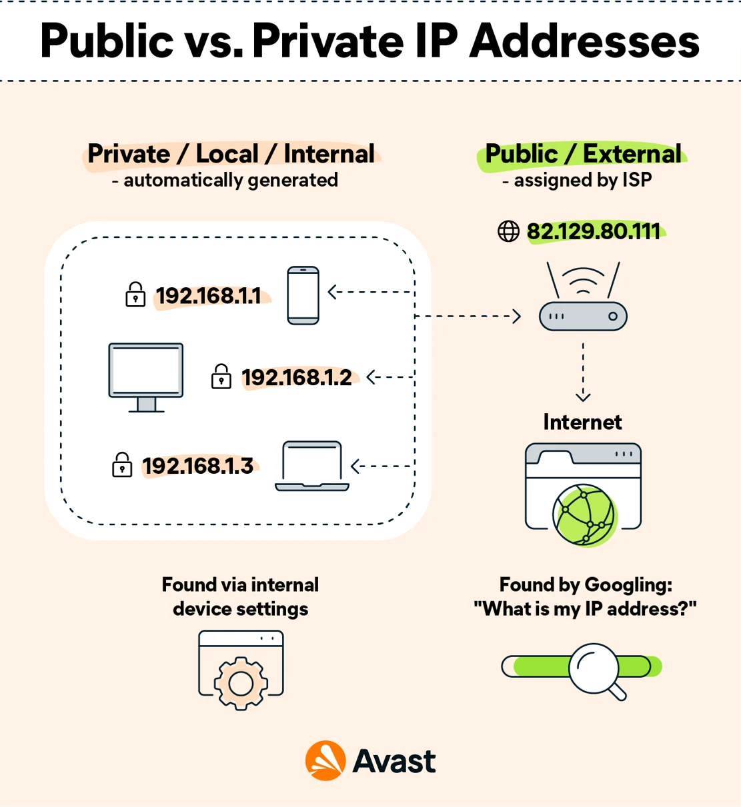
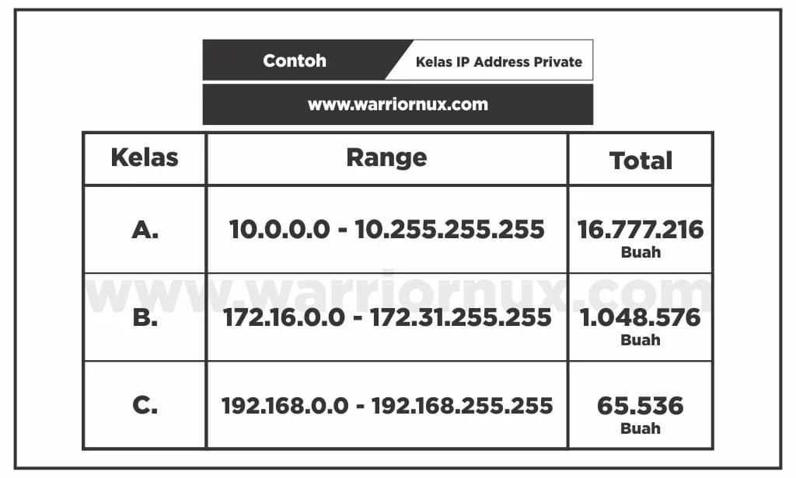
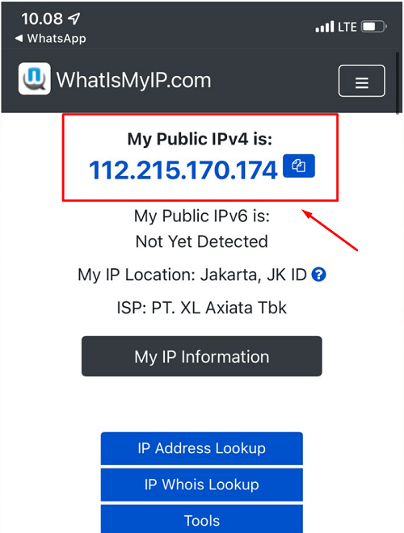
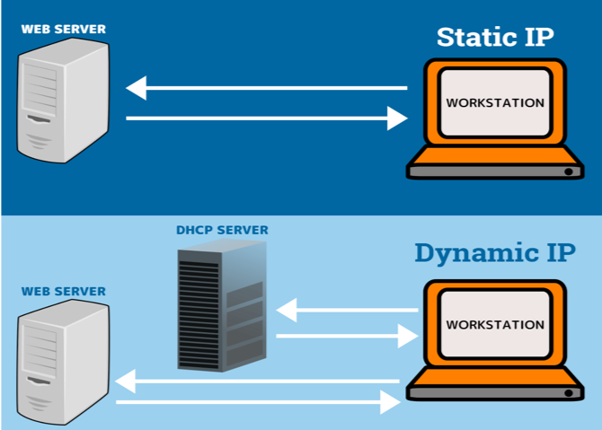
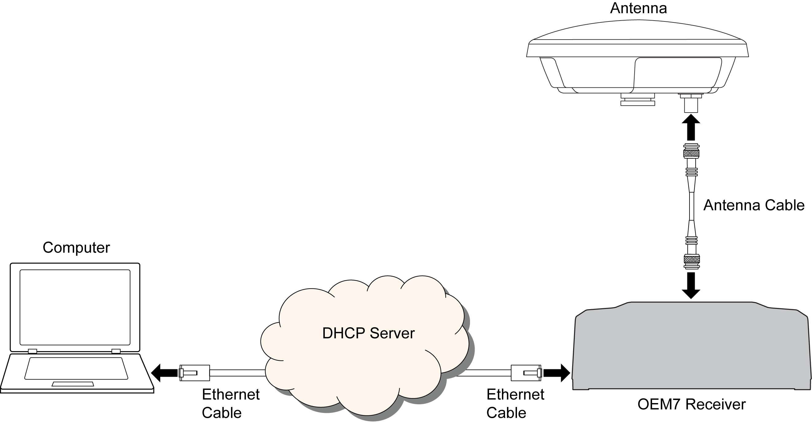
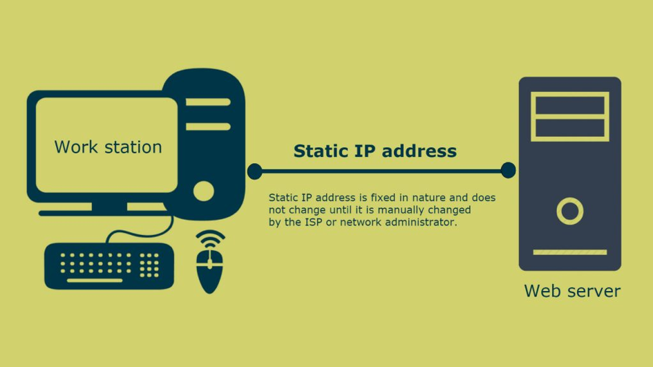

# Perbedaan IP Private & Public serta IP Dynamic & Static

## 1. IP Private vs IP Public
  

### IP Private
  

- **Pengertian**: IP ini dipakai di dalam jaringan lokal (seperti di rumah atau kantor) dan nggak bisa diakses dari luar internet.
- **Contoh**: Misalnya, IP untuk perangkat di rumah yang tersambung ke Wi-Fi.
  - 10.0.0.0 - 10.255.255.255
  - 172.16.0.0 - 172.31.255.255
  - 192.168.0.0 - 192.168.255.255
- **Keamanan**: Lebih aman karena cuma bisa diakses dalam jaringan itu aja.

### IP Public
  

- **Pengertian**: IP ini bisa diakses dari mana saja lewat internet.
- **Contoh**: IP server website yang kamu akses dari browser.
- **Keamanan**: Lebih rentan diserang karena tdapat diakses secara publik.

## 2. IP Dynamic vs IP Static
  

### IP Dynamic
  

- **Pengertian**: IP ini selalu berubah tiap kali perangkat nyambung ke jaringan. Dikasihnya otomatis sama router atau ISP.
- **Kelebihan**: Praktis, nggak perlu setting manual.
- **Kekurangan**: Nggak stabil buat yang butuh IP tetap kayak server.

### IP Static
  

- **Pengertian**: IP ini tetap dan nggak berubah-ubah. Di-setting manual atau disediakan ISP.
- **Kelebihan**: Stabil, bagus buat server atau akses jarak jauh.
- **Kekurangan**: Lebih mudah diserang dan mungkin ada biaya tambahan.

## Kesimpulan
Memilih jenis IP yang tepat tergantung kebutuhanmu. Kalau buat jaringan lokal dan keamanan, IP Private dan Static bisa jadi pilihan. Tapi, kalau buat internet sehari-hari, IP Dynamic lebih praktis.
