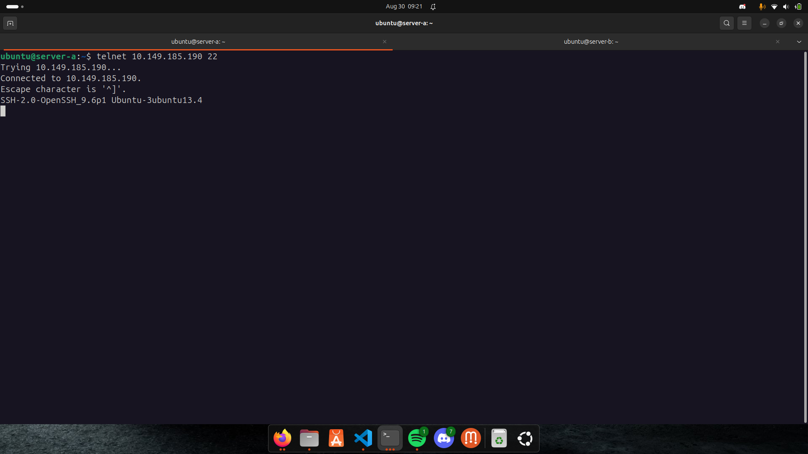

# Implementasi Firewall di Linux Server

## Studi Kasus:
- **Server A** hanya bisa mengakses **WebServer** yang ada di **Server B**.
- Gunakan **UFW** untuk mengatur izin/protokol jaringan seperti **TCP** dan **UDP**.

## Langkah-langkah:

1. **Buat 2 Virtual Machine (VM)**
   - **Server A**: Ini adalah server yang akan mengakses WebServer di **Server B**.
   - **Server B**: Ini adalah server yang akan menjalankan WebServer.

2. **Cek ip server**
    - **server A**
      .png)  

    - **server B** 
      .png)  

3. **Konfigurasi server b agar hanya bisa diakses server A**
   - **aktifkan ufw enable**
      .png)  
   
   - **setting ufw allow hanya bisa diakses ke server a**
      .png)  

   - **setting ufw tcp dan udp dan hanya bisa diakses server a**
      .png)  

    - **server a akses ke server b**
      .png)  

    - **server a akses ke server b dengan port 22 tcp/udp**
        

    - **server lain coba akses ke server b**
      .png)  