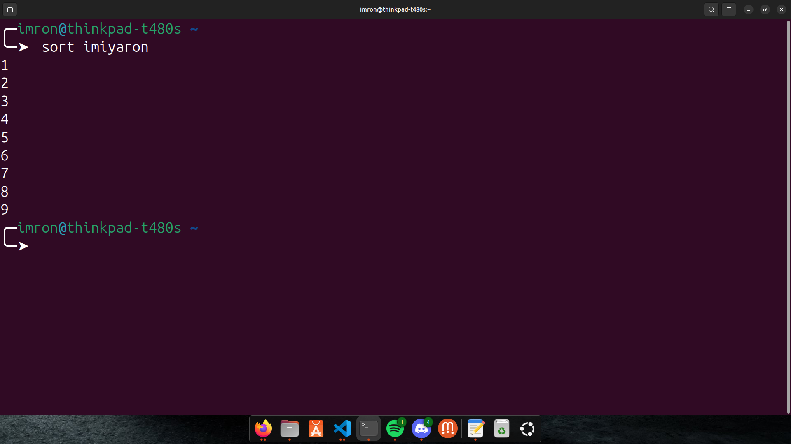
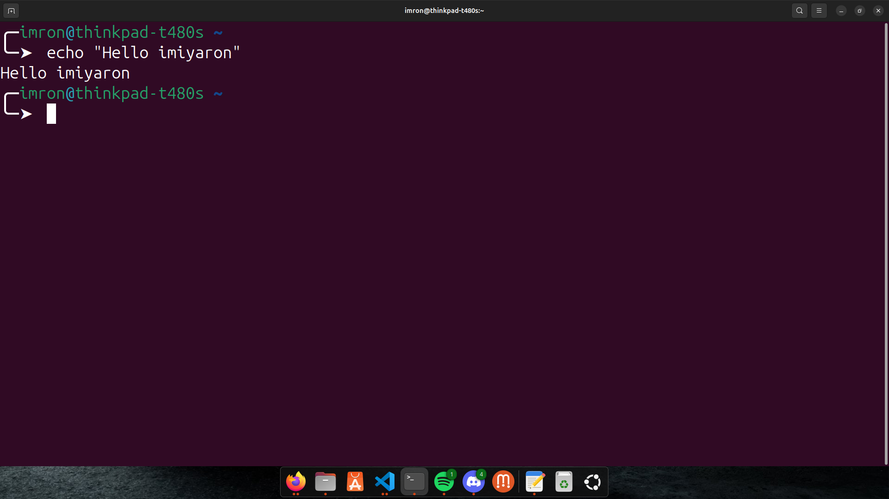

# Dokumentasi Manipulasi Teks di Text Editor Nano

Text editor Nano menyediakan berbagai shortcut untuk mempermudah manipulasi teks. Berikut adalah beberapa cara manipulasi teks yang dapat dilakukan menggunakan Nano:

## 1. Cat
- **Membuat suatu file baru serta memasukkan teks**
  - `cat > (file-name)`: untuk membuat suatu file baru serta memasukkan teks, Jika sudah menambakan teks kalian dapat keluar dengan klik CTRL + C.
    .png)  

- **Menggabungkan dua buah file**
  - `cat file1 file2 > file3`: Menempelkan teks yang telah disalin atau dipotong ke posisi kursor.
    .png)  

## 2. Sed
- **Mengganti text tertentu**
  - `sed -i 's/imron/maulana/g' iyaron`: mengganti semua kata imron menjadi maulana pada filetask2.
    .png)  

## 3. Grep
- **akan mencari jumlah kata pada suatu file**
  - `grep -c maulana iyaron`: akan mencari kata maulana pada file iyaron.
    .png)  

- **mencari semua file yang berisikan kata tertentu**
  - `grep maulana *`: Menghapus kata yang berada di posisi kursor.
    .png)  

## 4. Sort
- **mengurutkan data, baik itu secara ascending.**
  - `sort imiyaron`: akan mengurutkan data pada file imiyaron dari yang terkecil hingga terbesar.
      

- **mengurutkan data, baik itu secara descending.**
  - `sort -r imiyaron`: akan mengurutan data pada file imiyaron dari yang terbesar hingga terkecil.
    .png)  

## 5. Echo
- **Echo digunakan untuk mencetak string**
  - `echo "Hello imiyaron!"`: Mencetak string Hello imiyaron.
      

- **Mengulang Aksi**
  - `echo "Hello imiyaron!" >> file1`: untuk mencetak kata Hello imiyaron! di file1.
    .png)  

- **echo "imron" > file2**
  - `echo "imron" > file2` : untuk mengganti semua isi file dengan kata "imron" pada file 2
    .png)  