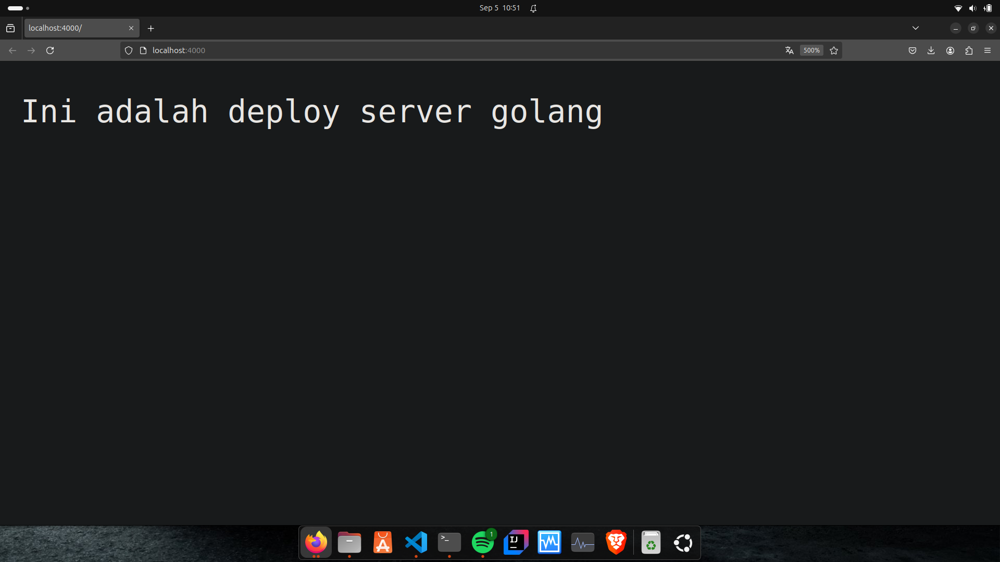

## Deploy Golang dan Python

# Golang

1. install golang
```bash
wget https://go.dev/dl/go1.23.0.linux-amd64.tar.gz
```

2. extract file
```bash
sudo tar -C /usr/local -xzf go1.21.1.linux-amd64.tar.gz
```

3. konfigurasi path
```bash
nano ~/.profile
```
- edit path :
```bash
export PATH=$PATH:/usr/local/go/bin
```

4. Cek apakah sudah terinstall
```bash
go version
```

5. buat folder baru dengan nama golang-web
```bash
mkdir golang-web
```
- masuk ke directory
```bash
cd golang-web
```

6. buat file index.go untuk program sederhana web server
```bash
nano index.go
```

- isi file index.go:
```bash
package main

import (
	"fmt"
	"net/http"
)

func helloHandler(w http.ResponseWriter, r *http.Request) {
	fmt.Fprintf(w, "Ini adalah deploy server golang")
}

func main() {
	http.HandleFunc("/", helloHandler)
	fmt.Println("http://localhost:4000")
	if err := http.ListenAndServe(":4000", nil); err != nil {
		fmt.Println("Gagal menjalankan server:", err)
	}
}
```

7. jalankan server golang
```bash
go run index.go
```

- buka localhost:4000 di browser

- akan muncul tampilan ini jika berhasil
 <br>

