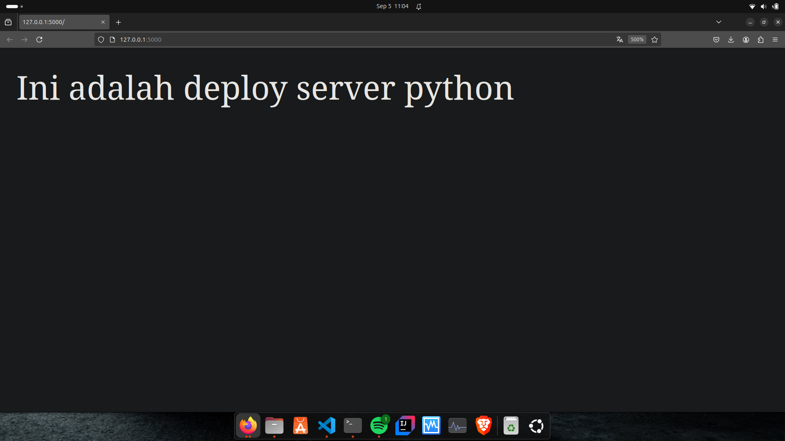

## Deploy Golang dan Python

# Python

# 1. Install python
- Python3 sudah ada secara default, untuk melakukan pengecekan jalankan perintah berikut.

```bash
python3 -v
```

# 2. install package manager dari python3

```bash
sudo apt install python3-pip
```

- install flask:
```bash
pip install flask
```
# 3. buat folder baru dengan nama python-web
```bash
mkdir python-web
```
- masuk ke directory
```bash
cd python-web
```

# 4. buat file index.py untuk program sederhana web server
```bash
nano index.py
```

# 5. isi file index.py:
```bash
from flask import Flask
app = Flask(__name__)
@app.route("/")
def helloworld():
    return "Ini adalah deploy server python"
if __name__ == "__main__":
    app.run()
```

# 6. jalankan server python
```bash
python3 index.py
```
- buka localhost:5000 di browser

- akan muncul tampilan ini jika berhasil
 <br>

