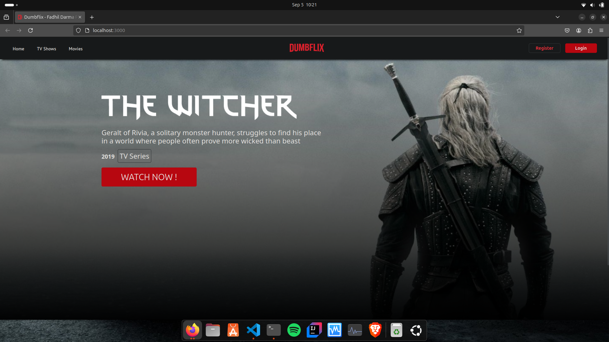

# Deployment Dumbflix (Node JS)

## 1. git clone https://github.com/dumbwaysdev/dumbflix-frontend.git
 <br>

## 2. cd dumbflix-frontend
 <br>

## 3. install nvm

- command: install nvm
 ```bash
curl -o- https://raw.githubusercontent.com/nvm-sh/nvm/v0.40.1/install.sh

```
 <br>

- command: configurasi nvm
 ```bash
export NVM_DIR="$([ -z "${XDG_CONFIG_HOME-}" ] && printf %s "${HOME}/.nvm" || printf %s "${XDG_CONFIG_HOME}/nvm")"
[ -s "$NVM_DIR/nvm.sh" ] && \. "$NVM_DIR/nvm.sh" # This loads nvm
```
 <br>

## 4. install node version 14

- command: install version 14
```bash
nvm i 14
```

- command: use version 14
```bash
nvm use 14
```
 <br>

## 5. Intall paket node modules dengan npm install

- command: npm install
```bash
npm install
```
 <br>

## 6. Jalankan Aplikasi dengan npm start
- command: npm start
```bash
npm start
```
 <br>

## 7. Tampilan APlikasi di browser
 <br>