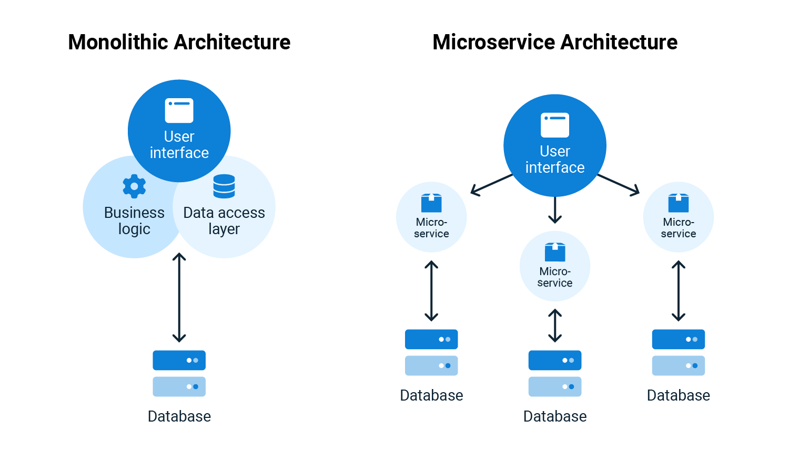

# Perbandingan Application Monolith & Application Microservices

Penjelasan singkat mengenai perbedaan **Application Monolith** dan **Application Microservices**:
  

## Monolith
**Monolith** itu kayak bangunan gedung besar yang semuanya gabung jadi satu. Semua fitur aplikasi, mulai dari login, pembayaran, sampai fitur lain-lain, ada di dalam satu kode yang besar. Jadi kalau ada perubahan kecil, kita harus utak-atik semuanya.

Contohnya, kalau mau benerin error di halaman login, kita juga harus cek halaman lain biar gak rusak. Ribet, kan?

### Kelebihan:
- Lebih gampang buat mulai karena semua udah satu paket.
- Gampang deploy karena gak perlu pisah-pisah sistem.

### Kekurangan:
- Kalau satu bagian rusak, bisa rusak semuanya.
- Susah buat scaling (nambah kapasitas) karena semuanya harus ikut diperbesar.

## Microservices
**Microservices** tuh kayak apartemen yang tiap unitnya punya fungsi sendiri-sendiri. Fitur login, pembayaran, dan fitur lain jalan sendiri-sendiri sebagai service yang terpisah. Jadi kalau mau ubah login doang, gak perlu ngubah bagian lain. 

Masing-masing unit bisa di-develop, di-maintain, bahkan di-deploy terpisah. Jadinya lebih fleksibel dan gak bikin pusing.

### Kelebihan:
- Kalau satu service rusak, yang lain tetep jalan.
- Bisa scaling hanya untuk bagian yang butuh, misal login lagi ramai, tinggal gedein servicenya tanpa ngaruh ke yang lain.
- Lebih fleksibel buat tim kerja, misal ada tim fokus buat satu service doang.

### Kekurangan:
- Lebih kompleks karena banyak komponen yang harus di-manage.
- Tiap service perlu komunikasi sama yang lain, jadi butuh effort buat ngatur.

