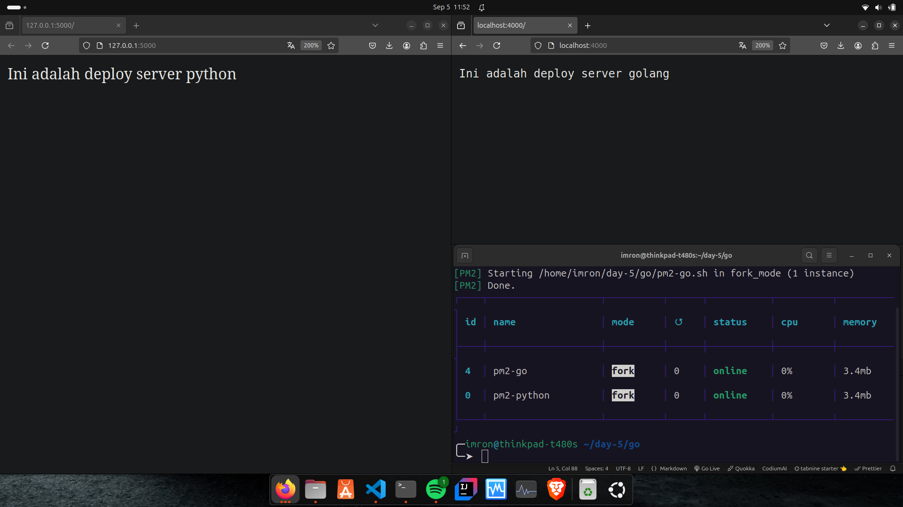

# Dokumentasi Menjalankan Aplikasi Flask di Background Menggunakan PM2

PM2 adalah manajer proses yang dapat digunakan untuk menjalankan aplikasi di background dan mengelola proses secara efisien. Meskipun PM2 dirancang untuk Node.js, tetapi bisa juga untuk aplikasi Python.

##  **Instalasi PM2**

```bash
npm install pm2@latest -g
```

## Konfigurasi PM2 untuk Aplikasi Go

 1. **Buat Skrip Bash**
```bash
nano pm2-go.sh
```
- isi file skrip

```bash
#!/bin/bash
go run /home/imron/day-5/go/index.go
```
- Berikan izin eksekusi pada skrip bash:
```bash
sudo chmod 700
```

3. **Jalankan dengan PM2**
```bash
pm2 pm2-go.sh
```

4. **Mengelola proses pm2**
- cek status
```bash
pm2 status
```

- stop server
```bash
pm2 stop <nama pm2>
```

- delete process
```bash
pm2 delete <nama pm2>
```

## Konfigurasi PM2 untuk Aplikasi Python

1. **Buat Skrip Bash**

2. **Buat Skrip Bash**
```bash
nano pm2-py.sh
```
- isi file skrip

```bash
#!/bin/bash
python3 /home/imron/day-5/python/index.py

```
- Berikan izin eksekusi pada skrip bash:
```bash
sudo chmod 700
```

3. **Jalankan dengan PM2**
```bash
pm2 pm2-go.sh
```

## Tampilan menjalankan 2 aplikasi sekaligus
 <br>