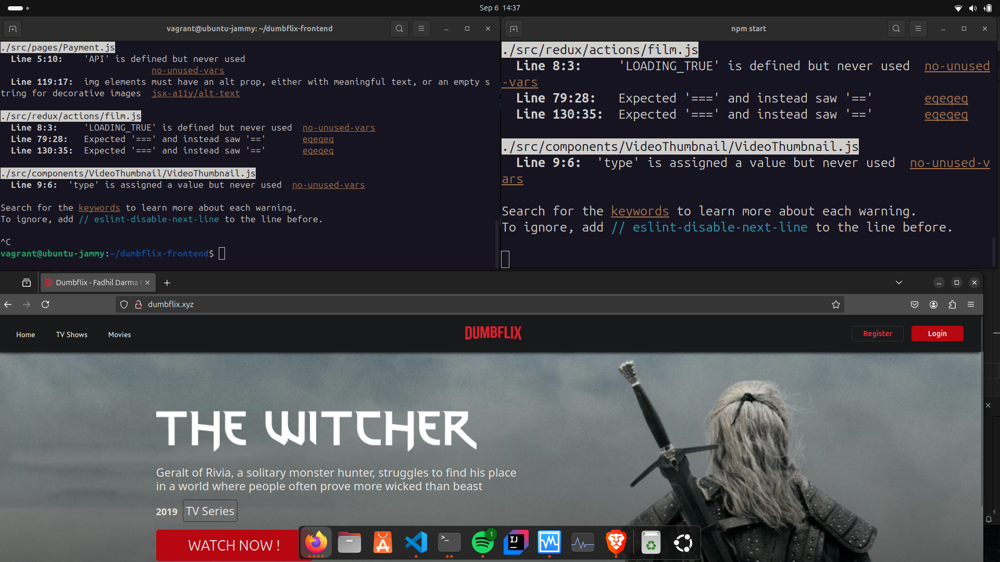

# Implementasi Load Balancing pada Aplikasi Dumbflix-Frontend

## siapkan 2 buath server
- **Server A**: `192.168.60.1` (Port 3000)
- **Server B**: `192.168.56.10` (Port 3000)
- **Domain**: `dumbflix.xyz`

## Konfigurasi Nginx untuk Load Balancing

1. **Buat file konfigurasi Nginx**:
   
```bash
sudo apt
cd /etc/nginx
sudo mkdir load-balance
cd nano load-balance
sudo nano load-balance
```

2. **Tambahkan konfigurasi load balancing berikut**:

   ```bash
   upstream domain {
       server 192.168.60.1:3000;  # Server A
       server 192.168.56.10:3000; # Server B
   }

   server {
       server_name dumbflix.xyz;

       location / {
           proxy_pass http://domain;
       }
   }

    ```
3. **Sebelum me-restart Nginx, pastikan konfigurasi tidak memiliki kesalahan sintaks:**
```bash
sudo nginx -t
```

4. **Setelah memastikan konfigurasi, restart Nginx untuk menerapkan perubahan:**
```bash
sudo systemctl restart nginx
```

5. **jalankan aplikasi dumbflix di ke dua server**

- server a :
```bash
cd dumbflix 
npm start
```
- server b :
```bash
cd dumbflix 
npm start
```

6. **edit konfigurasi di komputer lokal agar bisa diakses browser**
- tambahkan nama ip dan domainnya agar bisa diakses di browser lokal kita
```bash
sudo nano /etc/hosts
192.168.60.1    dumbflix.xyz
```

7. **test load balance**
- sekarang coba matikan salah satu aplikasi
```bash
ctrl + c
```

8. **refresh aplikasi**
- jika aplikasi masih bisa diakses berarti load balance berhasil
 tampilan seperti ini

  <br>