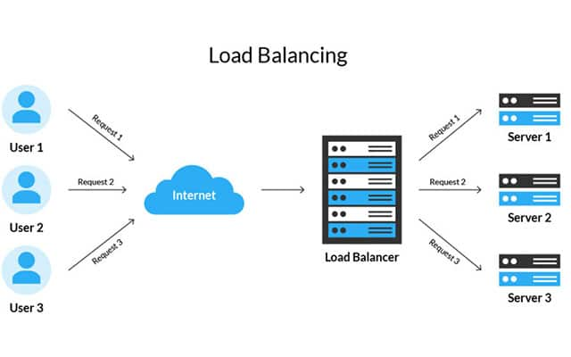

# Apa Itu Load Balance?
  

**Load balance** itu kayak kamu punya banyak teman yang mau main game bareng. Tapi, kalau cuma satu teman yang pegang controller, pasti dia kewalahan, kan? Jadi, kamu bagi-bagi controller ke teman-teman lain biar semua bisa main dengan nyaman dan gak ada yang terlalu capek.

Nah, di dunia teknologi, load balancing itu mirip. Bayangkan server (komputer yang nyediain layanan di internet) kayak controller yang harus ngerjain banyak pekerjaan sekaligus. Kalau semua pekerjaan ditanggung satu server doang, bisa jadi lambat dan overwork.

Jadi, **load balancer** itu alat yang membagi-bagi pekerjaan ke beberapa server. Dengan cara ini, semua server bisa kerja bareng dengan lebih efisien dan responsif, jadi pengguna nggak nunggu lama dan layanan tetap lancar.

**Intinya**: Load balancing itu cara bagi-bagi beban kerja ke beberapa server biar semuanya bisa jalan dengan lancar tanpa ada yang terlalu capek.
