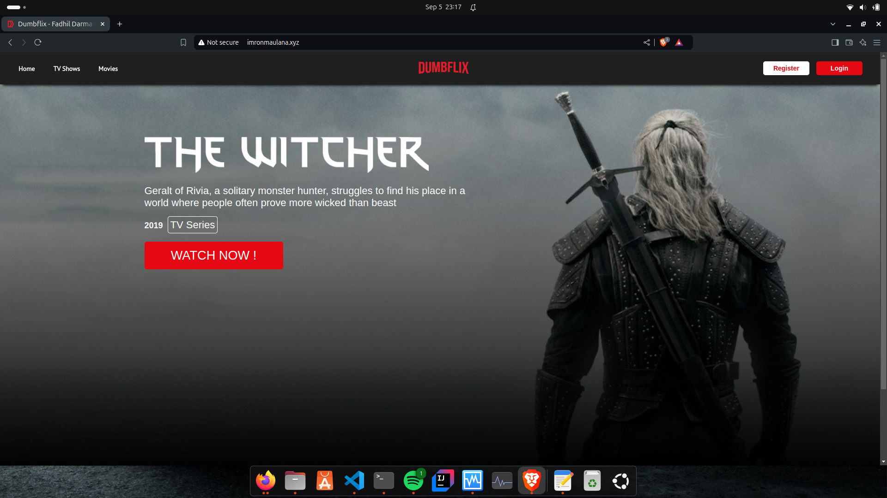

# Panduan Install dan Konfigurasi Nginx dengan PM2

## 1. Install Nginx

1. **install Nginx**:

- install nginx
```bash
sudo apt update
sudo apt install nginx -y
```
2. **Mulai dan aktifkan Nginx:Mulai dan aktifkan Nginx**:

```bash
sudo systemctl start nginx
sudo systemctl enable nginx
```

3. **Periksa status Nginx untuk memastikan berjalan dengan baik:**

```bash
sudo systemctl status nginx
```

## 2. Konfigurasi Nginx sebagai Reverse Proxy

1. **Buat file konfigurasi untuk domain:**

```bash
cd /etc/nginx
sudo mkdir dumbflix
sudo nano reverse.conf
```

- Tambahkan konfigurasi berikut ke dalam file:
```bash
server {
	server_name imronmaulana.xyz;

	location / {
		proxy_pass http://192.168.58.1:3000;
	}
 }

```

- tambahkan konfigurasi domain ke dalam etc/hots
```bash
sudo nano /etc/hosts
```
- tambahkan konfigurasi ke baris file /etc/hosts
```bash
sudo nano /etc/hosts
192.168.58.1    imronmaulana.xyz
```

2. **Periksa konfigurasi Nginx untuk kesalahan:**

```bash
sudo nginx -t
```

3. **Restart Nginx untuk menerapkan perubahan:**

```bash
sudo systemctl restart nginx
```

## 3. Install dan Konfigurasi PM2

1. **Install PM2 secara global menggunakan npm:**

```bash
sudo npm install -g pm2
```

2. **Masuk ke direktori aplikasi:**

```bash
cd dumbflix-frontend
```

3. **Jalankan aplikasi menggunakan PM2:**

```bash
pm2 start npm -- start

```

4. **Uji Akses Aplikasi**
Buka browser dan kunjungi http://imronmaulana.xyz. 
 <br>