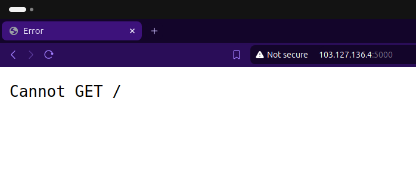

# Dumbflix Backend Deployment Guide

## Deployment Steps

1. **Clone Wayshub Backend Application**
```bash
git clone https://github.com/dumbwaysdev/dumbflix-backend.git
cd dumbflix-backend
npm install
```

2. **Use Node Version 14**

```bash
curl -o- https://raw.githubusercontent.com/nvm-sh/nvm/v0.40.1/install.sh | bash
nvm install 14
nvm use 14
```

3. **Change Configuration**
- konfigurasi database saya buat seperti ini
```bash
CREATE USER 'dumbflix'@'%' IDENTIFIED BY 'Satria150.';
GRANT ALL PRIVILEGES ON *.* TO 'dumbflix'@'%' WITH GRANT OPTION;
FLUSH PRIVILEGES;
mysql -u dumbflix -p 
create database dumb;
```

- Edit konfigurasi database di file dumbflix-backend/config/config.json sesuai dengan pengaturan database mysql.
```bash
{
  "development": {
    "username": "dumbflix",
    "password": "Satria150.",
    "database": "dumb",
    "host": "106.157.136.4",
    "dialect": "mysql"
  },

```


4. **Install sequelize-cli**
```bash
npm install -g sequelize-cli
sequelize init
```
5. **Running Migration**
```bash
npx sequelize-cli db:migrate
```

6. **Deploy Application on PM2**
    - install pm2
```bash
npm install -g pm2
```
- buat pm2 yang simple
```bash
pm2 init simple
module.exports = {
  apps : [{
    name   : "dumbflix-backend",
    script : "npm start"
  }]
}
```
- jalankan pm2
```bash
pm2 start ecosystem.config.js
```

7. **Cek aplikasi apakah sudah berjalan atau belum**
- akses ke port :5000

 <br>