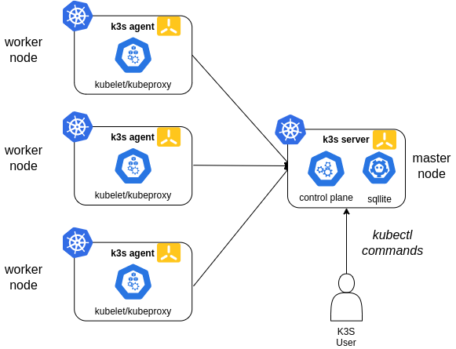

# Dokumentasi Setup Kubernetes K3s dengan NGINX Ingress, MySQL StatefulSet, dan Cert-Manager (Wildcard SSL)

 <br>

## Step 1: Setup Kubernetes Cluster (K3s) dengan 3 Node

1. Install K3s di master node (ini yang bakal jadi control plane):

```bash
   curl -sfL https://get.k3s.io | sh -
```

2. Setelah K3s ke-install, copy kubeconfig:

```bash
   sudo cat /etc/rancher/k3s/k3s.yaml
```

3. Tambah worker nodes ke cluster. Di worker node, install K3s dengan command berikut:

```bash
   curl -sfL https://get.k3s.io | K3S_URL=https://<master-node-ip>:6443 K3S_TOKEN=<token> sh -
```

   Ganti `<master-node-ip>` sama IP dari master node, dan `<token>` bisa lu dapet dari command ini di master node:

   ```bash
   sudo cat /var/lib/rancher/k3s/server/node-token
   ```

## Step 2: Install Ingress NGINX via Helm

1. Install Helm kalo belum ada:

```bash
   curl https://raw.githubusercontent.com/helm/helm/master/scripts/get-helm-3 | bash
```

2. Add repo Helm buat NGINX Ingress:

```bash
   helm repo add ingress-nginx https://kubernetes.github.io/ingress-nginx
```

3. Install NGINX Ingress Controller:

```bash
   helm install nginx-ingress ingress-nginx/ingress-nginx \
   --set controller.publishService.enabled=true
```

## Step 3: Deploy Backend, Frontend, dan MySQL

### 1. Deploy Backend

Buat file `backend-deployment.yaml`:

```yaml
apiVersion: apps/v1
kind: Deployment
metadata:
  name: backend
spec:
  replicas: 2
  selector:
    matchLabels:
      app: backend
  template:
    metadata:
      labels:
        app: backend
    spec:
      containers:
      - name: backend
        image: imronnm/imron-backend:latest
        ports:
        - containerPort: 5000
---
apiVersion: v1
kind: Service
metadata:
  name: backend-service
spec:
  selector:
    app: backend
  ports:
    - protocol: TCP
      port: 80
      targetPort: 5000
  type: ClusterIP
```

Deploy dengan command:

```bash
kubectl apply -f backend-deployment.yaml
```

### 2. Deploy Frontend

Buat file `frontend-deployment.yaml`:

```yaml
apiVersion: apps/v1
kind: Deployment
metadata:
  name: frontend
spec:
  replicas: 2
  selector:
    matchLabels:
      app: frontend
  template:
    metadata:
      labels:
        app: frontend
    spec:
      containers:
      - name: frontend
        image: imronnm/imron-frontend:kubernetes
        ports:
        - containerPort: 3000
---
apiVersion: v1
kind: Service
metadata:
  name: frontend-service
spec:
  selector:
    app: frontend
  ports:
    - protocol: TCP
      port: 80
      targetPort: 3000
  type: ClusterIP
```

Deploy dengan command:

```bash
kubectl apply -f frontend-deployment.yaml
```

### 3. Setup MySQL dengan StatefulSet

Buat file `mysql-statefulset.yaml`:

```yaml
apiVersion: v1
kind: Secret
metadata:
  name: mysql-secret
type: Opaque
data:
  mysql-root-password: <base64-encoded-password>
---
apiVersion: apps/v1
kind: StatefulSet
metadata:
  name: mysql
spec:
  selector:
    matchLabels:
      app: mysql
  serviceName: "mysql"
  replicas: 1
  template:
    metadata:
      labels:
        app: mysql
    spec:
      containers:
      - name: mysql
        image: mysql:5.7
        ports:
        - containerPort: 3306
        env:
        - name: MYSQL_ROOT_PASSWORD
          valueFrom:
            secretKeyRef:
              name: mysql-secret
              key: mysql-root-password
        volumeMounts:
        - name: mysql-persistent-storage
          mountPath: /var/lib/mysql
  volumeClaimTemplates:
  - metadata:
      name: mysql-persistent-storage
    spec:
      accessModes: ["ReadWriteOnce"]
      resources:
        requests:
          storage: 1Gi
---
apiVersion: v1
kind: Service
metadata:
  name: mysql-service
spec:
  ports:
  - port: 3306
  selector:
    app: mysql
  clusterIP: None
```

Deploy dengan command:

```bash
kubectl apply -f mysql-statefulset.yaml
```

## Step 4: Install Cert-Manager via Helm

1. Add repo Helm Cert-Manager:

```bash
   helm repo add jetstack https://charts.jetstack.io
   helm repo update
```

2. Install Cert-Manager:

```bash
   helm install cert-manager jetstack/cert-manager \
   --namespace cert-manager \
   --create-namespace \
   --version v1.7.1 \
   --set installCRDs=true
```

3. Deploy Wildcard SSL Certificate: Buat file `clusterissuer.yaml` buat Let's Encrypt:

   ```yaml
   apiVersion: cert-manager.io/v1
   kind: ClusterIssuer
   metadata:
     name: letsencrypt-prod
   spec:
     acme:
       server: https://acme-v02.api.letsencrypt.org/directory
       email: your-email@example.com
       privateKeySecretRef:
         name: letsencrypt-prod
       solvers:
       - http01:
           ingress:
             class: nginx
   ```

   Deploy dengan command:

```bash
   kubectl apply -f clusterissuer.yaml
```

4. Buat file `certificate.yaml` untuk wildcard domain:

   ```yaml
   apiVersion: cert-manager.io/v1
   kind: Certificate
   metadata:
     name: wildcard-cert
     namespace: default
   spec:
     secretName: wildcard-cert-secret
     issuerRef:
       name: letsencrypt-prod
       kind: ClusterIssuer
     commonName: "*.studentdumbways.my.id"
     dnsNames:
     - "*.studentdumbways.my.id"
   ```

   Deploy dengan command:

```bash
   kubectl apply -f certificate.yaml
```

## Step 5: Setup Ingress untuk Frontend dan Backend

Buat file `ingress.yaml`:

```yaml
apiVersion: networking.k8s.io/v1
kind: Ingress
metadata:
  name: ingress
  annotations:
    cert-manager.io/cluster-issuer: "letsencrypt-prod"
spec:
  tls:
  - hosts:
    - imron.kubernetes.studentdumbways.my.id
    - api.imron.kubernetes.studentdumbways.my.id
    secretName: wildcard-cert-secret
  rules:
  - host: imron.kubernetes.studentdumbways.my.id
    http:
      paths:
      - path: /
        pathType: Prefix
        backend:
          service:
            name: frontend-service
            port:
              number: 80
  - host: api.imron.kubernetes.studentdumbways.my.id
    http:
      paths:
      - path: /
        pathType: Prefix
        backend:
          service:
            name: backend-service
            port:
              number: 80
```

Deploy dengan command:

```bash
kubectl apply -f ingress.yaml
```

## Recap dari Setup Kubernetes Cluster K3s

- **Cluster Setup**: Kita udah bikin 3-node K3s cluster, 1 sebagai master/control plane dan 2 sebagai worker node. Ini biar distribusi load-nya smooth kalau ada banyak traffic ke aplikasi kita.

- **Ingress NGINX Controller**: Udah install Ingress NGINX pake Helm, yang mana ini penting buat ngatur routing HTTP/HTTPS dari domain ke service di dalam Kubernetes. Jadi, domain kayak imron.kubernetes.studentdumbways.my.id bisa nge-direct traffic ke frontend atau backend sesuai path yang di-define di Ingress rules.

## Breakdown Step-By-Step yang Udah Dibuat:

### 1. Backend & Frontend Deploy:

- Backend lu udah deploy pake image imronnm/imron-backend:latest, dan udah expose via service di port 5000.
- Frontend pake image imronnm/imron-frontend:kubernetes, running di port 3000, juga udah expose via service.
- Traffic-nya di-handle sama service masing-masing, trus diterusin ke Ingress NGINX buat di-route ke domain yang udah disiapin.

### 2. MySQL StatefulSet:

- MySQL kita deploy pake StatefulSet biar storage-nya persistent. Artinya, data di MySQL gak bakal hilang meskipun pod-nya ke-restart.
- StatefulSet ini udah connect sama Persistent Volume yang alokasi storagenya 1Gi, cukup buat nyimpen database. Kita juga udah set secret buat password root MySQL biar aman.

### 3. Wildcard SSL Certificate:

- Cert-Manager udah diinstall pake Helm buat handle SSL certificates dari Let's Encrypt.
- Kita bikin wildcard cert (*.studentdumbways.my.id), jadi semua subdomain di bawah itu, kayak imron.kubernetes.studentdumbways.my.id dan api.imron.kubernetes.studentdumbways.my.id, udah otomatis secured pake HTTPS. Enak, ga perlu request cert satu-satu!

### 4. Ingress Setup:

- Di Ingress rules, kita udah define dua host:
  - Frontend jalan di imron.kubernetes.studentdumbways.my.id
  - Backend jalan di api.imron.kubernetes.studentdumbways.my.id
- Jadi tiap request ke domain itu bakal di-route ke service frontend/backend yang sesuai.

## Langkah-Langkah Lanjutan

Kalo mau ngecek semuanya udah jalan atau belum, berikut beberapa hal yang bisa lu coba:

1. Cek Cluster Status: Pastikan semua pod, service, dan Ingress udah jalan:

```bash
   kubectl get pods
   kubectl get svc
   kubectl get ingress
```

2. Akses Domain: Coba buka domain frontend di browser:

   ```
   https://imron.kubernetes.studentdumbways.my.id
   ```

   Terus backend API di:

   ```
   https://api.imron.kubernetes.studentdumbways.my.id
   ```

3. Testing Database: Masuk ke MySQL pod buat ngecek database:

```bash
   kubectl exec -it <mysql-pod-name> -- mysql -u root -p
```

4. TLS/SSL Check: Pastikan HTTPS-nya aktif dan SSL cert udah terpasang dengan benar di browser atau pake tool online kayak SSL Labs.

## Closing

Udah selesai nih setup-nya, tinggal dipake aja buat production atau development! Kalo ada masalah kayak service gak ke-route atau cert-nya gak valid, tinggal dicek ulang config Ingress dan cert-manager-nya.