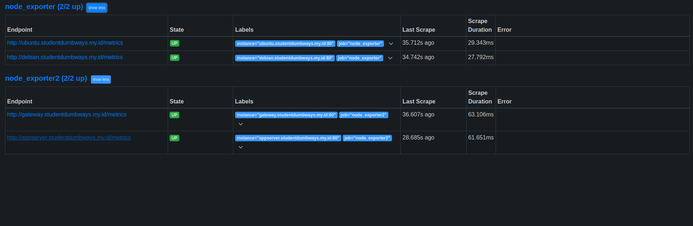
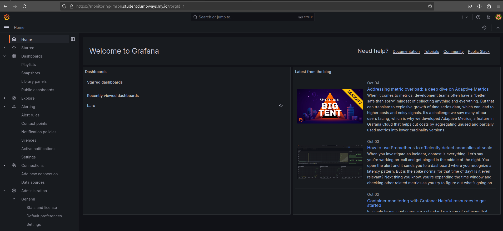
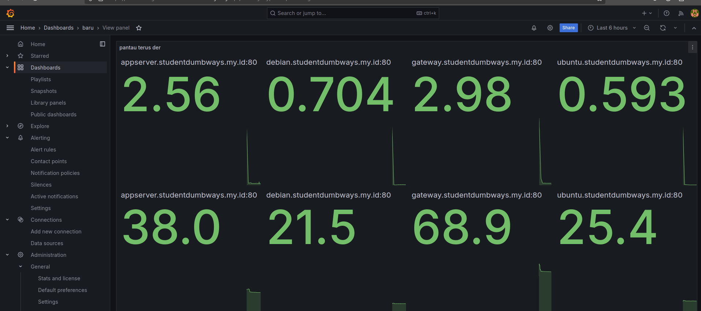
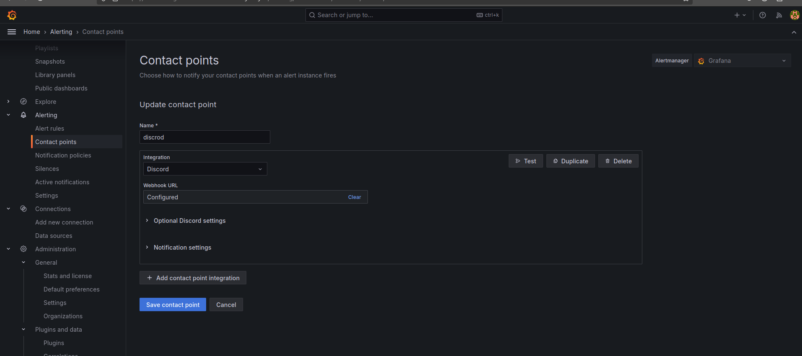
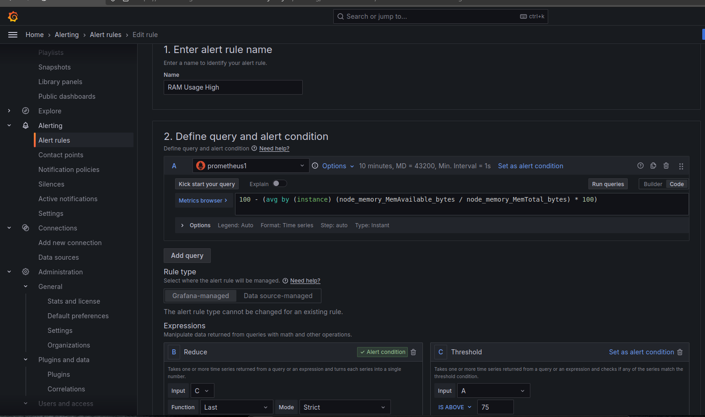
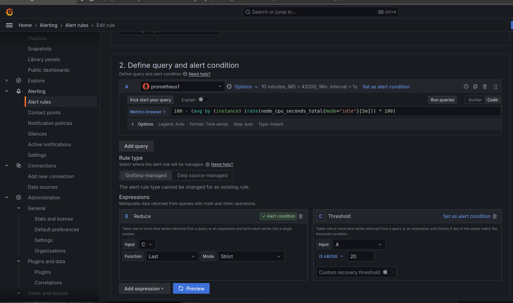
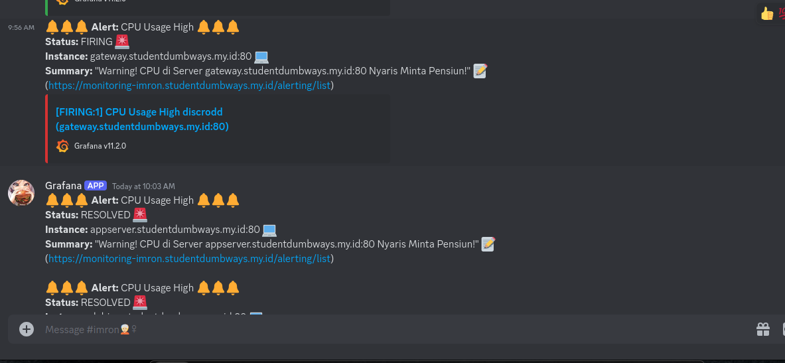

# Monitoring Setup dengan Node Exporter, Prometheus, dan Grafana

### 1. Nginx Konfigurasi
Berikut adalah konfigurasi Nginx yang diperlukan untuk memproxy Grafana:

```bash
# This is required to proxy Grafana Live WebSocket connections.
map $http_upgrade $connection_upgrade {
  default upgrade;
  '' close;
}

upstream grafana {
  server localhost:3000;
}

server {
  listen 80;
  root /usr/share/nginx/html;
  index index.html index.htm;

  location / {
    proxy_set_header Host $host;
    proxy_pass http://grafana;
  }

  # Proxy Grafana Live WebSocket connections.
  location /api/live/ {
    proxy_http_version 1.1;
    proxy_set_header Upgrade $http_upgrade;
    proxy_set_header Connection $connection_upgrade;
    proxy_set_header Host $host;
    proxy_pass http://grafana;
  }
}
```
### 2. File Konfigurasi Prometheus
- Buat file prometheus.yml di dalam folder prometheus dengan isi sebagai berikut:

```bash
global:
  scrape_interval: 15s

scrape_configs:
  - job_name: 'node_exporter'
    static_configs:
      - targets: ['node_exporter:9100']
```
 <br>

### 3. Docker Compose

- Buat file docker-compose.yml di direktori utama dengan isi berikut:
```bash
services:
  prometheus:
    image: prom/prometheus
    container_name: prometheus
    volumes:
      - ./prometheus:/etc/prometheus
    ports:
      - "9090:9090"
    command:
      - '--config.file=/etc/prometheus/prometheus.yml'
    restart: unless-stopped

  node_exporter:
    image: prom/node-exporter
    container_name: node_exporter
    ports:
      - "9100:9100"
    restart: unless-stopped

  grafana:
    image: grafana/grafana
    container_name: grafana
    volumes:
      - grafana-data:/var/lib/grafana
    ports:
      - "3000:3000"
    restart: unless-stopped

volumes:
  grafana-data:
```

### 4. Menjalankan Monitoring
Menjalankan Monitoring

1.  Buka Terminal: Navigasikan ke direktori tempat file docker-compose.yml berada.
2. Jalankan Docker Compose:

```bash
    docker-compose up -d
```
3. Akses Grafana: Setelah semua container berjalan, akses Grafana melalui URL berikut:
```bash
http://localhost:3000
```
    Username: admin
    Password: admin (akan diminta untuk mengubah password saat pertama kali login).

### 5. Generate SSL grafana
1. Instal Certbot
```bash
sudo apt update
sudo apt install certbot
sudo apt install python3-certbot-nginx
```
2. generate ssl dengan cerbot
```bash
sudo certbot --nginx -d domaingrafana.com
```

 <br>

 <br>

 <br>

 <br>

 <br>

 <br>