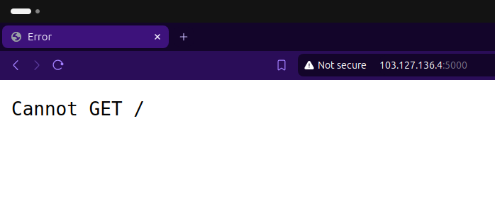

# Dumbflix Frontend

1. **Clone Repositori**
```bash
git clone https://github.com/dumbwaysdev/dumbflix-frontend.git
cd dumbflix-frontend
```

2. **Install Dependencies**
- Masuk ke direktori proyek dan instal ketergantungan yang diperlukan:
```bash
npm install
```

3. **Konfigurasi Aplikasi**
- Perbarui endpoint API di file konfigurasi:
- Buka src/config/api.js dengan editor teks.

```bash
const API_URL = 'https://your-backend-url.com/api';
```

4. **Deploy dengan PM2**
- Instal PM2 secara global jika belum terinstal:
```bash
npm install -g pm2
```

5. **Deploy Application on PM2**
- buat pm2 yang simple

```bash
pm2 init simple
module.exports = {
  apps : [{
    name   : "dumbflix-frontend",
    script : "npm start"
  }]
}
```
- jalankan pm2
```bash
pm2 start ecosystem.config.js
```

7. **Cek aplikasi apakah sudah berjalan atau belum**
- akses ke port :3000

 <br>