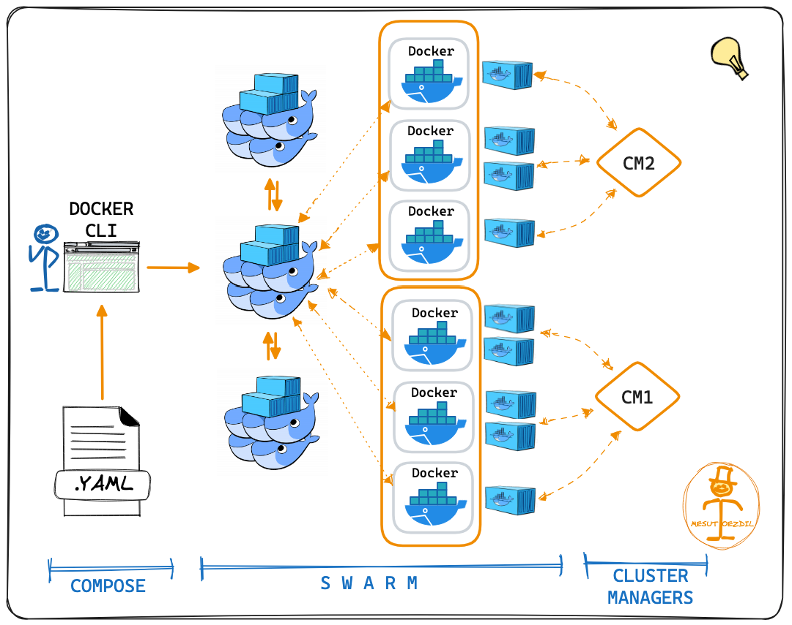

# Docker Swarm Deployment: Wayshub App

 <br>

## Daftar Isi
1. [Setup Cluster Docker Swarm](#1-setup-cluster-docker-swarm)
2. [Deploy Aplikasi Wayshub](#2-deploy-aplikasi-wayshub)
3. [Setup Reverse Proxy & SSL](#3-setup-reverse-proxy--ssl)
4. [Monitor Swarm Cluster](#4-monitor-swarm-cluster)
5. [Troubleshooting](#5-troubleshooting)
6. [Clean Up Cluster](#6-clean-up-cluster)

## 1. Setup Cluster Docker Swarm

### 1.1. Inisialisasi Docker Swarm

Pertama, kita bikin Docker Swarm cluster dengan satu node sebagai master:

```bash
docker swarm init --advertise-addr <IP_MASTER>
```

Ganti <IP_MASTER> dengan IP address dari master node.
Output-nya bakal kasih command untuk join node lain ke cluster, simpan command-nya ya!

### 1.2. Tambahin Worker Node

Jalankan command ini di worker nodes untuk gabung ke cluster yang tadi udah kita buat:

```bash
docker swarm join --token <TOKEN> <IP_MASTER>:2377
```

<TOKEN> ini dari output waktu kita inisialisasi swarm tadi.
<IP_MASTER> tetap pakai IP dari master node.

Untuk cek semua node udah terhubung, ketik ini di master node:

```bash
docker node ls
```

## 2. Deploy Aplikasi Wayshub

### 2.1. Setup Docker Compose File

Kita buat file docker-compose.yml buat ngatur service dari Wayshub. Pastikan lo punya file ini di master node.

```yaml
services:
  db:
    image: mysql:5.7
    networks:
      - wayshub_swarm
    volumes:
      - ./mysql/data:/var/lib/mysql
    environment:
      MYSQL_ROOT_PASSWORD: 
      MYSQL_DATABASE: 
      MYSQL_USER: 
      MYSQL_PASSWORD: 
    deploy:
      replicas: 1
    ports:
      - "3306:3306"

  backend:
    image: imronnm/imron-backend
    depends_on:
      - mysql
    networks:
      - wayshub_swarm
    ports:
      - "5000:5000"
    deploy:
      replicas: 3

  frontend:
    image: imronnm/imron-frontend
    ports:
      - "3000:3000"
    networks:
      - wayshub_swarm
    deploy:
      replicas: 3

  nginx:
    image: nginx:latest
    ports:
       - "80:80"
       - "443:443"
    volumes:
       - ./nginx/nginx.conf:/etc/nginx/nginx.conf
       - ./certs:/etc/nginx/certs
    deploy:
      replicas: 1
      placement:
        constraints: [node.role == manager]
    networks:
      - wayshub_swarm

networks:
  wayshub_swarm:
    driver: overlay
```

### 2.2. Deploy ke Docker Swarm

Sekarang kita deploy aplikasi ke Docker Swarm dengan docker stack. Di master node, jalankan command ini:

```bash
docker stack deploy -c docker-compose.yml wayshub
```

Ini akan ngatur deployment frontend, backend, dan MySQL database yang udah kita setting di docker-compose.yml.

### 2.3. Cek Status Service

Kita bisa cek status service yang running di cluster dengan command berikut:

```bash
docker service ls
```

Kalau semua udah running sesuai rencana, berarti aplikasi lo udah live di cluster Swarm!

## 3. Setup Reverse Proxy & SSL

### 3.1. Nginx Reverse Proxy

Lo bisa setup Nginx sebagai reverse proxy buat handle trafik ke frontend dan backend. Buat file nginx.conf

```nginx
events {
    worker_connections 1024;  # Adjust as needed
}

http {

   upstream wayshub_frontend {
        server wayshub_frontend:3000;
   }

   upstream wayshub_backend {
        server wayshub_backend:5000;
   }

    server {
        listen 80;
        server_name fe.wayshub.studentdumbways.my.id;
        return 301 https://$host$request_uri;  # Redirect HTTP to HTTPS
    }

    server {
        listen 443 ssl;
        server_name fe.wayshub.studentdumbways.my.id;

        ssl_certificate /etc/nginx/certs/fullchain.pem;
        ssl_certificate_key /etc/nginx/certs/privkey.pem;

        location / {
            proxy_pass http://wayshub_frontend; 
            proxy_http_version 1.1;
            proxy_set_header Upgrade $http_upgrade;
            proxy_set_header Connection 'upgrade';
            proxy_set_header Host $host;
            proxy_cache_bypass $http_upgrade;
        }
    }

    server {
        listen 80;
        server_name api.wayshub.studentdumbways.my.id;
        return 301 https://$host$request_uri;  # Redirect HTTP to HTTPS
    }

    server {
        listen 443 ssl;
        server_name api.wayshub.studentdumbways.my.id;

        ssl_certificate /etc/nginx/certs/fullchain.pem;
        ssl_certificate_key /etc/nginx/certs/privkey.pem;

        location / {
            proxy_pass http://wayshub_backend;  
            proxy_http_version 1.1;
            proxy_set_header Upgrade $http_upgrade;
            proxy_set_header Connection 'upgrade';
            proxy_set_header Host $host;
            proxy_cache_bypass $http_upgrade;
        }
    }
}
```

Pastikan Nginx terhubung dengan service yang ada di Docker Swarm.

### 3.2. SSL Setup

Untuk SSL, lo bisa pakai Cloudflare buat manage sertifikat SSL dengan mudah. Caranya:

1. Tambahin domain ke Cloudflare.
2. Aktifin SSL/TLS di dashboard Cloudflare.
3. Ganti nameserver domain lo sesuai instruksi Cloudflare.

Atau, kalau lo mau generate SSL sendiri, bisa pakai Certbot:

```bash
sudo apt update
sudo apt install certbot python3-certbot-dns-cloudflare
```

buat file cloudflare.ini
masukkan email dan global api key
kemudian

terbitkan sertifikat

```bash
sudo certbot certonly \
  --dns-cloudflare \
  --dns-cloudflare-credentials /etc/letsencrypt/cloudflare.ini \
  -d "*.wayshub.studentdumbways.my.id" \
  -d "wayshub.studentdumbways.my.id"
```

## 4. Monitor Swarm Cluster

### 4.1. Scale Up atau Down Service

Kalau trafik meningkat, lo bisa scale up service langsung dari Swarm:

```bash
docker service scale wayshub_frontend=5
```

Ini bakal nambah replica frontend jadi 5.

### 4.2. Rolling Update

Untuk update image aplikasi tanpa downtime, gunakan rolling update:

```bash
docker service update --image wayshub/frontend:v2 wayshub_frontend
```

Cluster bakal update ke image versi baru tanpa ganggu yang lagi running.

## 5. Troubleshooting

Kalau lo nemuin masalah saat deploy atau manage cluster Docker Swarm, berikut beberapa langkah troubleshooting yang bisa lo coba:

### 5.1. Service Gagal Running

Cek log dari service yang error untuk tau penyebabnya:

```bash
docker service logs <service_name>
```

Contoh, kalau mau cek log dari backend:

```bash
docker service logs wayshub_backend
```

Kalau ada masalah dengan koneksi antar-service (misal frontend nggak bisa konek ke backend), pastiin mereka berada di network yang sama seperti di docker-compose.yml.

### 5.2. Node Diskonek dari Cluster

Kalau ada worker node yang diskonek dari cluster, coba join ulang dengan command yang udah dikasih saat inisialisasi. Atau lo bisa force update node dengan command ini di master node:

```bash
docker node update --availability active <node_name>
```

### 5.3. Error SSL/HTTPS

Kalau lo pakai SSL dari Cloudflare, pastiin setting SSL/TLS mode di Cloudflare ada di Full atau Full (strict) buat ngindarin error 525 SSL Handshake Failed.

Untuk troubleshoot SSL yang di-generate manual pakai Certbot, cek status nginx dan sertifikatnya.

### 5.4. Cek Resource Usage

Kalau aplikasi lo lambat atau ada node yang down, cek penggunaan resource (CPU, memory) di tiap node dengan command ini:

```bash
docker node ps
```

Untuk cek detail penggunaan resource:

```bash
docker stats
```

Lo bisa scale up service atau tambah worker node kalau resource udah mentok.

## 6. Clean Up Cluster

Setelah selesai testing atau deployment, lo bisa clean up semua service dan stop cluster:

### 6.1. Hapus Semua Service

Untuk hapus semua service yang udah di-deploy:

```bash
docker stack rm wayshub
```

### 6.2. Leave Cluster (untuk Worker Nodes)

Di worker nodes, kalau lo mau keluar dari cluster, ketik command ini:

```bash
docker swarm leave
```

Di master node, kalau lo mau stop cluster sepenuhnya:

```bash
docker swarm leave --force
```

## Kesimpulan

Congrats! Lo udah berhasil bikin cluster Docker Swarm dan deploy aplikasi Wayshub di atasnya, lengkap dengan reverse proxy dan SSL. Dari setup cluster, deploy stack, sampai scaling dan monitoring service, semua udah dijalanin dengan Docker Swarm.

Docker Swarm bikin lo bisa ngatur deployment dengan lebih fleksibel dan scalable. Pastikan lo terus explore tools kayak Docker, Nginx, dan Cloudflare buat bikin deployment lo makin solid!